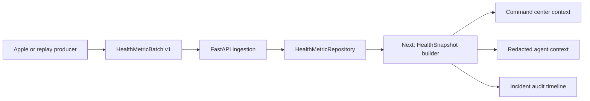

# Slice 01 — Scalar Health Metric Ingestion

## Outcome

Build one trustworthy seam between a future Apple client and the backend:

> Given a single-user batch of visible scalar observations, validate the frozen
> contract, accept each immutable metric ID at most once, and return a stable
> result without invoking incident or escalation behavior.

This is the first part of WT-00 plus the smallest useful seam from WT-20. It is
not the whole foundation gate.

## Why this comes first

Apple collection, backend snapshots, the command-center UI, and the agent all
need to agree on what a health observation means. Building that contract first
lets each later feature use the same fixtures instead of inventing its own field
names, units, timestamps, source semantics, or replay behavior.



## Exactly what this slice builds

### Frozen transport contracts

- `HealthMetric` v1 is one finite scalar observation with a canonical unit,
  UTC-normalized observation time, machine-stable source, optional display
  metadata, simulation marker, and `used_for_escalation: false`.
- `HealthMetricBatch` v1 contains 1–100 observations for exactly one user and
  one sending device.
- `HealthMetricBatchResult` v1 reports accepted and duplicate IDs and the
  authoritative server receipt time.
- Every object rejects unknown fields and carries `schema_version: 1`.

The first scalar examples cover heart rate, respiratory rate, oxygen saturation,
and step count. `metric_type` remains a constrained string so the later registry
can add supported allowlisted scalar types without revising the envelope.

### Ingestion endpoint

`POST /v1/health/metrics:batch`

| Request condition | HTTP | Result |
|---|---:|---|
| New batch and new metrics | 201 | `accepted` with accepted IDs |
| Exact retry using the same batch ID | 200 | `already_processed`; nothing is written again |
| New batch containing identical existing metric IDs | 201 | Existing IDs are counted as duplicates |
| Same batch ID with different content | 409 | `batch_id_conflict` |
| Same metric ID with different content | 409 | `metric_id_conflict`; the entire batch remains unwritten |
| Invalid schema, cross-user batch, duplicate in-batch IDs, or unsafe field | 422 | Validation failure; nothing is written |

The server, not the client, sets `server_received_at`.

### Replaceable repository boundary

`HealthMetricRepository` currently has two operations:

```text
ingest_batch(batch, server_received_at) -> HealthMetricBatchResult
latest_by_type(user_id, as_of) -> dict[metric_type, HealthMetric]
```

The in-memory adapter makes contract and API behavior runnable now. It is
explicitly ephemeral and is not the production persistence decision.

## Safety and privacy boundary

- Health metric ingestion imports no incident or escalation code.
- `used_for_escalation` can only be `false`.
- Replay sources must declare `simulated: true`.
- Raw ECG voltage and raw accelerometer, gyroscope, or magnetometer streams are
  not representable in this contract.
- There is no public endpoint that lists or echoes stored health history.
- Authentication, authorization, retention, and responder redaction are required
  before this endpoint can be exposed beyond a local demo environment.

## Intentionally out of scope

- HealthKit, workout, WatchConnectivity, Core Motion, or fall-event collection;
- capability/no-visible-sample states;
- structured sleep, ECG metadata, activity summary, or blood-pressure records;
- freshness classification;
- `HealthSnapshot` construction;
- PostgreSQL/Alembic persistence;
- incidents, responders, routing, notifications, protocols, agents, or web UI.

## Connection to Slice 02

The next feature is **HealthCapabilities + HealthSnapshot**:

1. Define a per-type capability contract with `unsupported`, `not_requested`,
   `requested_no_sample`, `available`, and `error` states.
2. Define typed structured records separately from scalar `HealthMetric`.
3. Ask `latest_by_type(user_id, captured_at)` for the newest eligible scalar
   observation of every type.
4. Combine observations and capabilities into an immutable snapshot.
5. Calculate `live`, `recent`, `historical`, or `unavailable` from explicit,
   non-medical display windows.
6. Require `used_for_escalation: false` on the complete snapshot.
7. Expose only a redacted snapshot view to the future command center and agent.

Because the repository seam already accepts `as_of`, Slice 02 can be developed
against the in-memory adapter and then move to PostgreSQL without changing the
Apple transport contract.

## Acceptance checklist

- Frozen examples validate against both JSON Schema and Pydantic.
- New batch returns 201 and stores each metric once.
- Exact retry returns 200 and does not increase repository count.
- Conflicting batch or metric IDs return stable 409 codes.
- Mixed-user, oversized, raw-field, infinite-value, and naive-time requests fail.
- `latest_by_type` selects the latest metric at or before a requested timestamp.
- Tests can inject a frozen clock and isolated repository.
