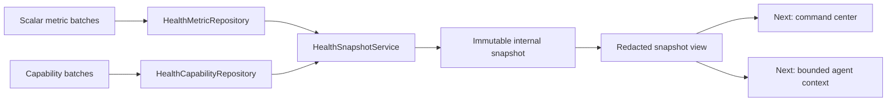

# Slice 02 — Health Capabilities and Immutable Snapshots

## Outcome

Turn accepted scalar observations and honest capability reports into one
immutable, redacted health-context view:

> Given a user and server-authoritative capture time, select only observations
> and capability checks visible at that time, calculate deterministic display
> freshness, store the result once, and never use it to authorize escalation.



## Contracts

### HealthCapability v1

One device/source check for one scalar metric type. Supported states are:

| Status | Meaning |
|---|---|
| `unsupported` | The type or service is unavailable for this SDK/device configuration |
| `not_requested` | The app has not requested the relevant access |
| `requested_no_sample` | Access was requested, but no sample is visible |
| `available` | At least one visible scalar observation was normalized |
| `error` | The capability query failed with a bounded, non-sensitive code |

`permission_denied` is intentionally absent. HealthKit read behavior does not
allow the application to distinguish denial from an empty or limited store.

Every capability includes a stable ID, user, metric type, acquisition class,
source, check time, simulation marker, and `used_for_escalation: false`.

### HealthCapabilityBatch v1

- One user and one sending device.
- 1–100 unique metric types and capability IDs.
- UTC-normalized send/check times.
- Immutable IDs and exact-retry semantics.

### HealthSnapshot v1

The internal immutable snapshot contains:

- snapshot ID, user, reason, and server-authoritative `captured_at`;
- one sorted item per metric type present in observations or capabilities;
- the latest scalar observation at or before `captured_at`, if visible;
- the latest capability check at or before `captured_at`, if reported;
- derived availability, freshness, age, and the exact windows used;
- `used_for_escalation: false` at snapshot, item, metric, and capability levels.

### HealthSnapshotView v1

The HTTP view retains the value, unit, source label, timestamps, availability,
freshness, age, and simulation marker. It omits:

- source bundle IDs;
- device models;
- capability and metric IDs;
- internal capability error details;
- complete nested internal records.

Authentication and role-based field policies remain required before non-local
exposure. This is the first redaction boundary, not the final authorization
system.

## Freshness behavior

Freshness is presentation metadata, not diagnosis or a medical threshold.

The default policy uses:

- live window: 15 seconds;
- recent window: 86,400 seconds;
- optional per-metric overrides through injected `FreshnessPolicy`.

Classification:

1. A `live` acquisition within the live window is `live`.
2. Any visible observation within the recent window is `recent`.
3. An older visible observation is `historical`.
4. A type without a visible observation is `unavailable`, while preserving its
   honest capability status.

Every snapshot item stores the live/recent windows used so a result is
reproducible if configuration later changes.

## APIs

### Capability ingestion

`POST /v1/health/capabilities:batch`

| Condition | HTTP | Result |
|---|---:|---|
| New batch | 201 | `accepted` with accepted capability IDs |
| Exact retry | 200 | `already_processed`; original receipt time retained |
| Same batch ID, changed content | 409 | `capability_batch_id_conflict` |
| Same capability ID, changed content | 409 | `capability_id_conflict`; no partial write |
| Invalid batch | 422 | Validation failure; no write |

### Snapshot creation

`POST /v1/health/snapshots`

The request supplies a stable snapshot ID, user, and one currently authorized
capture reason: `monitoring_started` or `manual_refresh`. The server supplies
`captured_at`.

| Condition | HTTP | Result |
|---|---:|---|
| New snapshot request | 201 | Captures and returns the redacted immutable view |
| Exact request retry | 200 | Returns the original snapshot unchanged |
| Same snapshot ID, changed request | 409 | `snapshot_id_conflict` |
| Invalid request | 422 | Validation failure |

### Snapshot read

`GET /v1/health/snapshots/{snapshot_id}`

- 200 returns the same redacted immutable view.
- 404 returns `snapshot_not_found`.

There is no general endpoint for listing a user's stored health history.

## Repository and application boundaries

New ports:

```text
HealthCapabilityRepository.ingest_batch(...)
HealthCapabilityRepository.latest_by_type(user_id, as_of)
HealthSnapshotRepository.find_by_request(request)
HealthSnapshotRepository.save(request, snapshot)
HealthSnapshotRepository.get(snapshot_id)
```

The Slice 02 adapters are thread-safe and in-memory. Slice 03 adds durable
PostgreSQL implementations of the same ports. Concurrent exact capability or
snapshot retries create one stored record set, and conflicts are preflighted
before mutation in both implementations.

## Safety invariants

- No capability status named `permission_denied` exists.
- Capability and snapshot contracts reject `used_for_escalation: true`.
- Raw ECG and high-frequency motion types remain forbidden.
- Snapshot construction imports no incident state-machine behavior.
- Values never influence freshness; only acquisition class and age do.
- Inputs observed or checked after `captured_at` are excluded.
- Exact retries return the original captured context, even if time or inputs later
  change.

## Intentionally out of scope

- Structured sleep, ECG metadata, activity-summary, and blood-pressure schemas;
- PostgreSQL/Alembic persistence and retention deletion;
- Apple HealthKit collection or Swift Codable models;
- authentication and responder/agent role authorization;
- incident-created or responder-accepted capture reasons;
- incident state transitions, responder search, protocols, or notifications;
- UI and agent consumption.

## Verification

- JSON Schema Draft 2020-12 and Pydantic contract parity.
- Capability error, replay, raw-type, user, and uniqueness invariants.
- Capability and snapshot ID conflict behavior.
- Concurrent exact-retry behavior.
- Latest-as-of selection for metrics and capabilities.
- Live/recent/historical/unavailable boundaries and per-type overrides.
- Frozen full snapshot and redacted-view fixture equality.
- Redaction checks and escalation safety tests.
- API success, retry, conflict, validation, missing, and OpenAPI outcomes.
- Slice 01 regression suite remains green.

Current automated result:

```text
52 passed
```

## Connection to Slice 03 — delivered

[Slice 03](03-postgres-health-persistence.md) implements the metric, capability,
and snapshot repository ports with transactions, migrations, explicit demo
scopes, and confirmed retention. Selection, freshness, redaction, and frozen
HTTP contracts remain unchanged.
