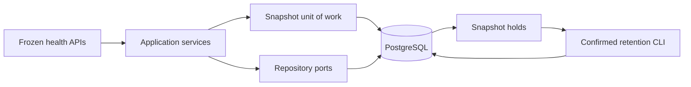

# Slice 03 — PostgreSQL Health Persistence and Retention

## Outcome

Replace process-local storage with durable, scoped PostgreSQL adapters without
changing any Slice 01–02 JSON or HTTP contract:

> Given one explicitly configured demo scope, persist immutable metric and
> capability receipts, capture snapshots inside one consistent database
> transaction, preserve exact retry results across restarts, and delete health
> context only through a confirmed scope-bound retention operation.



## Explicit demo scopes

Every persisted key begins with an internal `scope_id` UUID. Client-provided
batch, metric, capability, and snapshot IDs are therefore unique within one
demo, not globally across unrelated runs.

PostgreSQL mode requires both:

- `VITAL_RELAY_DATABASE_URL`;
- `VITAL_RELAY_DEMO_SCOPE_ID`.

The application fails closed if the URL is not PostgreSQL/psycopg, the scope is
missing, closed, or expired, or PostgreSQL cannot be reached. It never silently
falls back to in-memory storage after PostgreSQL has been configured.

The in-memory adapters remain the default when no database URL is configured.
They keep unit tests and fixture-only development fast.

## Schema and migration

Alembic revision `0001_health_persistence` creates:

| Table | Purpose |
|---|---|
| `demo_scopes` | Active/closed lifecycle and explicit expiration |
| `health_metric_batches` | Original ordered idempotency result and receipt time |
| `health_metrics` | Immutable normalized scalar observations |
| `health_capability_batches` | Original ordered capability result and receipt time |
| `health_capabilities` | Immutable capability history |
| `health_snapshot_requests` | Stable request fingerprint |
| `health_snapshots` | Immutable server-authored snapshot header |
| `health_snapshot_items` | Copied metric/capability audit payloads and freshness |
| `health_snapshot_holds` | Incident/reference protection from retention deletion |

Database checks independently prohibit raw ECG/motion metric names,
non-simulated replay rows, non-finite scalar values, inconsistent capability
errors, invalid snapshot-item state, and `used_for_escalation = true`. Snapshot
JSONB checks repeat the raw-type and escalation protections inside copied metric
and capability payloads. A shared trigger rejects every `UPDATE` on all eight
health audit tables, including otherwise valid-looking rewrites.

Latest-as-of indexes are ordered by:

```text
(scope_id, user_id, metric_type, observed_at DESC, metric_id DESC)
(scope_id, user_id, metric_type, checked_at DESC, capability_id DESC)
```

The PostgreSQL adapters use `DISTINCT ON (metric_type)` with the same timestamp
and UUID tie-break as the in-memory adapters.

## Idempotency and concurrency

Metric and capability ingestion use transaction-scoped advisory locks:

1. Serialize the scoped batch ID.
2. Return the original stored receipt for an exact retry.
3. Lock all scoped entity IDs in sorted order.
4. Preflight every fingerprint conflict before inserting anything.
5. Store the batch receipt and all new entities in one transaction.

The receipt stores accepted and duplicate UUID arrays in original request order.
An exact retry after a process restart therefore retains the original counts,
ordering, and `server_received_at`; only its status changes to
`already_processed`.

## Transactional snapshot capture

Slice 02 called three repository ports independently. That is sufficient for
in-memory locking but cannot provide a consistent PostgreSQL read transaction.

`PostgresHealthSnapshotUnitOfWork` now:

- serializes one scoped snapshot ID with a session-level advisory lock;
- starts a `REPEATABLE READ` transaction after acquiring that lock;
- checks the original request;
- reads metrics and capabilities as of one server capture time;
- inserts the request, header, and every item atomically;
- releases the advisory lock even after rollback.

If a reset commits while the repeatable-read transaction is waiting for its
scope lock, the unit of work rechecks the lifecycle at read committed and
returns the stable `DemoScopeUnavailableError` instead of leaking SQLSTATE
`40001` to the application.

Snapshot items contain copied nested payloads rather than foreign keys to live
source rows. Deleting old metrics or capabilities cannot mutate a retained
snapshot, and snapshot reads never recompute from newer source data.

## Retention and reset

Retention is a demo-scope lifecycle operation, not a general unbounded delete.

- Preview, reset, and expiry purge all require an actual UUID confirmation that
  exactly equals the repository's bound scope.
- A non-expired scope cannot use the expiry-purge path.
- Reset locks and closes the scope before completing deletion.
- Metric/capability entities and their idempotency receipts are removed together.
- Unheld snapshots, requests, and items are removed together.
- A snapshot with an `incident` or other reference hold remains readable from
  its copied audit data.
- Hold creation and reset take the same exclusive scope lock, so whichever wins
  the race has a deterministic outcome: preserve the held snapshot, or reject
  the late hold because the scope is closed.
- Hold foreign keys use `ON DELETE RESTRICT`; direct deletion of a held
  snapshot, request, or scope is rejected by PostgreSQL.
- A closed or expired scope accepts no new health writes.

CLI commands:

```bash
vital-relay-db upgrade

vital-relay-db create-scope \
  --scope 11111111-1111-4111-8111-111111111111 \
  --retention-hours 24

vital-relay-db preview-reset \
  --scope 11111111-1111-4111-8111-111111111111 \
  --confirm 11111111-1111-4111-8111-111111111111

vital-relay-db reset-scope \
  --scope 11111111-1111-4111-8111-111111111111 \
  --confirm 11111111-1111-4111-8111-111111111111
```

`--database-url` can be supplied explicitly; otherwise the CLI requires
`VITAL_RELAY_DATABASE_URL`.

Application import is side-effect free and Uvicorn uses factory mode. Database
engines have bounded connection/pool waits, are disposed on failed composition
and application shutdown, and PostgreSQL readiness revalidates the active scope.
Programmatic Alembic URLs take precedence over ambient shell configuration so a
test or CLI migration cannot be redirected to another configured database.

## Verification

The normal suite runs the shared behavioral contract against in-memory
adapters. The PostgreSQL suite starts a private Postgres.app cluster under
pytest temporary storage, listens through a private Unix socket, and never
touches a developer's normal cluster.

PostgreSQL coverage includes:

- migration upgrade, downgrade, and second upgrade from an empty database;
- migration/model parity and required index introspection;
- metric, capability, and snapshot adapter-contract parity;
- concurrent exact batch and snapshot submissions;
- atomic conflict rollback and deterministic latest-as-of queries;
- engine disposal/recreation with exact receipt and snapshot recovery;
- copied snapshot survival after source-row retention;
- held/unheld retention behavior and cross-scope isolation;
- staged scope-close races against ingestion, snapshot capture, and hold creation;
- direct SQL rejection of unsafe inserts and every update to audit tables;
- held-row deletion protection at the foreign-key boundary;
- migration URL precedence, engine lifecycle, and database-backed readiness;
- database CLI and FastAPI operation against the same real adapters.

Current results:

```text
84 passed, 31 PostgreSQL tests deselected   # make test
31 passed                                  # make test-postgres
```

## Intentionally out of scope

- PostGIS responder/AED models and spatial indexes;
- Apple HealthKit collection and Swift Codable implementations;
- wearable fall/manual-SOS events and the incident state machine;
- production authentication, authorization, backups, and managed deployment;
- automatic background scheduling of expiry purges.

PostGIS remains a later responder-search slice. Health persistence deliberately
does not require the spatial extension.

## Connection to Slice 04

The next feature is **Apple Swift health contracts and replay transport**. It
can submit the frozen metric/capability fixtures to either in-memory or durable
PostgreSQL storage without learning database details. Replay remains visibly
simulated and provides the deterministic fallback before physical-device
HealthKit and fall-entitlement work begins.
