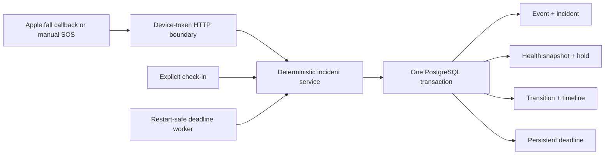

# Slice 04 — Real Incident Core

## Outcome

Turn a real first-party safety signal into one durable, inspectable incident:

> Given an authenticated Apple fall callback or deliberate Watch/iPhone manual
> SOS with a bounded wearer location, atomically persist the event, create or
> advance the user's active incident, capture and hold the current health context
> for display, and settle check-in or timeout transitions exactly once.

This is a real PostgreSQL product path, not a replay or an in-memory incident
demo. The accepted event contracts require `simulated: false` and allow only
`apple_fall` and `manual_sos` sources.

## Exact product boundary

The backend accepts two operational signals:

| Signal | Required evidence | Initial state |
|---|---|---|
| Apple fall | `fall_detected`, Apple fall date equal to the observation time, fall detection available, entitlement present, authorization `authorized` | `verifying` |
| Manual SOS | Deliberate `watch_button` or `iphone_button` activation | `escalating` |

Both signals require:

- an immutable event UUID;
- a first-party user and device identifier;
- a nonnegative signed-64-bit sequence that cannot be reused by that device for
  another event;
- a timezone-aware observation time;
- finite latitude/longitude, bounded horizontal accuracy, and a location capture
  time;
- the configured `X-Vital-Relay-Device-Token`.

The Apple client still owns fall-detection entitlement setup and receipt of the
actual Core Motion callback. The backend neither claims that entitlement is
approved nor manufactures a callback. It validates and persists the evidence
supplied by the first-party client.

## Frozen contracts

The Slice 04 Pydantic and JSON Schema contracts cover:

- `WearableEventRequest` and `WearableEventResult`;
- `GeoLocation`;
- `IncidentView` and `IncidentTransition`;
- `CheckInRequest` and `CheckInResult`;
- `IncidentTimelineEntry` and the ordered timeline response.

Representative, non-simulated Apple-fall and manual-SOS fixtures live under
`contracts/examples/`. Unknown fields, mismatched event/source combinations,
fake Apple entitlement metadata, simulated input, invalid coordinates, and
timezone-free timestamps are rejected before persistence.

## Authoritative state machine

The deterministic transition table is the only incident authority in this
slice:

| Current state | Operational trigger | Next state |
|---|---|---|
| conceptual `monitoring` | accepted Apple fall | `verifying` |
| conceptual `monitoring` | manual SOS | `escalating` |
| `verifying` | `i_am_okay` | `resolved` |
| `verifying` | `i_need_help` | `escalating` |
| `verifying` | verification timeout | `escalating` |
| `verifying` | manual SOS | `escalating` |

Responder acceptance, cancellation, close, and handoff are represented in the
frozen policy for the next slice, but Slice 04 exposes only event ingestion,
verification check-in, incident read, and timeline read. An LLM is not involved
in these transitions.

Health data is intentionally absent from the transition function. The incident
opens and advances identically whether its snapshot is rich, stale, partial, or
empty.

## Atomic PostgreSQL persistence

Alembic revision `0002_incident_core` adds:

| Table | Purpose |
|---|---|
| `wearable_events` | Immutable authenticated event and idempotency fingerprint |
| `incidents` | Current scope-bound state projection and retained context link |
| `incident_commands` | Immutable check-in receipt |
| `incident_state_transitions` | Append-only authorized state changes |
| `incident_deadlines` | Pending/fired/cancelled verification timeout |
| `incident_timeline_entries` | Ordered presentation-safe audit history |

Incident creation is one logical transaction containing:

1. the accepted wearable/manual event;
2. the active incident projection;
3. its initial authorized transition;
4. ordered timeline entries;
5. the fall-verification deadline when applicable;
6. an immutable health snapshot captured at server receipt time;
7. an incident hold that prevents retention from deleting that snapshot.

The exact `(scope, hold, snapshot)` relationship is protected by foreign keys.
The database also enforces one active incident per scoped user, unique event and
device-sequence identities, valid transition edges, non-simulated operational
rows, immutable audit records, and one authoritative verification deadline.

No incident repository falls back to process-local storage. If PostgreSQL or the
configured demo scope is unavailable, incident operations fail closed.

## Idempotency and active-incident behavior

- Reusing an event UUID with the same normalized content returns the original
  incident receipt; different content produces a stable conflict.
- Apple callbacks are also deduplicated by scoped user, device, and Apple fall
  date so delivery under a new request UUID does not open a second incident.
- Reusing a device sequence for different content is a conflict.
- Only one non-resolved incident can exist for a scoped user.
- A manual SOS received while fall verification is active advances that same
  incident to `escalating` and settles its pending deadline.
- Check-ins use an immutable response UUID. An exact retry returns the original
  transition; conflicting reuse is rejected.

## Restart-safe verification timeout

Fall verification is not implemented as an in-memory timer. The database stores
the deadline and its settlement status. A bounded application worker repeatedly
claims due rows, locks the incident/deadline pair, and applies the timeout
transition once. Concurrent workers or a process restart therefore observe the
same durable result.

If an explicit check-in races the deadline, the authoritative server receipt time
and row locks determine one winner. A response cannot revive or overwrite an
already timed-out incident.

## HTTP surface

Every endpoint below requires `X-Vital-Relay-Device-Token` and durable PostgreSQL
composition:

| Endpoint | Result |
|---|---|
| `POST /v1/wearable/events` | Accept/deduplicate an Apple fall or manual SOS and return the current incident |
| `GET /v1/incidents/{incident_id}` | Read the current durable projection |
| `POST /v1/incidents/{incident_id}/check-in` | Record `i_am_okay` or `i_need_help` idempotently |
| `GET /v1/incidents/{incident_id}/timeline` | Read the ordered immutable audit view |

The static device token is intentionally narrow hackathon authentication. It is
not a substitute for production device attestation, per-user identity, token
rotation, or responder role authorization.

## Health-context safety boundary

Every incident gets a server-authored health snapshot and retention hold so the
future command center can show the best available context at incident-open time.
That snapshot:

- can include all currently supported metric and capability types;
- may legitimately contain no visible samples;
- retains source, observation time, freshness, and availability semantics;
- remains immutable for audit/display;
- always carries `used_for_escalation: false`.

No heart rate, oxygen saturation, respiratory, activity, sleep, mobility, or
other optional wellness value participates in event acceptance or a state guard.

## Focused acceptance verification

Hackathon verification is intentionally concentrated on the highest-risk real
path instead of broad test volume:

1. Migrate a private real PostgreSQL database through revisions 0001 and 0002.
2. Submit the non-simulated Apple-fall fixture with a valid device token.
3. Confirm one event, one active incident, one snapshot/hold, one transition,
   one pending deadline, and an ordered timeline commit together.
4. Retry the event and a check-in to confirm the original receipts are returned.
5. Exercise both explicit `i_need_help` and deadline-driven escalation.
6. Restart application composition after a deadline becomes due and confirm it
   advances exactly once from persisted state.
7. Confirm an invalid token, simulated event, conflicting ID, or unavailable
   scope fails without a partial incident.

The acceptance run completed with `84` fast checks and `33` real-PostgreSQL
checks passing. Two PostgreSQL tests are deliberately focused on this slice's
end-to-end incident path and restart behavior; the exact commands and boundary
are recorded in `progress.md`.

## Intentionally out of scope

- Swift/Core Motion implementation and proof on a physical Apple Watch;
- entitlement approval or a safely observed real fall callback;
- replay/simulated fall ingestion;
- PostGIS responder and AED records;
- responder invitations, acceptance, and exact-location release;
- routing, notification delivery, protocols, WebSockets, agents, and evolution;
- production-grade authentication, authorization, device attestation, and
  managed deployment.

## Connection to Slice 05

The next feature is **PostGIS responder/AED discovery and live dispatch**. It
starts from a real `escalating` incident produced by this slice, ranks available
responders and the nearest seeded AED, records invitation/acceptance transitions,
and releases exact coordinates only through the accepted responder view. Static
venue coordinates are sufficient initially; live routing follows through the
same routing port.
