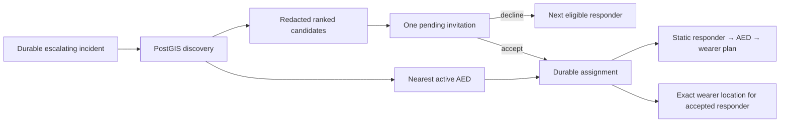

# Slice 05 — PostGIS Responder Discovery and Durable Dispatch

## Outcome

Turn a durable `escalating` incident into one authenticated, accepted responder
assignment:

> Given an escalating incident with a bounded wearer location, use PostGIS to
> rank currently available, qualified responders and the nearest active AED,
> invite one responder at a time, persist every decision exactly once, and
> release the exact wearer location only to the responder who accepts.



This is a real PostgreSQL/PostGIS path. Responder and AED coordinates are stored
as `geography(POINT, 4326)`, distance is evaluated in meters, and the spatial
columns have GiST indexes. There is no in-memory dispatch substitute.

## Exact product boundary

Slice 05 implements:

- discovery for incidents already in `escalating` or `response_active`;
- static venue responder and AED records scoped to one explicit demo scope;
- responder eligibility based on active identity, current availability, valid
  `first_aid` qualification, a fresh latest location, and configured radius;
- deterministic nearest-first candidate ranking using PostGIS distance;
- one durable pending invitation per incident;
- authenticated, idempotent responder decline and acceptance;
- automatic invitation of the next eligible responder after a decline;
- the authoritative `escalating → response_active` transition on acceptance;
- one immutable accepted assignment containing the chosen AED and persisted
  static route plan;
- exact wearer location disclosure only through the accepted responder endpoint.

The default search radius is 1,000 meters, bounded to a maximum of 2,000 meters.
Responder locations older than the configured freshness window are excluded.
These values are demo configuration, not medical or emergency-service policy.

## Frozen contracts

The Pydantic and JSON Schema contracts cover:

- `ResponderCandidateView` with a coarse distance band and no coordinates;
- `AEDSiteView` with public venue location and access instructions;
- `ResponderInvitationView`;
- `DispatchCoordinationView`, which cannot contain wearer coordinates;
- `ResponderDecisionRequest` and `ResponderDecisionResult`;
- `StaticRouteLeg` and `StaticRoutePlan`;
- `AcceptedDispatchView`, the only dispatch contract that contains the exact
  wearer `GeoLocation`.

Candidate ranks and invitation sequences are contiguous. Candidate skills are
allowlisted as `first_aid`, `cpr`, and `aed`; roles are `venue_staff`,
`trained_volunteer`, and `medical_professional`. Every invitation preserves its
redacted candidate snapshot so coordination history remains readable even after
the responder's live location becomes stale.

## Privacy boundary

Before acceptance, the command view exposes only:

- responder identity and display name;
- role and declared qualifications;
- rank;
- a coarse distance band;
- the location freshness timestamp;
- public AED metadata and its static venue coordinate.

It does not expose the wearer's location or any responder coordinate. The
accepted dispatch view is available only when the request supplies a token that
matches the assigned active responder. A token for another responder receives
no location or assignment data, and marking the assigned responder inactive
revokes later exact-location reads.

Responder access tokens are generated as high-entropy secrets for the demo and
stored only as SHA-256 hashes. The seed command emits each plaintext token once.
This is bounded hackathon authentication, not production identity, attestation,
token rotation, or authorization infrastructure.

## PostGIS discovery

Alembic revision `0003_postgis_dispatch` enables PostGIS and adds spatially
indexed responder-location and AED tables. Discovery selects each responder's
latest location and requires all of the following at the authoritative server
time:

1. the responder is active;
2. availability is `true`;
3. `first_aid` qualification is unexpired or has no expiry;
4. the latest location meets the freshness cutoff;
5. `ST_DWithin` places the location inside the configured radius.

Eligible responders are ordered by `ST_Distance` with deterministic identity
tie-breaking. The nearest active AED is selected using the incident's stored
location. Exact metric distances remain internal; the coordination contract
maps each responder into one of five coarse bands from `within_100_m` through
`1000_to_2000_m`.

## Durable invitation and acceptance flow

Coordination locks the incident and records `responder_search_started` once. If
there is no pending or accepted invitation, it creates one invitation for the
highest-ranked eligible responder who has not already decided on that incident.
Database constraints permit at most one pending invitation and at most one
accepted invitation per incident.

A responder decision uses an immutable decision UUID and a canonical request
fingerprint:

- an exact retry returns the stored result without another timeline entry or
  assignment;
- conflicting reuse is rejected;
- a decline settles the current invitation and creates at most one invitation
  for the next eligible responder in the same transaction;
- an acceptance revalidates responder availability, qualification, location
  freshness, and scope before committing;
- acceptance atomically writes the decision, invitation state, incident
  transition, assignment, static route, and ordered timeline entries.

The immutable decision receipt stores the complete accepted dispatch snapshot.
Dedicated accepted-dispatch reads validate the assignment against and return
that snapshot rather than reconstructing it from mutable AED rows. Deactivating
or editing an AED after acceptance therefore cannot rewrite the accepted route
or make the read model internally inconsistent.

The database enforces exact scope/incident/responder relationships between an
invitation, its decision, and its assignment. Decision receipts and assignments
are append-only.

## Static routing boundary

The routing port is real, but its first implementation is intentionally static.
At acceptance it persists exactly two walking legs:

1. responder to the selected AED;
2. AED to the wearer.

Each leg contains a fixed venue instruction, PostGIS-derived straight-line
distance, and a simple walking-time estimate. The plan is an auditable demo
handoff, not turn-by-turn navigation, traffic-aware routing, indoor pathfinding,
or a live ETA. A future routing provider can replace the adapter without
changing responder acceptance or the stored assignment contract.

## PostgreSQL persistence

Revision `0003_postgis_dispatch` adds:

| Table | Purpose |
|---|---|
| `responders` | Scoped responder identity, role, and token hash |
| `responder_skills` | Explicit allowlisted qualifications |
| `responder_availability` | Current availability projection |
| `responder_locations` | Append-only PostGIS location history |
| `aed_sites` | Active static venue AED records |
| `responder_invitations` | Current invitation projection and redacted snapshot |
| `responder_invitation_responses` | Immutable idempotent decisions |
| `responder_assignments` | Immutable accepted responder/AED/static-route link |

The migration also extends the incident timeline event allowlist for responder
search, invitation, decline, acceptance, and dispatch activation. It does not
drop the shared PostGIS extension on downgrade. A downgrade with an active
Slice 05 assignment removes its dispatch-only audit/transition records, returns
the incident to `escalating`, and recalculates sequence counters; it refuses to
proceed if a later incident transition would make that reversal unsafe.

## HTTP surface

| Endpoint | Authentication | Result |
|---|---|---|
| `POST /v1/incidents/{incident_id}/dispatch` | device token | Discover resources and create at most one pending invitation |
| `GET /v1/incidents/{incident_id}/dispatch` | device token | Read the redacted durable coordination view |
| `POST /v1/incidents/{incident_id}/responders/{responder_id}/response` | responder token | Decline or accept one invitation idempotently |
| `GET /v1/incidents/{incident_id}/responders/{responder_id}/dispatch` | accepted responder token | Read the exact accepted assignment, wearer location, AED, and static route |

Device-authenticated coordination cannot obtain the accepted-only location
contract through these endpoints. Responder endpoints authenticate before
revealing whether an invitation or assignment exists.

## Focused acceptance verification

Hackathon verification stays concentrated on one real end-to-end path plus the
spatial schema boundary:

1. Migrate a private PostgreSQL database through revision 0003 and confirm the
   PostGIS extension and GiST indexes exist.
2. Create a non-simulated manual SOS and seed active, unavailable, and stale
   responders plus static AED coordinates.
3. Confirm discovery ranks only fresh, available, first-aid-qualified responders
   and never serializes exact wearer or responder coordinates before acceptance.
4. Decline the first invitation, verify the next responder is invited once, and
   retry the same decision without duplicating state.
5. Accept the next invitation and confirm one `response_active` transition, an
   exact accepted wearer location, a persisted two-leg route, and ordered
   timeline events.
6. Confirm a missing, invalid, or different responder token cannot retrieve the
   accepted dispatch.
7. Confirm later AED edits do not change the immutable accepted view, responder
   deactivation revokes exact-location access, and a data-bearing downgrade
   reconciles the incident before revision 0002 is restored.

The focused acceptance run completed with:

```text
make test
84 passed, 35 deselected

make test-postgres
35 passed

.venv/bin/python -m pytest -m postgres \
  backend/tests/postgres/test_postgis_dispatch.py
2 passed
```

The two focused dispatch checks are part of the `35`-test full PostgreSQL/
PostGIS result. They cover the end-to-end flow and the PostGIS extension/GiST
schema boundary; `progress.md` records the detailed evidence.

## Intentionally out of scope

- notification delivery to responder devices;
- automatic radius expansion or parallel/broadcast invitations;
- production responder enrollment, certification verification, or identity;
- live responder location streaming after acceptance;
- live map routing, turn-by-turn navigation, traffic, or indoor directions;
- municipal AED registries or continuously verified AED availability;
- emergency-services dispatch, calling 911, or clinical decision support;
- protocol presentation, agent execution, sandboxing, evolution, and DGM.

## Connection to Slice 06

The next product slice is **fixed emergency first-aid protocol presentation**.
It starts from the accepted dispatch produced here and selects versioned,
immutable instructions by the incident's deterministic emergency kind. The
protocol is presentation content only: it cannot diagnose the wearer, alter the
incident state machine, or be generated by an LLM during an active incident.
