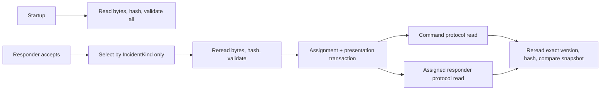

# Slice 06 — Fixed Versioned First-Aid Protocol Presentation

## Outcome

Attach one immutable, source-visible first-aid presentation to every accepted
responder assignment:

> Given a real accepted dispatch, map its persisted `IncidentKind` to one fixed
> protocol version, verify the exact packaged JSON bytes against an independently
> pinned SHA-256 digest, store the complete presentation in the same transaction
> as the assignment, and serve that identical presentation to the command client
> and active assigned responder after restart.



The backend package and API version are `0.5.0`. `/healthz` reports
`fixed_protocol_presentation` after revalidating the protected content.

## Exact product boundary

Slice 06 implements:

- two packaged, fixed protocols for the two currently persisted incident kinds;
- deterministic selection from `IncidentKind` and no other input;
- an append-only ID/version catalog kept separate from the active
  `IncidentKind` mapping so stored versions remain reloadable after a future
  active-version change;
- independently pinned SHA-256 digests over the raw JSON bytes;
- fail-closed loading for missing, modified, malformed, unknown, or mismatched
  content;
- one append-only PostgreSQL presentation snapshot created atomically with the
  accepted responder assignment;
- migration backfill for accepted assignments created before Slice 06;
- authenticated command and assigned-responder presentation reads;
- exact presentation identity and content across application restart.

It does not diagnose the wearer, interpret health measurements, generate advice,
or let an LLM choose or rewrite a step. It also does not send notifications or
add live routing.

## Fixed protocol catalog

| Incident kind | Protocol | Version | Fixed steps |
|---|---|---:|---:|
| `fall` | `fall-response` | `1.0.0` | 6 |
| `manual_sos` | `manual-sos-response` | `1.0.0` | 6 |

The fall protocol includes scene/person checks, emergency help, movement
precautions, CPR/AED direction when needed, and monitoring. The manual-SOS
protocol includes scene/person checks, emergency help, CPR/AED direction when
needed, trained first aid, and monitoring/handoff. Both carry an explicit
emergency-guidance disclaimer and instruct the responder to work within their
training and follow the emergency dispatcher.

These are fixed presentation records curated for the hackathon. They are not a
claim of clinical approval, diagnosis, or a substitute for emergency services.

## Source visibility

Every response includes the reviewing organization, page title, and HTTPS link.
The fixed content references:

- American Red Cross — [First Aid Steps](https://www.redcross.org/take-a-class/first-aid/performing-first-aid/first-aid-steps);
- American Red Cross — [First Aid for an Unresponsive and Breathing Person](https://www.redcross.org/take-a-class/resources/learn-first-aid/unresponsive-and-breathing-person);
- NHS — [Falls](https://www.nhs.uk/conditions/falls/) for `fall-response`;
- American Heart Association — [Emergency Treatment of Cardiac Arrest](https://www.heart.org/en/health-topics/cardiac-arrest/emergency-treatment-of-cardiac-arrest).

The source records make review provenance visible. A source link is not used as
runtime content and a network call is not required during an incident.

## Frozen contracts

The Pydantic and JSON Schema contracts cover:

- `FirstAidProtocolSource` — organization, title, and HTTPS URL;
- `FirstAidProtocolStep` — contiguous sequence, title, and fixed instruction;
- `FixedFirstAidProtocol` — protocol ID, exact semantic version, incident kind,
  title, disclaimer, sources, content digest, and ordered steps;
- `ProtocolPresentationView` — presentation, assignment, incident, responder,
  presentation time, fixed protocol snapshot, and non-simulated marker.

Unknown fields are rejected. Step sequences must be contiguous, source URLs must
be unique, and content digests must be lowercase 64-character SHA-256 values.
Neither the protocol nor presentation contract has a health-data, diagnosis,
observation, prompt, model, or generated-text field.

## Fail-closed integrity lifecycle

The packaged raw JSON deliberately does not contain its own digest. Expected
digests live in an append-only ID/version catalog separate from both the JSON and
the active `IncidentKind -> (protocol ID, version)` mapping. Changing a content
file cannot make it self-authorizing by changing a neighboring hash field, and a
future active mapping can move forward without making an already-presented
catalog version unreadable.

The registry performs three independent checks:

1. **Startup:** `create_app` reads and validates every registered file. Missing,
   modified, invalid UTF-8/JSON, contract-invalid, or identity-mismatched content
   prevents startup. Readiness rereads the files and returns `503` with
   `protocol_content_unavailable` if they later fail validation.
2. **Selection:** responder acceptance resolves only the incident's persisted
   `IncidentKind` through the active mapping into the append-only version
   catalog, rereads the selected file, recomputes its raw-byte SHA-256, validates
   the contract, and confirms ID/version/kind registration. Any failure aborts
   the complete acceptance transaction.
3. **Presentation:** each GET rereads the exact registered ID/version/digest and
   compares it with every stored metadata field and the complete persisted
   snapshot, then rechecks the incident kind, exact assignment/responder link,
   and accepted/presented timestamp. Missing, modified, unknown, or inconsistent
   content returns `503` rather than serving stale or generated advice.

There is intentionally no in-memory cache of protocol content.

## Atomic PostgreSQL snapshot

Alembic revision `0004_protocol_presentations` adds a
`protocol_presentations` table and an exact unique link on responder assignments.
The presentation stores:

- scope, presentation, incident, assignment, and responder IDs;
- schema version, protocol ID/version, and emergency kind;
- independently verified content SHA-256;
- authoritative presentation time;
- the complete validated protocol snapshot;
- `simulated: false`.

On acceptance, the decision, incident transition, assignment, protocol selection,
and presentation insert use one existing PostgreSQL transaction. If selection or
integrity validation fails, neither the assignment nor its presentation commits.

The database requires the exact `(scope, assignment, incident, responder)`
relationship, one presentation per incident/assignment, and a JSON object
snapshot with an allowlisted incident kind and valid digest. The presentation is
append-only and its exact assignment foreign key uses `ON DELETE RESTRICT`.
An insert trigger independently verifies that the presentation kind equals the
incident kind and `presented_at` equals the accepted assignment timestamp.

Upgrading an existing revision-0003 database rereads the protected exact
protocol version and backfills one deterministic presentation for every existing
accepted assignment. An accepted assignment without a presentation is treated
as integrity failure, not as an ordinary absent resource.

## Authentication and HTTP surface

| Endpoint | Authentication | Result |
|---|---|---|
| `GET /v1/incidents/{incident_id}/protocol` | `X-Vital-Relay-Device-Token` | Read the stored presentation for the command client |
| `GET /v1/incidents/{incident_id}/responders/{responder_id}/protocol` | `X-Vital-Relay-Responder-Token` | Read only when the responder is active, token-authenticated, and assigned to that presentation |

Before acceptance, no assignment or presentation exists and the command read
returns `404`. If an accepted assignment exists without its required
presentation, the read fails closed with `503` rather than reporting ordinary
absence.
The responder endpoint authenticates before exposing whether the presentation
exists. Deactivating the assigned responder revokes later responder reads, while
the device-authenticated command record remains available for audit.

## Deterministic safety boundary

Protocol selection has exactly one input: the persisted `IncidentKind` (`fall`
or `manual_sos`). It does not inspect:

- heart rate or any other health snapshot value;
- responder observations;
- location, distance, role, or routing data;
- an LLM response, prompt, agent state, or mutation candidate.

The instructions are presentation content. They do not create or advance an
incident, determine responder eligibility, claim a diagnosis, or replace the
authoritative state machine and emergency dispatcher.

## Focused acceptance verification

The hackathon gate remains intentionally small:

1. Validate both protocols, their source/step subcontracts, and generated JSON
   Schema examples.
2. Prove exact `IncidentKind` mapping plus ordered fixed steps.
3. Modify a copied content file and request unknown/mismatched identities to
   confirm fail-closed behavior.
4. Accept a real manual-SOS dispatch and confirm the assignment and one protocol
   presentation commit together.
5. Read identical presentations through the device and assigned-responder
   endpoints, revoke the responder after deactivation, and confirm pre-accept
   reads return no presentation.
6. Recreate the application and confirm the command endpoint returns the exact
   same presentation snapshot.
7. Downgrade the populated database to revision 0003, upgrade it again, and
   confirm the protected backfill recreates the identical presentation.

```text
make test
88 passed, 35 deselected

.venv/bin/python -m pytest -m postgres \
  backend/tests/postgres/test_postgis_dispatch.py
2 passed

make test-postgres
35 passed
```

The focused two-test file is included in the `35`-test PostgreSQL/PostGIS total.
An initial PostgreSQL run inside the filesystem sandbox could not allocate the
server's shared-memory segment; the identical isolated-cluster run outside that
sandbox passed, so this was an execution-environment limitation rather than a
product failure.

## Intentionally out of scope

- runtime generation, summarization, translation, or personalization of steps;
- clinical diagnosis or interpretation of health data;
- responder observations changing protocol selection;
- notification registration, APNs/Twilio, or external message delivery;
- live route lookup, refresh, turn-by-turn guidance, indoor routing, or live ETA;
- command-center/responder UI consumption;
- production protocol governance, legal/clinical sign-off, localization, or
  content-update workflow;
- evaluator/sandbox read-only mount enforcement.

Slice 06 provides digest-pinned, fail-closed product integrity. The future
evaluator and sandbox do not exist yet, so enforcement that prevents mutation
candidates from writing protocol files remains part of later NemoClaw/evolution
work rather than a completed claim.

## Connection to Slice 07

The next product slice is **command-center and responder live views**. It can
consume the existing incident/timeline, redacted coordination, accepted-only
dispatch, and fixed protocol presentation contracts. iOS UI-03 can use the same
dispatch and protocol contracts. Notification delivery remains a separate,
later provider slice rather than a prerequisite for these views.
