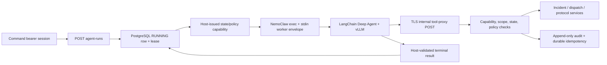

# Agent A3 — Live Sandboxed Coordination Vertical Slice

**Branch:** `codex/agent-a3-live-sandbox`
**Status:** Code and automated PostgreSQL/transport verification complete;
external NemoClaw, TLS, and live vLLM evidence remains an operator gate.

## Outcome

Agent A3 connects the existing LangChain Deep Agent runtime and Agent A2 policy
boundary to one real, durable incident-control path. A command operator can
start, observe, and exactly retry a coordination run. The model executes in a
NemoClaw process sandbox and can reach only privacy-bounded application tools
through a host-authenticated proxy.

There is no deterministic coordinator or automatic execution-substrate
fallback. Model, tool, transport, policy, lease, or sandbox failure produces a
durable `manual_required` result and returns control to the operator.

## Command API

All public endpoints require a product-mode `Authorization: Bearer ...`
session whose durable persona is `command`. Legacy device-token authentication
is not accepted.

| Method | Path | Result |
|---|---|---|
| `POST` | `/v1/incidents/{incident_id}/agent-runs` | `201` for the sole model execution; `200` for an exact terminal retry |
| `GET` | `/v1/incidents/{incident_id}/agent-runs/{run_id}` | One privacy-bounded durable record |
| `GET` | `/v1/incidents/{incident_id}/agent-runs?limit=1..50` | Newest bounded run records for that incident |

The start body contains only `schema_version`, client-stable `run_id`, and
`expected_state_version`. Tenant scope and actor identity come from the
authenticated session; the backend fetches the incident and active policy.
Only `escalating` and `response_active` incidents are eligible.

## State-specific agency

The model chooses strategy and tool order within its policy budget. The host
issues a smaller state-specific grant:

| Incident state | Granted tools |
|---|---|
| `escalating` | `get_incident`, `get_incident_timeline`, `get_dispatch_coordination`, `coordinate_dispatch` |
| `response_active` | `get_incident`, `get_incident_timeline`, `get_dispatch_coordination`, `get_fixed_protocol` |

Close, handoff, resolution, responder decisions, arbitrary notifications,
exact locations, protocol selection, filesystem, shell, web search, messaging,
and package installation are not model tools.

## Lease and authority fence

PostgreSQL creates the `running` record before the model is invoked and permits
only one live run per scope/incident. Its immutable start fields include the
command account/session, incident version, model, sandbox, and exact policy
identity.

Every run has a durable lease. Capability expiry is the earlier of the normal
five-minute lifetime and the lease deadline. A restarted process may reconcile
an abandoned run only after the lease—and therefore its mutation authority—has
expired. Terminal admission is fenced by database time at host receipt rather
than trusting sandbox-reported timestamps; a late, backdated, mismatched, or
malformed result is closed as `manual_required`. A per-run PostgreSQL advisory
fence drains every admitted host tool invocation—including its idempotency
completion and terminal audit—before finishing or reclaiming a run. This
prevents a reclaimed worker and an old worker from holding mutation authority
concurrently.

An exact retry of the same terminal run returns stored evidence without model
execution. A retry while the original lease is running returns conflict. Reuse
of a run ID with conflicting immutable content is rejected.

## Sandbox wire and inference

`ProcessSandboxAgentRunner` uses a fixed argv vector with `shell=False`, bounded
stdin/stdout, a process timeout, no inherited stdin, and no raw stderr in
results. The host invokes the absolute reviewed NemoClaw CLI path with a minimal
allowlisted launcher environment; database URLs, signing material, provider
credentials, and all `VITAL_RELAY_*` settings are absent from the child. The
envelope carries the normalized request, pinned policy, vLLM
settings, tool-proxy endpoint, and one masked short-lived capability. It never
contains the signing key or a persona credential.

The `vital-relay-agent-worker` reads exactly one envelope, constructs the real
`DeepAgentRunner` and typed HTTP tool gateway, and emits exactly one normalized
`AgentRunResult`. NemoClaw owns provider authentication and exposes vLLM through
`inference.local`; the worker receives only the non-secret client placeholder
`nemoclaw-managed-inference`.

NemoClaw's managed `/opt/venv` is read-only and currently Python 3.13, while
Vital Relay requires Python 3.14. The fixed exec path is therefore
`/sandbox/vital-relay-runtime/bin/vital-relay-agent-worker`. That project venv
must contain a self-contained, relocatable CPython 3.14 runtime plus an offline,
host-reviewed wheelhouse matching the sandbox architecture/libc; it must not be
derived from `/opt/venv`. Its interpreter, standard-library, native-library,
wheel, and installed-file hash inventory is part of the external gate; the
incident sandbox must not be reused as an interactive coding environment. The
staged runtime path is otherwise writable, so live acceptance additionally
requires a reviewed read-only image layer/mount and host-verified manifest;
path-based network authority is not granted to mutable bytes.

The host accepts only the reviewed NemoClaw URLs and exact private path. The
checked-in network preset is explicitly an additive route fragment. Restricted
Deep Agents baselines include GitHub/package access, so production activation
requires replacing the complete round-trippable base policy, retrieving both
base and full effective policies, and attesting their exact allowlist/hash after
each lifecycle or provider change. The exported policy must also extend the
existing `managed_inference` binary allowlist with the canonical staged Python
3.14 executable: the stock Deep Agents entry admits only `dcode` and managed
Python 3.13 paths. Both inference and private-tool entries must use the observed
`/proc/self/exe` path without a broad Python wildcard. Inference remains
provider-composed by NemoClaw. The worker validates root-owned proxy/CA files
and the exact managed proxy environment, then constructs an explicit CONNECT
proxy and SSL context;
ambient proxy discovery and redirects remain disabled. Bodies are bounded,
response schemas are revalidated, and transport errors become closed codes.
Private proxy calls run on a dedicated bounded executor rather than the shared
ASGI worker pool, so long-lived synchronous agent runs cannot starve their own
tool path. Queue saturation and cancelled/disconnected waiters fail closed;
late worker exceptions are consumed without exposing raw diagnostics.

## Durable tool proxy

The signing key remains in host composition. Each tool request repeats the
capability in `X-Vital-Relay-Agent-Capability` and a non-authoritative invocation
envelope. The proxy authenticates the signature and checks run, scope,
incident, policy, allowed tool, current incident version/state, typed arguments,
active-policy pointer, database-time run lease, and durable run/tool budgets
before calling scope-bound application services. Capability validity is checked
again after waiting for the per-run invocation fence.

Mutation identity is generated from trusted run/tool/call context, not model
input. PostgreSQL reserves it before a fresh mutation. Exact completed retries
replay the stored result without spending another tool-budget slot; conflicting
or ambiguous outcomes remain
`idempotency_in_doubt` and are never blindly executed again. Tool audits are
append-only and store identities, status, error codes, and payload hashes—not
capabilities, arguments, result bodies, credentials, or hidden reasoning. The
terminal transaction reconstructs its public tool trace from authenticated host
audit rows under the same run fence and reconciles those hashes/identities with
the sandbox trace. Credential-shaped output, forged/missing evidence, or a
completed result with no successful host tool evidence becomes
`manual_required`. Model-authored conclusion prose is never persisted or
returned. For a valid completion, the host renders one reviewed operational
summary from authenticated read/mutation effects; this is an output safety
boundary, not a deterministic coordination policy.

## Policy activation

The configured policy is loaded only when its canonical hash matches its
reviewed `.sha256` sidecar. On a scope's first agent-enabled startup, the
backend uses the provisioned command account to initialize revision 1. Later
startup never overwrites the active pointer. A configured artifact that does
not match the current pointer stops composition, and every run/tool consults
authorization again so a promotion immediately revokes the prior hash.

This pointer is the future WT-60 promotion bridge. Candidate selection and
evaluation remain offline; only a separately authorized promotion may change
the operational policy.

## PostgreSQL revision 0008

The migration adds:

- `agent_active_policies` with monotonic command-authorized activation;
- `agent_runs` with immutable starts, terminal-only transition, lease fencing,
  and one-running-run uniqueness;
- `agent_run_tool_budgets` with pinned per-tool effects, ceilings, and usage;
- `agent_tool_proxy_audits` with append-only trigger enforcement; and
- `agent_tool_idempotency` with immutable identities and conservative
  in-doubt/completed lifecycle checks.

Database triggers and foreign keys independently enforce command-session,
active-incident, active-policy, transition, and immutability constraints.

## Configuration and activation

Agent A3 defaults off. Enabling requires PostgreSQL and every reviewed setting
in `.env.example`, including `VITAL_RELAY_AGENT_SANDBOX=nemoclaw`, the sandbox
name, exact internal TLS endpoint, `inference.local` base URL, exact model ID,
bounded timeout, and host-only capability signing key. The checked-in pinned
baseline policy paths are defaults; alternate paths must be absolute.

The private route is always mounted but omitted from OpenAPI and returns closed
authentication/unavailable errors when the live proxy is not composed. The
public run API is documented but returns `503 agent_control_plane_unavailable`
when Agent A3 is disabled.

## Verification boundary

Automated tests cover typed service orchestration, state-specific grants,
exact retries, policy revocation, bearer authorization, sandbox command/wire
validation, HTTP proxy authentication and bounds, atomic PostgreSQL starts,
concurrent conflict, lease reconciliation, late-result fencing, active-policy
CAS, audit immutability, durable replay/in-doubt behavior, a one-connection
application-pool concurrency stress path, dedicated proxy execution saturation,
cancelled-waiter exception privacy, and launcher-environment secret exclusion.

The external acceptance gate remains:

1. pin the NemoClaw/OpenShell versions and image digest, onboard Restricted,
   replace the complete base policy, and attest the retrieved base/full policy;
2. stage and hash-verify the self-contained CPython 3.14 worker environment;
3. terminate trusted TLS for `vital-relay.internal:8443` at this backend;
4. serve the exact tool-capable model through `inference.local`;
5. execute a real escalating and response-active run;
6. capture protected-file and unlisted-egress denials; and
7. kill/restart a worker and prove authority expires before reconciliation.

No live NemoClaw, model-quality, or denial evidence is claimed until those
steps are run on the selected environment.
