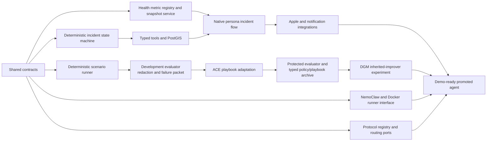

# Vital Relay Implementation Plan

**Source:** `proposal/proposal-final.md`  
**Git worktree execution map:** [worktree-plan.md](worktree-plan.md)  
**Progress ledger:** [progress.md](../progress.md)  
**Implemented slices:** [Scalar health metric ingestion](../docs/implementation-slices/01-health-metric-ingestion.md), [health capabilities/snapshots](../docs/implementation-slices/02-health-capabilities-snapshots.md), [PostgreSQL health persistence/retention](../docs/implementation-slices/03-postgres-health-persistence.md), [the real incident core](../docs/implementation-slices/04-incident-core.md), [PostGIS responder discovery/durable dispatch](../docs/implementation-slices/05-postgis-dispatch.md), [fixed versioned first-aid protocol presentation](../docs/implementation-slices/06-fixed-protocol-presentation.md), [single-app native persona live views](../docs/implementation-slices/07-native-persona-live-views.md), [allowlisted responder notifications](../docs/implementation-slices/08-allowlisted-responder-notifications.md), [incident resolution/assignment revocation](../docs/implementation-slices/09-incident-resolution-assignment-revocation.md), [authenticated persona sessions/active-incident discovery](../docs/implementation-slices/10-authenticated-persona-sessions-active-incident-discovery.md), [agent runtime/sandbox foundation](../docs/implementation-slices/10-agent-runtime-sandbox-foundation.md), [agent policy/tool-proxy foundation](../docs/implementation-slices/agent-a2-policy-tool-proxy-foundation.md), [offline evolution laboratory foundation](../docs/implementation-slices/11-evolution-laboratory-foundation.md), [live Core Location manual SOS](../docs/implementation-slices/11a-live-core-location-manual-sos.md), [real foreground HealthKit scalar ingestion](../docs/implementation-slices/11b-live-healthkit-ingestion.md), and [live sandboxed coordination](../docs/implementation-slices/agent-a3-live-sandboxed-coordination.md)\
**Next code slice:** Wave 3 — execute a same-budget ACE improvement round and wire operator promotion/rollback evidence\
**Delivery window:** 48-hour hackathon  
**Assumed team:** Three engineers  
**Current repository state:** The integrated tree contains the operational product through Slice 11C and all six Wave 2 lanes. One native app securely enrolls/restores a community, responder, or command session; acquires real foreground Core Location for manual SOS; reads stored HealthKit context; runs user-started live Watch workout/pedometer telemetry; and ingests genuine `CMFallDetectionManager` callbacks through durable WatchConnectivity, bounded Always-authorized iPhone location, and the authenticated wearable-event API. The backend supports operator-selected NemoClaw or content-locked Docker, live/static routing, fixed protocols, and durable agent runs. The trusted offline ACE host now provides verified merge/storage, redacted Reflector/Curator clients, complete attested candidate bundles, mandatory bounded Generator context, protected/final partitions, and regenerated signed baselines. Signed physical-device Apple evidence, live NemoClaw/vLLM/TLS/denial evidence, a complete model-generated improvement round, paired ACE comparison, durable production activation, and inherited-improver execution remain open.\
**Primary objective:** Keep one end-to-end incident demo runnable throughout the hackathon, then layer the advanced goals onto stable interfaces

---

## 1. Delivery strategy

### 1.1 Build a modular monolith, not microservices

Use one FastAPI backend containing clearly separated modules for events, incidents, tools, notifications, routing, protocols, the coordination agent, and evolution. Run the scenario evaluator and evolution loop as CLI/background entry points from the same Python package.

This provides clean boundaries without spending hackathon time on service discovery, queues, deployment coordination, or multiple backend repositories.

The complete runtime has three deployable pieces:

1. One Apple Watch + iPhone Vital Relay application with credential-scoped
   community, responder, and command personas.
2. FastAPI backend and evolution CLI.
3. PostgreSQL/PostGIS.

vLLM and NemoClaw/OpenShell are infrastructure dependencies, not additional product services. Docker is the predefined sandbox fallback.

### 1.2 Maintain two parallel critical paths



- **Operational path:** event → verification → incident → responder → route/protocol → timeline.
- **Improvement path:** scenario → trace → evaluation → mutation → archive → promotion.
- **Platform path:** PostGIS, sandbox, model endpoint, routing, and secrets.

The paths join through shared contracts and the active agent-version pointer. The evolution harness should evaluate the same state machine and tools used by the live path, with fake adapters and a virtual clock.

### 1.3 Implement fallbacks behind interfaces from the start

Do not add fallbacks after preferred integrations fail. Define each preferred and fallback implementation behind the same port:

| Port | Preferred adapter | Fallback adapter |
|---|---|---|
| `FallEventSource` | `AppleFallEventSource` | First-party `ManualSOSSource` while entitlement access is pending |
| `HealthMetricSource` | HealthKit + workout + Core Motion adapters | Capability-aware absence; fixtures are test inputs, not a deployed source |
| `AgentRunner` | `NemoClawAgentRunner` | `DockerAgentRunner` |
| `ResponderRepository` | `PostGISResponderRepository` | Seeded static coordinates still queried through PostGIS |
| `RoutingProvider` | `MapboxWalkingRoutingProvider` | `StaticVenueRoutingProvider` |
| `NotificationProvider` | Twilio SMS or APNs | `InAppNotificationProvider` |
| `Coordinator` | `DeepAgentCoordinator` | `DeterministicCoordinator` |
| `ProtocolContentProvider` | Protected local protocol content | Source-link-only record |

### 1.4 Non-negotiable engineering rules

- The backend state machine is authoritative.
- The LLM cannot create an incident or bypass a state transition.
- The sandbox never receives database, Twilio, Mapbox, or APNs credentials.
- External actions go through a backend tool proxy with state checks and idempotency.
- Replayed input is marked `simulated: true` at creation and cannot be relabeled later.
- Replay fixtures remain confined to contract/scenario verification and are not
  accepted by the real Slice 04 incident endpoint.
- Collect every user-authorized metric in the incident-relevant health-data allowlist when the current device, region, settings, and HealthKit store provide it.
- Label health values by acquisition class (`live`, `recent_context`, or `user_initiated`) and always include the sample timestamp and source.
- No optional health or wellness metric independently opens or escalates an incident; manual SOS, fall event, explicit help request, and verification timeout remain the only escalation inputs.
- Missing HealthKit results are represented as `no_visible_sample`, never inferred to mean the person denied permission or has no underlying data.
- First-aid files, evaluator code, hidden scenarios, safety constraints, and promotion logic are read-only to candidates.
- ACE adaptation uses only synthetic development traces and explicitly consented, redacted rehearsal traces. Live incidents are never learning inputs, and protected/final outcomes never become Reflector or Curator feedback.
- Evolved playbooks may contain only bounded operational tactics. They cannot contain medical guidance, protected health information, participant identity, exact coordinates, secrets, recipient changes, permissions, tool schemas, state transitions, protocol content, or evaluator knowledge.
- Playbook helpful/harmful evidence, delta validation, merge, deduplication, contradiction handling, and pruning are host-owned and deterministic; the model cannot grade or directly activate its own context.
- No code path accepts a real emergency number.
- Every incident, tool call, candidate, and promotion has a stable ID and timestamp.
- The deterministic coordinator remains runnable even after the LLM path is added.

---

## 2. Definition of done

The implementation is complete when a fresh demo reset can execute this sequence reliably:

1. Live Watch heart rate plus every supported live workout metric exposed by the active configuration is visible in the command center.
2. A recent HealthKit context snapshot includes all visible allowlisted heart, respiratory, sleep, activity, mobility, and user-initiated record summaries, each with freshness/source metadata.
3. Core Motion provides derived motion/activity context without uploading a continuous raw sensor stream.
4. The UI shows per-metric availability/freshness plus Apple fall entitlement/authorization status and the active fall-event source.
5. A real Apple fall callback enters the authenticated incident contract when
   entitlement access is available; deliberate manual SOS exercises the real
   operational path without manufacturing a fall.
6. The Watch/iPhone safety check times out or receives a user response.
7. The deterministic state machine opens and advances the incident.
8. The sandboxed agent calls only state-authorized typed tools.
9. PostGIS ranks responders and finds the nearest seeded AED.
10. One responder declines and another accepts.
11. The accepted responder receives an exact location, walking route, role, and immutable sourced protocol.
12. The designated demo contact receives exactly one allowlisted notification.
13. The simulated dispatcher and timeline update in real time.
14. A baseline scenario failure is evaluated reproducibly.
15. ACE turns a redacted development failure into a typed, content-addressed playbook delta, and a paired same-budget comparison reports whether it safely beats the static baseline.
16. A typed policy mutation improves the protected validation result without failing a hard gate.
17. Agent N creates Agent N+1 with a different improver hash, and N+1's inherited improver creates N+2.
18. The original and inherited improvers are compared with the same seeds and proposal budget.
19. An operator promotes a hashed policy/playbook candidate and can roll back to the previous active version.
20. Routing, model, and preferred sandbox outages have working fallbacks.
21. The five-minute script succeeds in at least five consecutive rehearsals after a clean reset.

---

## 3. Prerequisites to resolve before feature work

These are external or environment prerequisites. Start them immediately because engineering effort cannot remove their lead time.

### 3.1 Apple

- Confirm access to an Apple Developer team.
- Submit the Fall Detection Notifications entitlement request for the final bundle identifier.
- Confirm physical iPhone and Apple Watch availability and pairing.
- Confirm the Watch supports fall detection and the team can sign/install a watchOS app.
- Inventory the exact Watch model, iPhone model, OS versions, region, and enabled Health features; these determine which metrics can produce samples.
- Add `NSHealthShareUsageDescription`, `NSHealthUpdateUsageDescription` only if the app writes workout data, `NSMotionUsageDescription`, and `NSFallDetectionUsageDescription` with accurate explanations.
- Review the HealthKit read allowlist with the team and request only incident-relevant data rather than nutrition, reproductive health, medications, or clinical records.
- Create the watchOS and iOS targets with stable bundle IDs before submitting the entitlement.
- Do not plan to produce a real fall event physically. The entitlement path is implemented and observed if an event safely occurs; the demo uses replay otherwise.

### 3.2 Model and sandbox

- Confirm the AI workstation hardware and the exact local model.
- Start vLLM separately and verify `/v1/models` plus one structured tool-call response.
- Install/onboard NemoClaw with the LangChain Deep Agents runtime.
- Confirm Docker is installed before NemoClaw onboarding so the fallback is already available.
- Record the local inference endpoint and maximum acceptable response latency.

### 3.3 External integrations

- Provision PostgreSQL with PostGIS.
- Obtain a Mapbox token restricted to the required APIs and allowed origins.
- Choose the real notification path: Twilio SMS is the recommended hackathon default; in-app notification remains mandatory as fallback.
- Create a strict recipient allowlist containing only consenting team/demo numbers or devices.
- Review first-aid source usage and reproduction rights. If rights are unclear, store metadata and authoritative links rather than copying content.

### 3.4 Toolchain decision

The repository currently runs the FastAPI, SQLAlchemy, Alembic, psycopg,
GeoAlchemy2, and test stack on pinned Python 3.14. Keep vLLM and later agent
dependencies in their own supported environment or container if their Python
constraints diverge from the operational backend.

Recommended remaining toolchain:

- Python backend managed with `uv`.
- Docker Compose for PostgreSQL/PostGIS and local dependencies.
- Alembic for database migrations.
- pytest for backend, scenario, and safety tests.
- Xcode-managed Swift packages for Apple targets.

---

## 4. Target repository structure

```text
vital-relay/
  apps/
    apple/
      VitalRelay.xcodeproj
      WatchApp/
      iPhoneApp/
      Sources/VitalRelayFeature/
      Shared/
        HealthMetric.swift
        HealthSnapshot.swift
        HealthDataManager.swift

  backend/
    src/vital_relay/
      api/
      domain/
        events.py
        incidents.py
        state_machine.py
        policies.py
      application/
        incident_service.py
        coordinator.py
        tool_proxy.py
      adapters/
        postgis.py
        routing_mapbox.py
        routing_static.py
        notifications_twilio.py
        notifications_in_app.py
        health_ingestion.py
      agent/
        deep_agent.py
        deterministic.py
        runner.py
      protocols/
        registry.py
        selector.py
      health/
        metric_registry.py
        snapshot.py
        freshness.py
      evolution/
        candidate.py
        evaluator.py
        archive.py
        playbook.py
        reflection.py
        curation.py
        context_store.py
        mutation.py
        promotion.py
        dgm_experiment.py
      cli.py
      config.py
    tests/
      unit/
      contract/
      integration/
      safety/
      scenarios/

  contracts/
    json-schema/
    examples/

  protocols/
    manifests/
    content/
    mappings.yaml

  agents/
    baseline/
      manifest.yaml
      coordination_policy.yaml
      playbook.yaml
      prompts/coordinator.md
      improver/reflector_playbook.md
      improver/curator_rules.yaml
      improver/mutation_prompt.md
      improver/failure_categories.yaml

  protected/
    safety_constraints.yaml
    evaluator_config.yaml
    validation_scenarios/
    final_test_scenarios/

  scenarios/
    development/
    demo/

  artifacts/
    agents/
    runs/

  infrastructure/
    compose.yaml
    migrations/
    nemoclaw/
      policy.yaml
    docker-agent/
      Dockerfile
      policy.md

  scripts/
    bootstrap
    demo-reset
    rehearsal-check

  progress.md

  proposal/
    proposal-final.md
    implementation-plan.md
    worktree-plan.md

  .env.example
  Makefile
  README.md
  pyproject.toml
```

Keep generated candidates under `artifacts/` and out of the import path. The active version is resolved through a manifest/DB pointer, not by overwriting the baseline directory.

---

## 5. Contracts to freeze first

### 5.1 Wearable event envelope

Slice 04 freezes one real operational envelope for Apple fall callbacks and
deliberate first-party manual SOS events:

```json
{
  "schema_version": 1,
  "event_id": "uuid",
  "user_id": "demo-user-1",
  "event_type": "fall_detected",
  "source": "apple_fall",
  "simulated": false,
  "observed_at": "2026-07-18T14:32:05Z",
  "device_id": "demo-watch-1",
  "sequence": 42,
  "location": {
    "latitude": 41.8781,
    "longitude": -87.6298,
    "horizontal_accuracy_m": 8.0,
    "captured_at": "2026-07-18T14:32:05Z"
  },
  "payload": {
    "fall_date": "2026-07-18T14:32:05Z",
    "fall_detection_available": true,
    "entitlement_present": true,
    "authorization_status": "authorized"
  }
}
```

Required invariants:

- Product input is always `simulated: false`; the endpoint accepts only
  `apple_fall` and `manual_sos`.
- `apple_fall` requires affirmative availability, entitlement, and authorization
  metadata, and its Apple fall date must equal `observed_at`.
- `manual_sos` requires a deliberate `watch_button` or `iphone_button`
  activation method.
- Both inputs require finite, bounded, timestamped wearer coordinates.
- Server receipt time, incident ID, health snapshot ID, and retention hold are
  authored by the backend and are never trusted request fields.
- `event_id` is the idempotency key at the API and database layers.
- Duplicate Apple callbacks are also deduplicated using scoped user, device, and
  Apple fall date.
- Health metric samples and snapshots do not open or escalate an incident.
- Only manual SOS, explicit `I need help`, an accepted fall event, or verification timeout can advance escalation.
- Replay remains available only to offline scenario/contract tooling and cannot
  enter this real incident endpoint.

### 5.2 Health-data acquisition and freshness contract

Implement a capability-aware `HealthMetricRegistry`. It attempts every metric in the allowlist that the current OS SDK exposes, requests user authorization, queries visible samples, and returns normalized records. No missing metric fails session startup.

#### Live or near-live during the demo workout

| Group | Metrics | Apple API | Handling |
|---|---|---|---|
| Live workout | Heart rate | `HKLiveWorkoutBuilder` | Stream at the update cadence, throttle backend/UI delivery to approximately 1 Hz |
| Live workout | Active energy, basal energy, supported walking/running/cycling/swimming/wheelchair distance | `HKLiveWorkoutDataSource.typesToCollect` | Discover dynamically; never assume a type is collected for every workout/device |
| Workout state | Elapsed time, activity type, session running/paused state | `HKWorkoutSession` / builder | Send state changes and periodic elapsed-time summaries |
| Motion | User acceleration, gravity, rotation rate, attitude | `CMMotionManager` or supported batched manager | Compute on-device one-second features: peak acceleration, variance, stillness, orientation change, and signal quality; do not continuously upload raw high-frequency samples |
| Activity/pedometer | Steps, pedestrian distance, cadence/pace where available, stationary/walking/running/cycling/automotive state | `CMPedometer`, `CMMotionActivityManager` | Treat as contextual activity data and capability-check each service |
| Safety event | Authorized fall event | `CMFallDetectionManager` | Event input to verification, separate from motion-derived context |

#### Recent HealthKit context

Query these values at monitoring-session start, refresh when HealthKit reports changes, and capture a snapshot when an incident opens:

| Category | Allowlisted metrics | Retrieval and presentation |
|---|---|---|
| Heart context | Resting heart rate, walking heart-rate average, HRV SDNN, one-minute heart-rate recovery | Latest visible sample plus timestamp, unit, source, and age |
| Heart events | High-heart-rate event, low-heart-rate event, irregular-rhythm event, AFib burden when the type is supported and a sample is visible | Recent event/estimate summary only; never reinterpret as a diagnosis |
| Respiratory/wellness | Respiratory rate and oxygen saturation | Latest visible sample; label as stored context rather than live telemetry; display Apple's wellness limitation for blood oxygen |
| Sleep | Last completed sleep session, sleep stages/duration, sleeping wrist temperature, and sleeping breathing-disturbance values when supported | Aggregate the last completed sleep period; include source and sample time |
| Activity | Step count, active energy, walking/running distance, flights climbed, recent workouts, current-day Move/Exercise/Stand activity summary | Current-day aggregate plus latest workout metadata |
| Mobility | Walking speed, step length, walking asymmetry, double-support percentage, stair ascent/descent speed, and walking steadiness when visible | Latest value and recent trend summary; context only |
| Fall history | Number-of-times-fallen samples | Recent stored history; not a substitute for the real-time fall callback |
| ECG | Latest saved Apple Watch ECG metadata: recorded date, duration, sampling frequency, classification, symptoms status, and average HR when visible | Read-only, user-initiated historical record; do not upload voltage waveform by default and never call it live ECG |
| Connected-source vitals | Blood pressure correlation, body temperature, blood glucose, body mass, and BMI when the user explicitly enables expanded context and a compatible source has written samples | Optional second authorization group; always show source/timestamp and never use for automatic escalation |

Do not request nutrition, reproductive-health, medication, audiogram, clinical-record, or unrelated HealthKit categories for the hackathon. “Pull everything available” means every visible value in this incident-relevant registry, not every HealthKit type Apple defines.

#### Availability semantics

HealthKit deliberately does not reveal whether the user denied read access to a particular type. Use only these statuses:

```text
unsupported          The SDK/device reports that the type or service is unavailable.
not_requested        The app has not presented the relevant authorization request.
requested_no_sample  Authorization was requested, but no sample is visible to the app.
available            At least one visible sample was normalized successfully.
error                A query or normalization error occurred; include a non-sensitive error code.
```

Never display `permission_denied` for HealthKit read data. `requested_no_sample` may mean no underlying data, denied access, or time-limited authorization.

Represent these states in `HealthCapabilities` and `HealthSnapshot`; do not synthesize a numeric `HealthMetric` when no visible sample exists.

#### Normalized scalar health metric transport

The first frozen transport contract covers visible scalar observations. The client supplies observation and source time; the backend adds authoritative `server_received_at` to its stored record and batch result.

```json
{
  "schema_version": 1,
  "metric_id": "uuid",
  "user_id": "demo-user-1",
  "metric_type": "respiratory_rate",
  "acquisition_class": "recent_context",
  "value": 16.0,
  "unit": "count/min",
  "observed_at": "2026-07-18T08:10:00Z",
  "source": "apple_healthkit",
  "source_kind": "apple_healthkit",
  "source_name": "Apple Watch",
  "source_bundle_id": "com.apple.health",
  "device_model": "optional-redacted-model",
  "simulated": false,
  "quality": null,
  "used_for_escalation": false
}
```

Raw ECG voltage and raw high-frequency motion types are forbidden by this contract. Structured records such as sleep, ECG metadata, activity summaries, and blood-pressure correlations receive separate typed schemas rather than being forced into a scalar or an arbitrary `components` object.

#### Health snapshot

Create `HealthSnapshot` at three points:

1. Monitoring session start.
2. Incident creation.
3. Responder acceptance or manual operator refresh.

The snapshot combines the latest visible scalar metric per type, typed structured records, and `HealthCapabilities`. It preserves timestamp, age, acquisition class, availability, and source. It must also contain:

- `captured_at`;
- `live_metric_types` discovered for the active workout configuration;
- `available_metric_types` and `requested_no_sample_metric_types`;
- authorization-window start dates when HealthKit exposes limited historical access;
- explicit `used_for_escalation: false` for all optional context metrics.

Freshness labels are display/transport rules, not medical thresholds:

| Label | Meaning |
|---|---|
| `live` | Delivered by the active workout/motion session and currently updating |
| `recent` | Visible stored sample falls within the configured per-type display window |
| `historical` | Visible sample exists but is older than the display window |
| `unavailable` | Unsupported or no sample visible |

Every UI value shows its observed time or age; never show an old value as current.

#### Query and transport strategy

- Use `HKLiveWorkoutBuilder` only for types in its actual `typesToCollect` set.
- Use `HKAnchoredObjectQuery` for initial snapshots and incremental saved-sample changes where the sample type supports it; use the purpose-built HealthKit query for activity summaries, ECG records, and other specialized types.
- Use `HKObserverQuery`/background delivery only as a change notification; follow it with an anchored/sample query to obtain data.
- Persist anchors on-device per sample type.
- Respect limited historical authorization by querying only from the earliest authorized date when provided.
- Batch recent-context updates and send only changed normalized metrics.
- Keep raw ECG voltage and raw high-frequency motion on-device by default.
- Retain backend health snapshots only for the demo session and remove them through `demo-reset`.

### 5.3 Incident state machine

| Current state | Input | Next state | Side effects permitted |
|---|---|---|---|
| `MONITORING` | health metric sample/batch | `MONITORING` | Store normalized values and throttle live UI updates; no escalation |
| `MONITORING` | fall detected | `VERIFYING` | Create check-in with authoritative expiry |
| `MONITORING` | manual SOS | `ESCALATING` | Open incident immediately |
| `VERIFYING` | `I_AM_OKAY` | `RESOLVED` | Log false alarm; no external notifications |
| `VERIFYING` | `I_NEED_HELP` | `ESCALATING` | Enable coordination tools |
| `VERIFYING` | timeout | `ESCALATING` | Enable coordination tools |
| `ESCALATING` | responder accepts | `RESPONSE_ACTIVE` | Reveal exact location; allow route/protocol tools |
| `ESCALATING` | cancellation | `RESOLVED` | Cancel invitations and log resolution |
| `RESPONSE_ACTIVE` | close/handoff | `RESOLVED` | Append resolution receipt, transition/timeline, and accepted-assignment revocation atomically |

Every transition is a database transaction that writes both current state and an append-only transition record.

### 5.4 Core domain ports

Define Python protocols/interfaces before adapters:

```text
FallEventSource.emit() -> WearableEvent
HealthMetricSource.capabilities() -> HealthCapabilities
HealthMetricSource.snapshot() -> HealthSnapshot
HealthMetricSource.observe(handler) -> HealthMetricUpdate
ResponderRepository.find_nearby(query) -> RankedResponders
AEDRepository.find_nearest(location) -> AEDResult
RoutingProvider.route(origin, destination, profile) -> RouteResult
NotificationProvider.send(template, recipient) -> DeliveryResult
ProtocolRegistry.select(observations, incident_type) -> ProtocolRecord
Coordinator.coordinate(incident_summary, allowed_tools) -> CoordinationTrace
AgentRunner.run(bundle, request, tool_endpoint) -> AgentRunResult
Clock.now()/advance() -> timestamp
```

Inject `Clock`, routing, notification, responder, and model adapters. The scenario evaluator uses a virtual clock and scripted adapters so hundreds of runs do not wait on real countdowns or networks.

### 5.5 Backend API

Minimum public endpoints:

| Endpoint | Purpose |
|---|---|
| `POST /v1/persona-sessions` | Exchange an operator-issued persona enrollment bootstrap for an installation-bound access/refresh session |
| `GET /v1/persona-sessions/current` | Revalidate the current access session and durable account |
| `POST /v1/persona-sessions/{session_id}/rotation` | Replace only the short-lived access token using the refresh credential |
| `DELETE /v1/persona-sessions/{session_id}` | Revoke a session idempotently using the refresh credential |
| `GET /v1/community/incidents/active` | Discover only the community account's active incident locators |
| `GET /v1/responders/me/incidents/active` | Discover only this responder's pending/accepted incident locators |
| `GET /v1/command/incidents/active` | Discover active incident locators in the command account's demo scope |
| `POST /v1/wearable/events` | Idempotent event ingestion |
| `POST /v1/health/metrics:batch` | Idempotent normalized live/recent health-metric ingestion |
| `POST /v1/health/snapshots` | Store a bounded monitoring/incident snapshot |
| `GET /v1/users/{user_id}/health-context` | Load redacted latest context and availability/freshness metadata |
| `POST /v1/demo/replays/{scenario_id}/start` | Start a visibly labeled demo replay |
| `GET /v1/incidents/{incident_id}` | Load command-center state |
| `POST /v1/incidents/{incident_id}/check-in` | Record Watch/iPhone response |
| `POST /v1/incidents/{incident_id}/responders/{responder_id}/response` | Accept or decline invitation |
| `POST /v1/incidents/{incident_id}/observations` | Record responder-observed protocol inputs |
| `POST /v1/incidents/{incident_id}/resolution` | Idempotently close or record an external handoff through the state machine |
| `GET /v1/incidents/{incident_id}/timeline` | Read ordered audit events |
| `GET /v1/system/readiness` | Show model, sandbox, DB, routing, notification, and entitlement status |
| `WS /v1/ws/incidents/{incident_id}` | Stream timeline and state changes |

Admin/evolution endpoints may remain CLI-only until the evaluator works. Add only what the dashboard needs:

| Endpoint | Purpose |
|---|---|
| `GET /v1/admin/evolution/archive` | List candidate nodes and metrics |
| `GET /v1/admin/evolution/agents/{agent_id}` | Load manifest, hashes, diff, and scores |
| `POST /v1/admin/evolution/agents/{agent_id}/promote` | Operator-approved atomic promotion |
| `POST /v1/admin/evolution/rollback` | Restore previous active version |

Internal tool endpoints must be on a separate router and require a short-lived incident-scoped token. They are not exposed to browsers.

### 5.6 Database model

Minimum tables:

- `persona_accounts`
- `persona_sessions`
- `wearable_events`
- `health_metrics`
- `health_snapshots`
- `health_snapshot_items`
- `health_capabilities`
- `incidents`
- `incident_transitions`
- `incident_timeline`
- `responders`
- `responder_skills`
- `responder_locations`
- `aed_sites`
- `responder_invitations`
- `responder_assignments`
- `notifications`
- `tool_calls`
- `protocol_presentations`
- `agent_versions`
- `agent_edges`
- `scenario_runs`
- `promotion_events`
- `runtime_config`

Use `geography(Point, 4326)` plus GiST indexes for responder and AED locations. Search with `ST_DWithin`, then order by distance. Keep exact wearer coordinates inside the backend; pre-acceptance notifications receive only approximate distance. Exact coordinates become available to the accepted responder's signed incident view.

Store normalized summaries, not raw ECG waveforms or continuous raw accelerometer/gyroscope streams. Index health metrics by `(user_id, metric_type, observed_at)` and snapshots by incident/session. `demo-reset` deletes health context and derived motion features from the backend.

### 5.7 Candidate bundle and protected boundary

Mutable candidate bundle:

```text
manifest.yaml
coordination_policy.yaml
playbook.yaml
playbook_delta.json
prompts/coordinator.md
improver/reflector_playbook.md
improver/curator_rules.yaml
improver/mutation_prompt.md
improver/failure_categories.yaml
```

Protected and mounted read-only:

```text
state machine
health metric registry, normalization rules, and the rule that optional context cannot escalate
tool schemas and policy proxy
recipient allowlists
notification credentials
first-aid manifests and content
safety constraints
validation/final expected outcomes
evaluator code
promotion logic
historical scores and lineage edges
ACE host merge/validation code and host-owned helpful/harmful evidence
```

Compute separate hashes for the complete agent bundle, policy, playbook, delta log,
Generator/Reflector/Curator role configuration, model identity, and improver subset.

---

## 6. User experiences to implement

### 6.1 Apple Watch

- Discover the live workout types actually available for the current device and session, then display and transport all supported allowlisted values rather than assuming heart rate is the only signal.
- Include heart rate, active/basal energy, distance, elapsed workout state, and any additional relevant type returned by `HKLiveWorkoutDataSource.typesToCollect`.
- Derive compact one-second motion features from acceleration, gravity, rotation, and attitude when Core Motion is available; do not upload continuous raw motion streams.
- Include pedometer-derived steps, distance, cadence, pace, and motion/activity state when supported.
- Manual SOS.
- Full-screen safety check with `I'm okay` and `I need help`.
- Countdown based on backend `expires_at`, not only a local timer.
- Haptic feedback.
- Connection/offline indicator.
- Per-source capability, authorization-requested, last-sample, and freshness status without claiming that a missing read proves permission was denied.
- Fall authorization and availability status.

### 6.2 iPhone

- Own the normalized backend transport and offline retry queue.
- Own a central `HealthMetricRegistry` and staged HealthKit authorization flow for the incident-relevant allowlist.
- Query the latest available heart, respiratory, sleep, activity, mobility, fall-history, and user-initiated record summaries; send a snapshot at monitoring start and incident creation.
- Use anchored queries for incremental stored-data updates, persist anchors by metric type, and use observer queries only as change notifications followed by a data query.
- Normalize units, observation time, source device/app, acquisition class, availability, and freshness for every value.
- Keep ECG access to saved-record metadata/summary by default; never represent it as a live ECG stream and do not upload raw waveforms.
- Mirror the Watch check-in when the Watch is unavailable.
- Show active data source and `REPLAYED` badge.
- Provide a developer/demo menu for approved replay scenarios.
- Forward Watch events through the exact shared Codable model.

### 6.3 Single native role-based application

Use one native Vital Relay binary with a persona-aware composition root and
separate credential/state graphs:

- **Community/wearer:** monitoring, health context, safety check, SOS, and a
  privacy-redacted responder relay.
- **Responder:** only the authenticated responder's approximate invitation,
  accept/decline, then exact map/static route and fixed protocol after the
  backend confirms acceptance.
- **Command:** authoritative incident state/version, location, responder and AED
  coordination, timeline, protocol audit metadata, readiness, and later
  dispatcher/evolution controls.

Persona selection never grants authority locally. Each graph uses a
server-validated credential scoped to its role, discards all state when the
account changes, and cannot decode another persona's sensitive payloads. Slice
10 implements operator-provisioned persona accounts, installation-bound opaque
access/refresh sessions, rotation/revocation, secure native restore, and
role-scoped active discovery. Product APIs transport the session access token
through their existing typed community/command or responder headers. A
production identity provider, attestation, account recovery, and remote device
administration remain later security work.

---

## 7. Workstreams and ownership

| Workstream | Primary owner | Secondary owner | Deliverables |
|---|---|---|---|
| Apple | Person A | Person B for API contract | Live workout metrics, recent HealthKit context, derived motion/pedometer features, fall adapter, safety check, replay parity |
| Incident platform | Person B | Person C for tools | FastAPI, health ingestion/context, state machine, DB, PostGIS, routing, notifications, timeline |
| Native persona experience | Person B | Person A for UX testing | One iOS app with isolated community, responder, command, dispatcher, and evolution views |
| Agent and sandbox | Person C | Person B for proxy | Deep Agent, deterministic fallback, NemoClaw/Docker runners, policy tests |
| ACE, evolution, and DGM | Person C | Person B for persistence | Scenarios, evaluator, playbook reflection/curation, mutation, archive, lineage, promotion |
| Demo and QA | Shared | Product/demo lead if available | Script, source labels, measured results, reset and fallback rehearsals |

Avoid file conflicts by assigning primary ownership at the directory level. Shared contracts are reviewed by all three people before implementation branches diverge.

---

## 8. Phase-by-phase execution plan

### Phase 0 — De-risk and freeze contracts (hours 0-4)

#### P0-1: Bootstrap the repository

**Owner:** Person B  
**Tasks:**

- Create backend package, tests, the native Apple target, infrastructure
  directory, `.env.example`, Makefile, and README.
- Add FastAPI, Pydantic, SQLAlchemy, Alembic, psycopg, GeoAlchemy2, pytest, pytest-asyncio, httpx, and structured logging.
- Add Docker Compose PostGIS service and health check.
- Create commands such as `make dev`, `make test`, `make demo-reset`, and `make evaluate`.

**Acceptance:** API and PostGIS start from documented commands; one health endpoint and one database migration pass.

#### P0-2: Freeze contracts

**Owner:** Shared  
**Tasks:**

- Implement Pydantic models and JSON Schema for health metrics, health capabilities, health snapshots, events, incidents, transitions, tools, protocols, scenarios, mutations, and results.
- Commit representative JSON fixtures, including partial availability, stale samples, multiple source devices, and no-visible-sample cases.
- Write invariant tests for metric units/acquisition class/availability, `source`, `simulated`, idempotency, and allowed state transitions.
- Use the health and event fixtures to verify the shared Swift `Codable`
  contracts consumed by each native persona graph.

**Acceptance:** The same fixture validates in Python, Swift unit tests, and TypeScript/runtime validation, or discrepancies are documented before parallel work begins.

#### P0-3: Submit entitlement and create Apple skeleton

**Owner:** Person A  
**Current status:** Slices 11B/11C and the live Watch lane enable HealthKit,
provide the usage descriptions and staged scalar registry, expose fall
authorization/readiness, and wire the genuine callback through durable transfer
and authenticated ingestion. Apple entitlement approval, provisioning, and a
signed paired-device callback remain external evidence.

**Tasks:**

- Fix bundle IDs and submit Apple's entitlement request.
- Add HealthKit and fall-detection usage descriptions plus a staged authorization UI skeleton.
- Create the incident-relevant HealthKit type registry, while checking type and feature availability at runtime.
- Add Core Motion and pedometer capability discovery so unsupported hardware produces explicit status instead of errors.
- Define `FallEventSource` with Apple and replay implementations.

**Acceptance:** Entitlement request status is recorded; both adapters compile even if the real entitlement is pending.

#### P0-4: Sandbox/model spike

**Owner:** Person C
**Current status:** The merged Agent A1/A2 foundations provide normalized Deep
Agent contracts, vLLM/NemoClaw readiness checks, deny-by-default NemoClaw and
Docker profiles, typed tool policy/capability enforcement, and focused static
tests. No real model is serving and neither containment path has completed the
live parity/denial evidence gate on this machine.

**Tasks:**

- Verify vLLM model listing and one structured response.
- Onboard a Deep Agents NemoClaw sandbox.
- Build a minimal Docker runner using the same request/result contract.
- Prove candidate filesystem isolation with a harmless denied read/write test.

**Acceptance:** At least one runner completes a hello/tool-schema request, and the fallback runner is not merely theoretical.

#### P0-5: Baseline scenario

**Owner:** Person C  
**Current status:** The merged offline evolution laboratory has virtual time,
frozen scripted tool responses, a reproducible recorded baseline, and the full
planned catalog: 12 development, 6 protected, and 4 final scenarios. It remains
an offline evaluator, not a production coordinator.

**Tasks:**

- Create `fall_timeout_responder_accepts.yaml`.
- Implement a virtual clock, fake responder repository, fake notification provider, and deterministic coordinator skeleton.
- Produce a stable trace and score.

**Gate G0:** Do not leave hour 4 without frozen event/state/tool contracts and one deterministic scenario result.

---

### Phase 1 — Deterministic vertical slice (hours 4-12)

#### P1-0: Health ingestion and context service

**Owner:** Person B  
**Dependencies:** P0-2  
**Current status:** Implemented and verified through Slices 01–03.  
**Tasks:**

- Add migrations and batch endpoints for metric samples, source capabilities, and snapshots.
- Normalize unit, observation time, source, acquisition class, availability, and freshness without inventing values for missing samples.
- Build latest-context queries grouped by heart, respiratory, sleep, activity, mobility, fall history, and user-initiated records.
- Apply field-level redaction so responders and agents receive only the bounded summaries required for the active incident.
- Implement the demo retention window and deletion as part of `demo-reset`.
- Keep all optional health metrics out of state-transition guards and escalation conditions.

**Acceptance:** Fixtures covering supported, unsupported, stale, missing, and mixed-source data ingest idempotently; the latest-context API returns correct freshness labels; changing any optional wellness value cannot trigger or suppress escalation.

#### P1-1: State machine and incident service

**Owner:** Person B  
**Dependencies:** P0-2  
**Current status:** Incident creation/check-in/timeout is complete from Slice 04;
Slice 09 adds the terminal active-response command and assignment revocation.
The real endpoint accepts Apple fall/manual SOS only, not replay.
**Tasks:**

- Implement transition table and transactional transition writer.
- Make check-in expiry authoritative in the backend.
- Add duplicate-event handling and append-only timeline events.
- Add authenticated Apple fall/manual SOS ingestion endpoints; keep replay in
  offline scenario tooling rather than the real incident API.
- Accept strict idempotent `close`/`handoff` requests only from
  `response_active`, with one server timestamp and one transaction for the
  resolved incident, transition, timeline, exact receipt, and append-only
  accepted-assignment revocation.
- Preserve command incident/timeline/protocol audit reads after resolution
  while keeping the command dispatch view active-state-only and denying revoked
  responder exact-dispatch/protocol reads with a privacy-preserving `404`.

**Acceptance:** The frozen policy rejects forbidden transitions; duplicate event
or resolution submission has one durable effect; the persistent timeout
advances exactly once after restart; concurrent resolution attempts produce one
winner; revoked responder exact access ends without deleting command audit; and
optional health context cannot affect the result.

#### P1-2: PostGIS responder and AED search

**Owner:** Person B  
**Dependencies:** P0-1  
**Current status:** Implemented and verified in Slice 05.  
**Tasks:**

- Create scope-bound responder, skill, availability, location, AED, invitation,
  decision, and assignment persistence in Alembic revision
  `0003_postgis_dispatch`.
- Store responder/AED points as `geography(POINT, 4326)` with explicit GiST
  indexes; use `ST_DWithin` and `ST_Distance` for fresh qualified responder
  ranking and PostGIS nearest-AED selection.
- Provide the explicit `seed-response-network` CLI for two Chicago Loop demo
  responders and two AEDs. Rotate high-entropy responder tokens on each seed,
  emit plaintext once, and persist only SHA-256 hashes.
- Persist one pending invitation at a time, idempotent accept/decline receipts,
  the `escalating -> response_active` transition, and one immutable assignment.
- Redact wearer and responder coordinates before acceptance; expose only coarse
  distance bands. Authenticate accepted-responder reads with the responder-bound
  active token before releasing the exact wearer location, and serve the
  assignment from its immutable acceptance snapshot.
- Persist a two-leg `static_venue` plan from responder to AED to wearer. Treat
  its straight-line distance and walking estimate as a hackathon venue handoff,
  not live or turn-by-turn routing.

**Acceptance:** One real PostgreSQL/PostGIS API flow ranks the correct responders
and AED, excludes stale/unavailable/unqualified responders, advances decline to
the next invitation idempotently, accepts once, protects exact location by
responder token, persists the two route legs, and verifies the PostGIS extension
and both spatial indexes. It also proves AED edits cannot rewrite an accepted
snapshot, responder deactivation revokes the exact read, and a data-bearing
downgrade reconciles the incident. The focused Slice 05 file passes `2` tests; the full
PostgreSQL/PostGIS suite passes `35` tests.

#### P1-3: Fixed protocol registry

**Owner:** Person B  
**Current status:** Product registry and presentation complete and verified in
Slice 06. Candidate filesystem isolation remains later NemoClaw/evolution work.  
**Tasks:**

- Freeze source, step, fixed-protocol, and presentation contracts with no
  diagnosis, health-value, observation, prompt, or generated-text fields.
- Package `fall-response` `1.0.0` and `manual-sos-response` `1.0.0` with fixed
  ordered steps, disclaimers, and source-visible Red Cross, NHS, and AHA links.
- Map only the persisted `IncidentKind`; responder observations, optional health
  context, routing, and LLM output cannot change the protocol.
- Pin SHA-256 digests in an append-only ID/version catalog separate from the raw
  JSON and active `IncidentKind` mapping; reread/recompute/validate content at
  startup, selection, and presentation. Unknown, missing, modified, malformed,
  or identity-mismatched content fails closed while stored older versions remain
  exactly loadable after future active-mapping changes.
- Add revision `0004_protocol_presentations` and atomically insert one complete
  append-only presentation snapshot with the exact accepted assignment. Backfill
  existing accepted assignments from protected exact versions and use a database
  trigger to enforce incident kind plus accepted/presented timestamp.
- Expose device-authenticated command and active assigned-responder reads; an
  application restart returns the identical stored presentation. Treat an
  accepted assignment without a presentation as integrity failure.

**Acceptance:** `make test` passes `88` checks and the full real PostgreSQL/
PostGIS suite passes `35`; the focused dispatch/protocol file passes `2`. Tests
prove exact kind mapping, ordered source-visible content, independent raw-byte
hash validation, fail-closed unknown/modified identities, atomic presentation
persistence, active responder authorization, restart-stable reads, and identical
revision-0003 backfill after downgrade/upgrade.

**Honesty boundary:** Digest-pinned product integrity and content-locked sandbox
source staging are complete. Real Docker/NemoClaw protected-file denial remains
an external runtime evidence gate; candidate/model/mutation code is required to
stay outside the accepted trusted evaluator host.

#### P1-4: Deterministic tool proxy and coordinator

**Owner:** Person C  
**Tasks:**

- Implement the complete typed tool catalog against backend application services.
- Add state permission, idempotency, allowlist, timeout, and audit middleware.
- Implement the deterministic coordinator sequence for fall/no-response.

**Acceptance:** A replay incident reaches responder invitation, acceptance, AED assignment, protocol presentation, simulated dispatch, and resolution without an LLM.

#### P1-5: Basic command and responder UI

**Owner:** Person B  
**Current status:** Slice 07 supplies the redacted wearer and separately
authenticated command/responder graphs. Slice 09 adds command close/handoff
confirmation and immediate responder teardown of revoked exact data.
**Tasks:**

- Build the native command-center state/timeline experience.
- Build the native accept/decline flow with a responder-scoped credential.
- Let command confirm a typed close or external handoff only for an
  authoritative active response, reusing the pending resolution identity on
  retry.
- Revalidate the responder projection before committing exact route/protocol
  data and clear cached exact data immediately on resolution or revoked access.
- Compose community, responder, and command access profiles in one iOS binary
  without sharing persona state or credentials.
- Add `DEMO SYSTEM` and `REPLAYED INCIDENT` labels.
- Use polling as the reliable baseline; add streaming only after the vertical
  flow is stable.

**Gate G1:** At hour 12, record a deterministic end-to-end run. If it does not work, pause advanced UI and external integrations until it does.

---

### Phase 2 — Apple, agent, sandbox, routing, notification (hours 12-22)

#### P2-1: Apple live data, HealthKit context, and check-in

**Owner:** Person A  
**Current status:** Slice 11B implements foreground stored context for 26
standard scalar quantity types plus four separately opted-in connected-source
quantities. The live Watch lane adds a real watchOS target, user-started
`HKWorkoutSession`/`HKLiveWorkoutBuilder`, independently available bounded
`CMPedometer` features, latest-only WatchConnectivity transport, and
authenticated community-session ingestion. Anchored/observer refresh,
background health delivery, structured sleep/ECG/workout/blood-pressure
records, and signed-device proof remain open.

**Tasks:**

- Start `HKWorkoutSession`/live workout builder, inspect the actual `typesToCollect`, and stream every supported allowlisted live metric rather than hard-coding heart rate.
- Normalize heart rate, active/basal energy, distance, elapsed/session state, and any additional relevant reported type; throttle updates to an appropriate UI/transport cadence.
- Check Core Motion and pedometer availability, derive one-second motion/activity features on-device, and never upload continuous raw sensor streams.
- Request HealthKit access in understandable groups, beginning with live monitoring and adding heart context, respiratory/sleep, activity, and mobility only as needed.
- Query all visible incident-relevant context types from the registry and optionally include connected-source measurements such as blood pressure, temperature, glucose, or body composition only when expanded context is explicitly enabled.
- Implement anchored and observer-query refresh with persisted anchors by type.
- Create a health snapshot at monitoring start and when an incident is created, preserving source, observed time, availability, and freshness.
- Implement WatchConnectivity transfer and iPhone retry queue.
- Build Watch and iPhone check-in views using backend expiry.
- Add manual SOS and source/status indicators.

**Acceptance:** Every available live type and visible recent-context type reaches the backend with a capability/availability status and valid timestamp on physical devices; a check-in response reaches the backend; disconnect/reconnect does not duplicate an incident or metric batch. Unsupported or unavailable data remains clearly absent rather than fabricated.

#### P2-2: Apple fall event path

**Owner:** Person A  
**Current status:** Slice 11C implements availability/readiness,
`CMFallDetectionManager` authorization and callback mapping, stable deduplication,
durable Watch delivery, disposition gating, bounded iPhone location, authenticated
ingestion, restart-safe receipts, and visible native status. Entitlement approval,
signing, and physical paired-device callback/background evidence remain external.

**Tasks:**

- Check `CMFallDetectionManager.isAvailable`.
- Request authorization and set the delegate.
- Map fall date/source/device into `WearableEvent`.
- Deduplicate repeated callbacks.
- Display entitlement and authorization status.
- Validate replay parity through the same adapter boundary.

**Acceptance:** Production path compiles/signs with available entitlements; replay and Apple adapters produce contract-equivalent fixtures except source/simulation metadata. No physical fall is used as a test.

#### P2-3: Deep Agent coordinator

**Owner:** Person C  
**Current status:** The normalized Deep Agent runner, versioned policy,
host-issued bounded capabilities, deny-by-default authenticated tool proxy,
durable runs/leases/audits/idempotency, five production tool schemas, selected
sandbox wiring, and mandatory reviewed Generator context are integrated. Real
local-model/NemoClaw/Docker execution and containment evidence remain external;
failure closes to `manual_required`, with no substitute planner.

**Tasks:**

- Give the agent only a structured incident summary, a redacted health snapshot with source/freshness labels, and the current allowed tool schemas.
- State explicitly that health context is informational: the agent may summarize it but cannot diagnose, reinterpret measurements, or use optional values to authorize escalation.
- Execute tool calls through the backend proxy, not direct adapters.
- Record agent version, tool request/result, latency, and concise explanation.
- Enforce a bounded model timeout and fail closed to `manual_required` without
  automatically running another coordinator or sandbox.

**Acceptance:** Same integration scenario passes with LLM coordination and with forced model outage.

#### P2-4: NemoClaw integration and checkpoint

**Owner:** Person C  
**Current status:** Merged containment profiles and readiness tooling define the
NemoClaw primary path and read-only/non-root Docker fallback with bounded model
gateway routes. The required toolchain/model is not running, so real parity,
protected-file denial, and unlisted-egress denial evidence remain external gates.

**Tasks:**

- Run the agent with deny-by-default filesystem and egress policy.
- Allow only routed inference and the internal tool proxy.
- Keep service credentials on the backend host.
- Add tests for denied protected-file write, denied arbitrary network egress, and missing raw credentials.
- Keep `DockerAgentRunner` on the same request/result contract.

**Checkpoint at hour 18:** If the full incident run is not stable in NemoClaw, select Docker for the stage demo and continue NemoClaw as a recorded/secondary proof. Do not spend the final 30 hours debugging onboarding.

#### P2-5: Routing and notification

**Owner:** Person B  
**Current status:** Static venue routing, bounded live Mapbox-compatible walking
directions, durable source-labelled fallback provenance, the allowlisted APNs
provider path, durable receipts, and native handoff are implemented. Real
provider credentials/request evidence and signed-device delivery remain external.
**Tasks:**

- Keep the completed `StaticVenueRoutingProvider` and persisted two-leg route as
  the explicit no-network baseline.
- Implement Mapbox walking route with strict timeout, response validation, and cache.
- Add automatic selection of the static venue provider on live-route timeout/error.
- Keep the completed APNs adapter restricted to explicitly allowlisted,
  responder-authenticated installations and a fixed generic template.
- Prove the completed APNs path on a signed physical device and configure
  Associated Domains before claiming HTTPS universal-link delivery.

**Acceptance:** The provider-capable notification path now exposes a bounded
responder-scoped receipt and forced provider failures do not block state
progression. Physical display, incident-timeline projection, and live-route
fallback evidence remain open gates.

**Gate G2:** At hour 22, the live/replay incident must work with preferred or declared fallback adapters. Freeze the chosen stage sandbox and notification path.

---

### Phase 3 — Evolution harness and safe promotion (hours 22-34)

#### P3-1: Scenario suite

**Owner:** Person C  
**Current status:** The merged laboratory implements fixed-seed virtual time,
frozen tool worlds, development/protected/final manifest separation, a
byte-reproducible recorded baseline, and the full 12/6/4 scenario target.

**Tasks:**

- Build 10-12 development scenarios covering immediate acceptance, false alarm, timeout, decline then accept, stale location, no skill match, duplicate webhook, route outage, model outage, cancellation, notification failure, and protocol branch selection.
- Build six protected validation scenarios with hidden expected outcomes.
- Build four to six final-test scenarios and freeze them.
- Use fixed seeds and virtual time.

**Acceptance:** Baseline results are deterministic across three repeated runs.

#### P3-2: Protected evaluator

**Owner:** Person C  
**Current status:** Observable trace/world metrics, hard safety gates, bounded
development failure packets, candidate-view redaction, host-signed artifact
integrity, conclusion-template validation, the 12/6/4 catalog, and cadence-gated
final authority are merged under the accepted trusted-offline-host boundary.
Durable multi-process cadence, production secret operations, and a separate
signer/issuer service remain hardening work.

**Tasks:**

- Grade observable state transitions and tool results, never prose.
- Emit direct metrics and hard-gate results.
- Produce bounded failure packets from development runs.
- Prevent candidates from seeing validation/final expected results.
- Run protocol, allowlist, evaluator, and audit-log integrity checks after every candidate.

**Acceptance:** Intentionally invalid candidates fail for protected-path changes, unsafe recipients, duplicate actions, and generated protocol text.

#### P3-2A: ACE operational playbook adaptation

**Owner:** Person C
**Current status:** Immutable playbook/delta/identity contracts, deterministic
merge/store, mandatory bounded Generator selection, the real loopback
OpenAI-compatible Reflector, closed-code redaction, typed Curator, and verified
candidate bundles are implemented. One real local-model improvement round and
the paired same-budget ACE report remain open.

**Tasks:**

- Define immutable `Playbook`, `PlaybookItem`, and `PlaybookDelta` contracts with stable IDs, applicability tags, provenance, versions, and hashes.
- Inject only approved, budget-bounded playbook items selected by incident state, incident kind, and tool tags into the Generator.
- Give the Reflector only a redacted development or consented-rehearsal trace plus a host-produced failure packet; reject live-incident, protected, and final-test feedback.
- Restrict the Curator to typed `ADD`, `REFINE`, `TAG`, and `DEPRECATE` operations. Apply them through deterministic host validation, merge, deduplication, contradiction detection, and pruning.
- Keep helpful/harmful evidence counters host-owned and derived from observable evaluation results, never model self-report.
- Hash and archive the exact input context, selected item IDs, deltas, output playbook, role configuration, and model identity.
- Compare the reviewed static playbook against ACE using the same runner, model, seeds, scenario partitions, and candidate budget.

**Acceptance:** The paired report covers the full planned development set and
at least six protected scenarios across at least three paired seed sets, records
zero new hard-gate failures, and reports the pre-registered meaningful-effect
threshold (default: `0.05` on a normalized `0–1` protected score) whether ACE
passes, fails, or is inconclusive. The final set remains evaluation-only at the
declared cadence. Any playbook item
containing medical guidance, protected health information, identity, exact
coordinates, secrets, recipient/permission changes, tool/state/protocol edits,
or evaluator knowledge is rejected before execution.

#### P3-3: Typed mutation generator

**Owner:** Person C  
**Current status:** A schema-owning adapter limits A2 mutations to allowlisted
strategy membership/order and numeric budget paths, validates and exactly
replays the child, records invalid attempts, and hashes exact artifacts.
Recursively verified candidate bundles now bind policy, improver, mutation,
playbook, lineage, and partition attestations. A live local-model proposal round
remains open.

**Tasks:**

- Define safe ranges for each `coordination_policy.yaml` field.
- Prompt the local model with parent policy, bounded failure packet, diverse inspiration, and mutation schema.
- Apply only typed YAML operations; reject arbitrary paths and out-of-range values.
- Generate four candidates per round and record invalid attempts.

**Acceptance:** At least one complete round produces candidate manifests, diffs, hashes, and evaluation results without manually editing the candidate.

#### P3-4: Archive, promotion, and rollback

**Owner:** Person B + Person C  
**Current status:** The offline foundation has a content-addressed
quality/diversity archive, cross-process local locking, host-owned promotion thresholds,
operator-approved active-pointer changes, and rollback. Transactional database
persistence, authenticated approval, native admin surfaces, and live A2 policy
activation remain pending.

**Tasks:**

- Store candidates and lineage in DB/content-addressed artifacts.
- Keep elites for overall result, latency, notification count, and stale/decline handling.
- Add operator approval, atomic active pointer change, and previous-version rollback.
- Surface exact regressions and safety gates in the native command persona.

**Acceptance:** Promote a candidate, run a scenario with the new version, then roll back without restarting the backend or overwriting artifacts.

**Gate G3:** At hour 34, freeze one reproducibly improved safe policy/playbook candidate. If neither ACE nor policy mutation improves validation, use the reviewed static playbook and best safe baseline policy, then present the measured evolution process without fabricated improvement.

---

### Phase 4 — DGM experiment and demo polish (hours 34-42)

#### P4-1: Inherited improver chain

**Owner:** Person C  
**Current status:** Append-only parent/child lineage records and recursively
verified complete candidate bundles bind every child to exact improver and
mutation receipts, and the laboratory defines equal-seed/equal-budget comparison
records. The N → N+1 → N+2 chain has not yet been executed and compared from
archived descendants, so no inherited-improvement result is claimed.

**Tasks:**

1. Designate a fixed Agent N and original improver I0.
2. Let I0 propose a bounded change to `reflector_playbook.md`, `curator_rules.yaml`, `mutation_prompt.md`, or `failure_categories.yaml`.
3. Validate and archive Agent N+1 with improver I1.
4. Load I1 from N+1's bundle and use it to generate N+2 ACE/playbook or policy candidates.
5. Give I0 the same N+1 failure packet, seeds, and candidate budget.
6. Compare best descendants and repeat with a second seed if time permits.

**Acceptance:** Logs prove which improver hash generated every child. The inheritance claim does not depend on a filename alone.

The inherited artifact cannot alter the Generator's incident authority, host
playbook validator/merge logic, protected evaluator, candidate budget, or
promotion gate.

#### P4-2: Claim rubric

**Current status:** The rubric remains authoritative. Current merged evidence
includes exact improver mutation receipts, recursive candidate verification,
and inherited-lineage contracts, but no executed equal-budget N → N+1 → N+2
comparison. It therefore does not satisfy either positive inherited-improver
claim.

Freeze one of these exact claims:

| Evidence | Allowed claim |
|---|---|
| N+1's changed improver actually creates N+2 | “DGM-inspired inherited-improver mechanism” |
| Above plus I1 reproducibly beats I0 under equal budget | “Demonstrated recursive improvement of the bounded improvement operator” |
| Hash or loading evidence is missing | No DGM inheritance claim |

#### P4-3: Complete presentation surfaces

**Owner:** Shared  
**Tasks:**

- Display PostGIS distances and live/static route status.
- Display immutable protocol source/version/hash.
- Display sandbox mode and policy test status.
- Display active agent hash, improver hash, candidate diff, metrics, and safety gates.
- Add one-click demo reset and predetermined scenario controls.

**Gate G4:** At hour 42, stop adding product features. Only bug fixes, evidence capture, fallback validation, and rehearsal remain.

---

### Phase 5 — Hardening and rehearsal (hours 42-48)

#### P5-1: Safety and failure drill

Run each failure deliberately:

- duplicate fall event;
- Watch disconnected;
- late `I'm okay` response;
- model timeout;
- NemoClaw unavailable/Docker selected;
- PostGIS unavailable/fallback data selected;
- Mapbox timeout/static route selected;
- notification provider error/in-app selected;
- responder declines;
- no qualified responder;
- candidate attempts protected-file change;
- protocol hash mismatch;
- rollback after promotion.

Every failure must either recover or produce a clear, non-dangerous operator-visible error.

#### P5-2: Freeze measured evidence

- Run baseline and selected candidate on development and protected validation.
- Run the final test only at the declared cadence after selection.
- Export result JSON, candidate hashes, lineage graph, and exact diffs.
- Label every displayed number as measured, illustrative, or target.
- Freeze the DGM claim using the rubric above.

#### P5-3: Rehearsal

- Rehearse from `make demo-reset` at least five consecutive times.
- Keep the replay scenario and candidate archive local.
- Record a fallback of the Apple status view, live mutation, lineage proof, and route.
- Assign one operator to run the demo and one to watch logs/readiness.
- Stop all non-demo notifications before and after rehearsal.

---

## 9. Testing strategy

Testing is second priority to the hackathon product path. Add only enough
verification to protect contract boundaries, database atomicity/idempotency,
authoritative state transitions, and irreversible external actions. Do not delay
PostGIS, routing, protocol presentation, Apple integration, sandboxing, or the
demo UI to chase broad coverage percentages or duplicate behavior already
enforced by schemas/database constraints.

For Slice 04, the minimum acceptance is one focused real-PostgreSQL API flow plus
one restart/due-deadline flow. In-memory incident substitutes are specifically
excluded because they cannot establish the behavior this slice exists to build.

### 9.1 Unit tests

- Health metric registry mappings, canonical units, and unsupported-type handling.
- Availability semantics and live/recent/historical freshness classification.
- Snapshot selection, source precedence, aggregation, and role-based redaction.
- State transition matrix and forbidden transitions.
- Event source/simulation invariants.
- Idempotency keys and duplicate callbacks.
- Policy range validation.
- Responder ranking and stale-location exclusion.
- Protocol selection and protected hash.
- Promotion manifest and rollback pointer.
- Improver and full-bundle hash calculation.
- Playbook/delta hashing, idempotent typed-delta application, deduplication, contradiction rejection, and deterministic pruning.

Run only the incident transition/contract cases needed to prove operational
triggers are closed and health data is not an input. Exhaustive permutation
coverage is optional during the hackathon.

### 9.2 Contract tests

- Swift, Python, and TypeScript fixtures for `HealthMetric`, `HealthSnapshot`, `WearableEvent`, and incident updates.
- Tool input/output schemas.
- Routing and notification adapters.
- NemoClaw and Docker `AgentRunner` parity.

### 9.3 Integration tests

- FastAPI + PostGIS with real migrations.
- Authenticated Apple-fall/manual-SOS ingestion against revision 0002 with
  atomic snapshot/hold linkage and exact retry behavior.
- Persistent verification timeout processed exactly once after application
  restart.
- Batch health ingestion, idempotent retries, persisted anchors, and latest-context queries across mixed sources.
- WebSocket incident update.
- PostGIS radius/nearest behavior.
- Mapbox response parsing plus forced static fallback.
- Tool proxy state/allowlist/idempotency enforcement.
- Promotion and rollback with candidate artifact hashes.
- Paired static-baseline-versus-ACE execution with identical runner, model, seeds, scenario partitions, and candidate budget.

### 9.4 Safety tests

- Verify optional health/wellness values never cause, suppress, or advance an emergency transition.
- Verify raw ECG waveforms and continuous raw motion samples are absent from backend requests, logs, and storage.
- Verify `demo-reset` removes health samples, snapshots, capabilities, and derived motion features.
- Block real emergency-number patterns in configuration and runtime inputs.
- Block recipients outside the allowlist.
- Do not reveal exact location before acceptance.
- Reject duplicate irreversible actions.
- Reject generated or mutated medical content.
- Reject candidate edits to protected paths.
- Reject live-incident, protected-validation, or final-test feedback as ACE adaptation input.
- Reject playbook items containing medical guidance, protected health information, participant identity, coordinates, secrets, permissions, tool/state/protocol edits, or evaluator knowledge.
- Verify helpful/harmful playbook evidence comes from host-observed evaluation rather than model self-report.
- Verify sandbox has no raw external-service credentials.
- Verify candidate cannot alter expected results, scores, lineage parents, or logs.

### 9.5 End-to-end scenarios

The development suite should include at least:

1. Manual SOS, immediate responder acceptance.
2. Replayed fall, user confirms okay.
3. Replayed fall, timeout, responder accepts.
4. First responder declines; second accepts.
5. Stale nearest responder is excluded.
6. No exact skill match; safe fallback behavior.
7. Duplicate notification webhook.
8. Mapbox unavailable; static route succeeds.
9. vLLM unavailable; deterministic coordinator succeeds.
10. Notification provider unavailable; in-app notification succeeds.
11. Cancellation after acceptance.
12. Responder observation selects the correct immutable protocol.
13. Health context is partially available and partly stale; the UI labels it correctly and escalation behavior is unchanged.

---

## 10. Configuration and secrets

Create `.env.example` with names but no values:

```text
DATABASE_URL=
VLLM_BASE_URL=
VLLM_MODEL=
MAPBOX_ACCESS_TOKEN=
TWILIO_ACCOUNT_SID=
TWILIO_AUTH_TOKEN=
TWILIO_FROM_NUMBER=
DEMO_RECIPIENT_ALLOWLIST=
TOOL_PROXY_SIGNING_SECRET=
DEMO_ADMIN_TOKEN=
ACTIVE_AGENT_ID=
HEALTH_DATA_RETENTION_HOURS=24
HEALTH_CONTEXT_EXPANDED=false
MOTION_FEATURE_INTERVAL_MS=1000
```

Rules:

- Fail startup if a real notification provider is enabled without an explicit allowlist.
- Never put secrets into the candidate bundle or sandbox environment.
- Backend adapters own external credentials.
- The sandbox receives a short-lived, incident-scoped tool token only.
- Log recipient IDs and delivery status, not full message bodies or phone numbers.
- Retain backend health context only for the configured demo window and delete it on reset; document any local HealthKit data that remains under Apple/user control.
- Keep expanded connected-source measurements off by default and require a deliberate demo configuration plus user authorization.
- Provide a `DEMO_OFFLINE_MODE=true` configuration that selects all fallbacks.

---

## 11. Observability and readiness

Every log/event should carry:

- `event_id`
- `incident_id`
- `user_id` or redacted demo identifier
- `agent_id`
- `improver_hash` when relevant
- `tool_call_id`
- `scenario_run_id` when relevant
- `simulated`
- timestamp and latency

The readiness endpoint and command-center banner should show:

| Component | States |
|---|---|
| Apple fall path | unavailable / entitlement pending / unauthorized / authorized |
| HealthKit registry | available count / requested with no visible sample / unsupported count / last snapshot time |
| Live workout feed | inactive / active plus actual collected type list / degraded |
| Motion and pedometer | available / unavailable / derived-feature timestamp |
| Event source | Apple / replay / manual |
| Model | healthy / degraded / deterministic fallback |
| Sandbox | NemoClaw / Docker / unavailable |
| Database | PostGIS / fallback / unavailable |
| Routing | Mapbox / static fallback |
| Notification | Twilio or APNs / in-app fallback |
| Active agent | ID and content hash |
| Improver | hash and inheritance status |

---

## 12. Risk register and fallback triggers

| Risk | Early signal | Trigger | Response |
|---|---|---|---|
| Apple entitlement not approved | No approval before device integration | Approval unavailable by rehearsal | Show pending status and use replay adapter; never claim a live fall callback occurred |
| HealthKit type unavailable or no visible sample | Capability check fails or a query is empty | Any requested type is unsupported or returns no sample | Show per-type capability/no-visible-sample state, continue with available metrics, and never infer denial or fabricate a value |
| Health collection harms battery or transport stability | Watch heat, workout drain, queue growth | Sustained degradation during device test | Send bounded live updates, derive one-second features on-device, batch stored context, and disable the lowest-value optional streams |
| Stale health context is mistaken for current status | Old sample appears beside live data | Any value exceeds its freshness threshold | Show observed time and age, label historical/stale data, and prohibit optional context from affecting escalation |
| Simulator masks device-only behavior | Tests pass only in Simulator | No physical-device evidence by Gate G2 | Use deterministic fixtures for contracts but require physical Watch/iPhone evidence for live types, background delivery, and connectivity |
| Python 3.14 dependency issue | Install/build errors | More than 30 minutes lost | Pin backend to Python 3.13 |
| NemoClaw onboarding/runtime unstable | Agent cannot complete vertical scenario | Not stable by hour 18 | Select Docker for stage; retain NemoClaw policy evidence if available |
| vLLM too slow/unreliable | Tool response exceeds target | Two consecutive timeouts | Use smaller model or deterministic coordinator for incident; keep model for offline mutation |
| PostGIS setup issue | Migrations or extension fail | Not working by hour 8 | Use seeded in-memory/SQLite coordinates; preserve repository interface |
| Mapbox token/network issue | Route call fails | Any stage failure | Automatic static venue route |
| Notification registration issue | APNs/Twilio not delivered | Not reliable by hour 34 | In-app notification and signed responder link |
| Protocol content rights unclear | Cannot approve copied text | Unresolved by hour 12 | Display source-link-only record and metadata |
| No improved mutation found | Validation does not improve | Gate G3 | Show real search/archive and safe baseline; do not fabricate uplift |
| ACE context poisoning, contradiction, or collapse | Curated items conflict, grow without bound, or increase hard-gate failures | Any invalid item or hard-gate regression | Reject the delta, retain the reviewed static playbook, and inspect the host-owned merge/evidence trace |
| ACE overfits or leaks evaluation/participant data | Development improves while protected regresses, or forbidden data appears in context | Any leakage check or paired protected regression | Quarantine the bundle, preserve partition isolation/redaction, and report no ACE improvement claim |
| DGM counterfactual inconclusive | I1 does not beat I0 consistently | Before freeze | Claim inherited mechanism only |
| Demo exceeds five minutes | Rehearsal consistently overruns | Two overruns | Precompute mutation, reduce narration, keep one visible diff and one lineage comparison |

---

## 13. Recommended issue order

Create work items in this order:

1. `FOUNDATION-01` Bootstrap backend/web/compose/test tooling.
2. `CONTRACT-01` Health metric, capability, snapshot, wearable event, and incident schemas.
3. `CONTRACT-02` State transition and tool schemas.
4. `APPLE-01` Bundle IDs, HealthKit authorization skeleton, and fall entitlement
   submission — capability declarations, usage copy, visible authorization, and
   fail-closed readiness are implemented; Apple approval/signing remains external.
5. `PLATFORM-01` vLLM smoke test.
6. `PLATFORM-02` NemoClaw and Docker runner spike — contracts, containment
   profiles, and readiness checks are merged; live model/sandbox parity remains.
7. `EVOLVE-01` Virtual clock, reproducible baseline, and full 12 development / 6
   protected / 4 final scenario catalog — complete under the accepted trusted
   offline-host boundary.
8. `HEALTH-01` Health ingestion, normalization, retention, and latest-context service.
9. `BACKEND-01` Event ingestion and state machine.
10. `BACKEND-02` Timeline and WebSocket.
11. `GEO-01` PostGIS migrations, responder search, and AED search — complete in
    Slice 05.
12. `PROTOCOL-01` Protected manifest, content, mapping, and selector — product
    registry/presentation complete in Slice 06; future candidate mount isolation
    remains with NemoClaw/evolution.
13. `AGENT-01` Typed tool proxy and coordination policy — Agent A3 integrates
    durable scoped wiring, authenticated transport, active-policy checks, and
    durable tool evidence; live NemoClaw/TLS/model execution evidence remains.
14. `NATIVE-01` Single-app command center, health-context drawer, and responder views.
15. `APPLE-02` Live workout metric discovery, Core Motion/pedometer features,
    HealthKit snapshots, and WatchConnectivity — implemented in source with
    visible Start/Stop and persona-scoped iPhone ingestion; signed-device proof remains.
16. `APPLE-03` Safety check, manual-SOS location, and fall adapters — live
    Core Location manual SOS and the genuine fall callback path are complete in
    source; entitlement approval and physical callback evidence remain.
17. `AGENT-02` Deep Agent coordinator — the worker protocol, sandbox runner,
    command service/API, durable leases, and scoped tool transport are integrated.
    Live model/NemoClaw/TLS execution evidence remains. Failure closes to
    `manual_required`; no deterministic action planner is substituted.
18. `PLATFORM-03` NemoClaw policy denial tests and runner integration — runner
    integration and policy gates are merged; real protected-file/egress denial
    evidence remains.
19. `ROUTE-01` Mapbox route and static fallback — both providers and truthful
    fallback provenance are integrated; a live provider request remains an external gate.
20. `NOTIFY-01` Real allowlisted APNs notification — provider-capable Slice 08
    complete; signed physical-device delivery remains the external gate.
21. `RESOLUTION-01` Idempotent close/handoff and accepted-assignment
    revocation — complete in Slice 09.
22. `IDENTITY-01` Authenticated persona/session enrollment plus role-scoped
    active-incident discovery — complete in Slice 10.
23. `EVOLVE-02` Development/validation/final scenario partitions — complete at
    12 development, 6 protected, and 4 cadence-gated final cases.
24. `EVOLVE-03` Protected evaluator and hard gates — host-recomputed signed
    evidence is merged under the accepted trusted-offline-host boundary;
    multi-process cadence storage and a separate signer remain hardening work.
25. `ACE-01` Structured playbook/item/delta contracts plus deterministic merge,
    validation, deduplication, contradiction handling, pruning, and immutable
    storage — complete for the Wave 2 foundation.
26. `ACE-02` Closed-code redaction, real local Reflector, typed Curator, bounded
    Generator retrieval, and candidate construction are merged; the real paired
    protected comparison against the static playbook remains.
27. `EVOLVE-04` Typed mutation, quality-diversity archive, and recursively
    verified complete candidate bundles are merged; a real local-model proposer
    round remains.
28. `EVOLVE-05` Promotion and rollback — local operator-approved pointer and
    rollback merged; transactional durable/live activation remains.
29. `DGM-01` Improver hashing and N → N+1 → N+2 lineage — identity/lineage
    contracts merged; executed inherited-improver chain evidence remains.
30. `DGM-02` Equal-budget I0/I1 counterfactual — comparison contract merged;
    archived evidence-derived result remains.
31. `NATIVE-02` Command and evolution views in the single native app.
32. `DEMO-01` Reset, readiness, rehearsal, and recorded fallbacks.

---

## 14. Immediate next actions

After integrating Slice 11C and Wave 2, continue with these actions:

1. Submit/confirm the Apple fall-detection entitlement and run the already-wired
   genuine callback on a signed paired Watch/iPhone. Keep manual SOS available
   while approval is pending and never synthesize a production fall.
2. Run the signed physical-device HealthKit/Core Location/APNs gates with consenting
   community and allowlisted responder profiles. Record the location prompt,
   HealthKit authorization and visible sample/source receipts, real device fix,
   event ingest, provider acceptance, device display, exact handoff, and
   acceptance as separate external evidence.
3. Execute both operator-selected sandbox profiles against the exact reviewed
   local model and authenticated tool proxy. Capture TLS/model, protected-file,
   egress, crash, lease, and cleanup evidence; never auto-fallback at runtime.
4. Run the integrated Generator–Reflector–Curator and candidate-bundle pipeline
   for one real development round, compare it with the static playbook under the
   same model/seeds/budget, then expose reviewed promotion and rollback evidence.

Do not replace the deterministic protocol with generated advice or claim the
persisted static venue route is live navigation. APNs provider acceptance is not
proof that the device displayed an alert. Persona authority and assignment
revocation are now server-owned; health context remains presentation/audit only
and cannot create or advance an emergency transition.

---

## 15. Proposal-to-implementation traceability

This matrix ensures every success criterion in `proposal-final.md` has an owner, implementation location, and verification step.

The merged agent/evolution code now includes the ACE contracts, host merge/store,
redacted Reflector/Curator, bounded Generator selection, verified candidate
bundles, evaluator, archive, and lineage foundations. It does not yet satisfy the
live sandbox, model-generated improvement, paired comparison, activation, or
inherited-improvement evidence criteria below. Slice 11C and the Watch-health
lane implement the native source paths; signed physical-device evidence remains.

| # | Proposal success criterion | Implementation work | Verification |
|---:|---|---|---|
| 1 | Live Apple Watch signal | P2-1; live workout/pedometer transport and authenticated ingestion implemented | Signed-device run shows every available allowlisted live metric with timestamp/source |
| 2 | Entitlement request, Apple fall adapter, visible fallback | P0-3, P2-2; adapter/readiness/ingestion implemented, Apple approval external | Signed paired-device callback plus readiness and contract evidence |
| 3 | Confirm safety, request help, or timeout | P1-1, P2-1 | State-machine and physical-device check-in tests |
| 4 | Deterministic state authorization | P1-1, P1-4 | Complete allowed/forbidden transition and tool-permission test matrix |
| 5 | Sandboxed local agent without diagnosis | P2-3, P2-4; runtime/policy/profile foundation merged, live containment pending | NemoClaw/Docker parity test and policy-denial tests |
| 6 | Indexed responder/AED proximity and acceptance | P1-2, P1-5 | PostGIS integration test plus responder UI flow |
| 7 | One allowlisted real notification | P2-5 | Logical duplicate is blocked and correlated APNs acceptance is covered automatically; display/open on one consenting signed physical device remains pending |
| 8 | Simulated dispatcher and no emergency number | P1-4, WEB-02, safety tests | Persistent simulation label and emergency-number rejection test |
| 9 | Auditable timeline | P1-1, P1-5 | Ordered append-only events visible through API and WebSocket |
| 10 | Live route and static fallback | P2-5; live-first provider and source-labelled fallback integrated | Successful real Mapbox request plus forced-timeout fallback evidence |
| 11 | Immutable sourced first-aid protocol | P1-3 | Source/version visible, deterministic mapping test, protected hash check |
| 12 | Typed ACE playbook delta from redacted development evidence | P3-2A contracts, redaction, Reflector/Curator, merge/store implemented | Execute one real local-model round and retain exact input/delta/output/role/model hashes |
| 13 | Same-budget static-baseline-versus-ACE evidence | P3-2A (`ACE-02`); planned | Paired report with identical model, seeds, partitions, budget, and hard-gate comparison |
| 14 | Offline typed policy evaluation | P3-1 through P3-3; offline recorded-evaluation and typed-mutation foundation merged | One complete model-generated mutation round with trace and metrics |
| 15 | Protected validation improvement without hard-gate failure | P3-2, P3-2A, P3-3 | Frozen policy/playbook candidate result and safety-gate report |
| 16 | Hash, approval, and rollback | P3-4 | Promote, execute, and roll back without overwriting artifacts |
| 17 | Separate final-test evidence with no reflection leakage | P3-1, P3-2A, P5-2 | Final partition result exported only at declared cadence and absent from Reflector/Curator input |
| 18 | N → N+1 → N+2 with inherited improver | P4-1 | Parent/child records and logs proving the loaded improver hash |
| 19 | Equal-budget I0/I1 comparison | P4-1, P4-2 | Same seeds/budget report and frozen claim rubric outcome |

---

## 16. Health-data expansion acceptance

These requirements extend the original proposal's heart-rate example into a capability-aware health-data implementation.

Slice 11B implements stored scalar H2 context, honest HealthKit H4 capability
states, H5 connected-source consent defaults, and native/Python v1 transport
parity. The live Watch lane implements H1 workout data and the bounded
`CMPedometer` portion of H3 in source, retaining either source when the other is
unavailable. Structured records within H2, additional motion-activity features,
full cross-language H7 evidence, and signed physical-device proof remain open.

| ID | Requirement | Verification |
|---|---|---|
| H1 | Collect all supported allowlisted live workout metrics exposed for the current device/session | Physical-device test records the actual `typesToCollect` set and verifies a normalized backend sample for each relevant type |
| H2 | Pull all visible recent context in the heart, respiratory, sleep, activity, mobility, fall-history, and user-initiated allowlist | Fixture and device snapshots show values, source, observed time, acquisition class, and freshness; missing values remain absent |
| H3 | Include feasible Core Motion and pedometer context without streaming raw high-frequency data | Device test verifies one-second derived features and confirms raw accelerometer, gyroscope, and ECG samples are absent from requests/storage |
| H4 | Represent support and visibility honestly | Tests cover `unsupported`, `not_requested`, `requested_no_sample`, `available`, and `error`; no code or UI infers `permission_denied` from an empty read |
| H5 | Minimize access, disclosure, and retention | Authorization is staged, responder/agent payloads are redacted, expanded connected-source metrics default off, and reset/expiry deletes backend health context |
| H6 | Keep emergency control deterministic | Mutation tests prove optional health/wellness values cannot create, suppress, or advance escalation; only fall/manual SOS/check-in/timeout/state-machine inputs do so |
| H7 | Preserve cross-platform contract parity | The same `HealthMetric` and `HealthSnapshot` fixtures validate in Swift, Python, and TypeScript |

---

## 17. Apple health-data implementation references

Use Apple's current SDK documentation as the source of truth during implementation and re-check device/OS availability before freezing the demo build:

- [HKLiveWorkoutDataSource typesToCollect](https://developer.apple.com/documentation/healthkit/hkliveworkoutdatasource/typestocollect) — discover the types the live builder will collect for the actual configuration.
- [HealthKit quantity type identifiers](https://developer.apple.com/documentation/healthkit/hkquantitytypeidentifier) — supported quantity identifiers and per-type platform availability.
- [HealthKit authorization](https://developer.apple.com/documentation/healthkit/authorizing-access-to-health-data) — staged authorization, limited read windows, and the privacy behavior of read requests.
- [HKAnchoredObjectQuery](https://developer.apple.com/documentation/healthkit/hkanchoredobjectquery) and [HKObserverQuery](https://developer.apple.com/documentation/healthkit/hkobserverquery) — incremental stored-data synchronization and change notifications.
- [Sleep analysis](https://developer.apple.com/documentation/healthkit/hkcategorytypeidentifier/sleepanalysis) and [activity summaries](https://developer.apple.com/documentation/healthkit/hkactivitysummary) — recent sleep/activity context.
- [HKElectrocardiogram](https://developer.apple.com/documentation/healthkit/hkelectrocardiogram) — saved, read-only ECG records; not a live ECG stream.
- [Core Motion](https://developer.apple.com/documentation/coremotion/) and [processed device motion](https://developer.apple.com/documentation/coremotion/getting-processed-device-motion-data) — availability-aware motion, pedometer, activity, altitude, and processed motion inputs.

---

## 18. ACE implementation references

- [Agentic Context Engineering paper](https://arxiv.org/abs/2510.04618) — source for the Generator–Reflector–Curator pattern, incremental context deltas, and operational playbook framing.
- [ACE reference implementation](https://github.com/ace-agent/ace) — implementation reference only; Vital Relay keeps its own typed tool, host-validation, privacy, partition-isolation, and promotion boundaries.

The paper's results motivate an experiment, not a guaranteed outcome for Vital
Relay. `ACE-02` must establish the claim through the paired, equal-budget
protected comparison defined in P3-2A.
