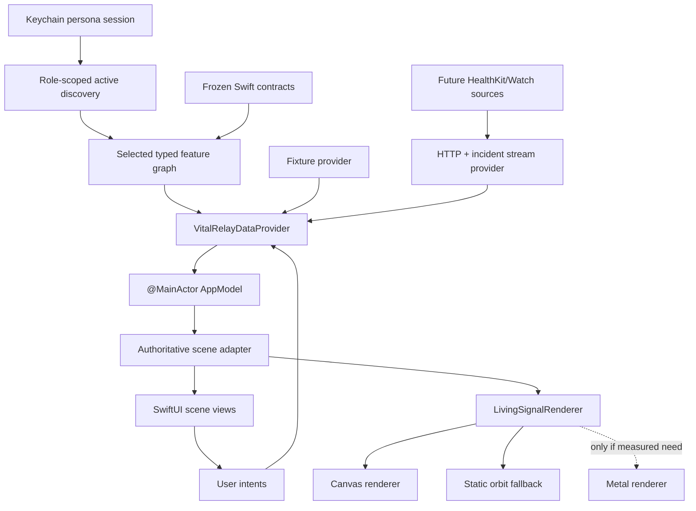

# Vital Relay iOS Frontend Implementation Plan

**Product direction:** Living Relay  
**Primary target:** iPhone first, Apple Watch companion second  
**Approach:** authenticated SwiftUI product path with explicit fixture-only QA launches
**Estimated frontend lane:** 28–36 focused hours  
**First useful milestone:** 6 hours

## Implementation status

- **UI-01 complete:** fixture monitoring, particle heart, safety check, Getting
  Help acknowledgement, Reduce Motion, and simulator QA.
- **UI-02 complete:** frozen real-incident contracts, authenticated URLSession
  transport, persisted exact retries, server-authoritative expiry, polling,
  live/replay state mapping, and a Resolved scene.
- **UI-03 complete:** community access-header POST/GET dispatch coordination, strict
  privacy-redacted contracts, independent monotonic polling, and a
  searching/pending/accepted relay constellation with public AED context.
- **Slice 07 complete:** one app target now composes isolated community/wearer,
  responder, and command graphs. Responder uses its own token for coarse
  invitation/decision and accepted-only exact MapKit route/protocol; command
  renders state/timeline/coordination/protocol. The wearer graph remains
  redacted.
- **Slice 08 complete in code:** the responder graph now has APNs permission and
  authenticated registration, a device-bound Keychain access profile, strict
  privacy-minimal notification/deep-link parsing, and exact expected-invitation
  validation. The backend has a real allowlisted APNs provider, but a signed
  physical-device display has not been claimed.
- **Slice 09 complete in code:** command can confirm a strict idempotent close or
  external handoff for an active response. The responder graph revalidates
  accepted-only reads and immediately removes exact location, static route, and
  protocol when the server resolves/revokes the assignment.
- **Slice 10 complete in code:** normal launch restores or securely enrolls one
  installation-bound community, responder, or command session; role-scoped
  discovery removes manual incident IDs; selection composes one typed graph;
  `401`, switching, and logout tear it down before another persona can enter.
- **Next frontend increment:** use the authenticated community session for live
  HealthKit/Core Motion capability and scalar collection, live Core Location
  manual SOS, and a genuine entitled Apple fall callback. Physical Keychain and
  APNs proof remain external gates. NemoClaw/Docker can proceed in parallel;
  streaming and Watch remain future work.

## 1. Outcome

Build a dark, minimal iOS experience in which one living visual follows the
authoritative incident state:

```text
Monitoring → Verifying → Escalating → Response active → Resolved
```

The normal app launch restores an authenticated session or presents enrollment,
then discovers only the active incidents allowed for that account. Live persona
graphs fail closed when their session or incident API is unavailable. Replayed
incidents remain explicit visual/contract QA inputs and never substitute for a
configured product path.

This is the one native frontend. Community/wearer, responder, command, and later
evolution views remain separate feature graphs inside it.

## 2. Implementation decisions

1. **Build iPhone before Watch.** Prove the complete visual and interaction
   flow on one screen size, then derive the compact Watch experience.
2. **Keep the existing Slice 04 contract gate.** Swift models and deterministic
   replay transport are the first production foundation.
3. **Keep fixtures test-only.** Frozen examples can drive contract and visual QA,
   but a configured live persona never falls back to replay or fabricated data.
4. **Authenticate before composing a graph.** Restore or enroll one durable
   persona session, load role-scoped discovery, and build only the selected
   typed community, responder, or command client. A discovery ID never grants
   authority.
5. **Start the living graphic with SwiftUI Canvas.** Move to Metal only after a
   measured performance failure on the demo device.
6. **Treat animation as presentation.** It is derived from incident state and
   never owns escalation, countdown authority, responder selection, or health
   interpretation.
7. **No production GIF dependency.** Short movies/GIFs may document motion
   studies; the app renders state-aware motion natively.
8. **Keep advanced visuals optional.** Every animated state has a static Silent
   Orbit fallback that is also used for Reduce Motion and low-power degradation.
9. **Target the actual demo device and installed SDK first.** Back-deployment is
   deferred until the vertical demo is stable.

## 3. Architecture



### Boundary rules

- `AppModel` exposes server-derived state and sends typed user intents.
- Normal launch restores or enrolls exactly one server-authorized persona before
  discovery or graph composition. Fixture/raw-token launches are explicit QA.
- Discovery provides locators only; each selected typed graph reauthorizes the
  session persona and resource.
- Scene views never mutate an incident directly.
- The countdown displays backend `expires_at`; a local clock only renders the
  remaining duration.
- The fixture and live providers conform to the same interface.
- Replay/source/simulation metadata is carried from contracts and cannot be
  replaced by view-local flags.
- The renderer receives a presentation state, not raw backend models or raw
  health streams.

## 4. Proposed repository shape

```text
apps/apple/
  VitalRelay.xcodeproj
  Packages/
    VitalRelayContracts/
      Sources/
      Tests/
    VitalRelayUI/
      Sources/
        DesignSystem/
        LivingSignal/
        Components/
      Tests/
  iPhoneApp/
    App/
      VitalRelayApp.swift
      AppModel.swift
      AppEnvironment.swift
    Features/
      Monitoring/
      SafetyCheck/
      Coordination/
      ResponseActive/
      Resolved/
      Responder/
      DemoMenu/
    Data/
      VitalRelayDataProvider.swift
      FixtureDataProvider.swift
      APIDataProvider.swift
      IncidentEventStream.swift
      Clock.swift
    Resources/
      Fixtures/
  WatchApp/
    Features/
      Monitoring/
      SafetyCheck/
      ManualSOS/
  UITests/
```

Keep contracts independent of SwiftUI, HealthKit, WatchConnectivity, and the
renderer. This lets Swift fixture parity remain testable without launching an
app target.

## 5. State and provider seams

### Presentation state

```swift
enum LivingRelayScene: Equatable {
    case monitoring(MonitoringViewState)
    case verifying(SafetyCheckViewState)
    case escalating(CoordinationViewState)
    case responseActive(ResponseViewState)
    case resolved(ResolvedViewState)
}
```

Each associated view state is already redacted and display-ready. The wearer
dispatch view state cannot contain exact wearer/responder coordinates, route,
ETA, or responder credentials even after the incident becomes response-active.
Those fields belong to a separate authenticated responder surface.

### Data provider

```swift
protocol VitalRelayDataProvider: Sendable {
    func currentScene() async throws -> LivingRelayScene
    func scenes() -> AsyncStream<LivingRelayScene>
    func submit(_ intent: UserIntent) async throws
}
```

The initial `FixtureDataProvider` advances through deterministic scenes using an
injectable clock. `APIDataProvider` later maps health endpoints, incident
snapshots, and timeline events into the same scene types.

### Render state

```swift
enum LivingSignalVisualState: Equatable {
    case heart(rate: Int?, freshness: Freshness)
    case verification(progress: Double)
    case relay(activeNode: RelayNode, completed: Set<RelayNode>)
    case route(RouteShape) // responder-authenticated surface only
    case resolved
}
```

Only this bounded state reaches the particle renderer.

## 6. Build phases

### Phase 0 — Bootstrap and device decisions

**Time:** 1–2 hours

#### Work

- Create `apps/apple/` with iPhone app, Watch app placeholder, local contracts
  package, local UI package, unit-test targets, and UI-test target.
- Record Xcode version, iPhone model/OS, Apple Watch model/OS, signing team,
  bundle IDs, and supported orientation.
- Use portrait-only iPhone for the hackathon flow unless the demo specifically
  needs landscape.
- Add a scheme that launches directly into deterministic replay fixtures.
- Add CI/local commands for Swift package tests and simulator app tests.

#### Gate

- Clean clone opens and builds without HealthKit, entitlements, secrets, or a
  backend.
- Simulator shows a black `Vital Relay` placeholder screen.

### Phase 1 — Slice 04 contracts and replay transport

**Time:** 4–6 hours

This is the repo's already-declared next milestone.

#### Work

- Implement immutable `Codable` and `Sendable` Swift equivalents for metric,
  capability, batch/result, snapshot request, and redacted snapshot view.
- Decode and round-trip every frozen JSON fixture.
- Implement a typed `URLSession` client for the current metric, capability, and
  snapshot endpoints.
- Add the deterministic metric → capability → snapshot replay sequence, including
  exact retries and idempotent results.
- Enforce `simulated: true` for replay and reject unsafe/raw payload variants.
- Keep HealthKit and Watch frameworks out of the contracts package.

#### Gate

- All shared fixtures pass Swift tests.
- Replay transport works against the in-memory backend.
- No UI is allowed to relabel replay data as live.

### Phase 2 — Dark design system and fixture shell

**Time:** 3–4 hours

#### Work

- Add semantic color, type, spacing, material, and motion tokens from the design
  proposal.
- Build `DemoBoundary`, `ReplayBadge`, `SourceStatus`, `PrimarySafetyButton`,
  `IncidentStatusText`, and accessible bottom-sheet components.
- Implement `AppModel`, `Clock`, `VitalRelayDataProvider`, and the deterministic
  fixture provider.
- Build a root scene switcher with five placeholder states.
- Add environment-driven Reduce Motion and Reduce Transparency variants before
  introducing complex animation.

#### Gate

- One debug control can step through all five states.
- Every screen persistently identifies demo/replay state.
- Large Dynamic Type and VoiceOver have a usable reading/action order.

### Phase 3 — Living Signal visual spike

**Time:** 4–6 hours

This phase is deliberately early because the particle morph is the largest
visual and performance risk.

#### Work

- Generate a deterministic set of particle IDs and normalized seed positions.
- Define target positions for heart, halo, relay nodes, route, and resolved glow.
- Interpolate the same particle IDs between targets so state changes morph rather
  than crossfade between unrelated assets.
- Render with SwiftUI `Canvas` and `TimelineView`; use additive blending and
  bounded trails sparingly.
- Map the displayed heart-rate sample to a restrained visual phase only. Cap the
  visual cadence and label stale/missing samples honestly.
- Implement static Silent Orbit state illustrations.
- Pause when the scene is inactive and reduce the particle budget in Low Power
  Mode.

#### Performance gate on the physical demo iPhone

- 60 fps target during monitoring and state morphs.
- No sustained thermal warning during a 10-minute rehearsal.
- Safety buttons respond immediately during animation.
- Reduce Motion produces no automatic particle movement.

If the gate fails, first lower particle count and trail length. Use Metal only
if Canvas still misses the gate. Do not delay the incident flow for a renderer
rewrite; ship Silent Orbit if needed.

### Phase 4 — Complete fixture-driven incident flow

**Time:** 5–7 hours

#### Monitoring

- Particle heart / orbit, latest displayed heart rate, source, freshness, Watch
  connection, and deliberate hold-for-SOS action.
- Details and demo scenarios live in sheets, not dashboard navigation.

#### Safety check

- Backend-shaped `expires_at`, visible textual countdown, `I'm okay`, and
  `I need help`.
- Haptics on entry and bounded final seconds; no flashing or shaking.
- Sending, acknowledged, expired, and retry states.

#### Getting help

- Human-readable searching, invitation-pending, and accepted responder outcomes.
- Relay constellation highlights only the active handoff and public AED site.
- No agent reasoning and no arbitrary generated content.

#### Response active

- Keep the wearer on the relay constellation with accepted responder name/role,
  coarse distance band, public AED context, and one next action.
- No wearer fixture or live model contains exact location, route, ETA, accepted
  dispatch, or responder token. The separately authenticated responder graph
  owns accepted-only exact routing and tears it down on revocation.

#### Resolved

- Exact state-machine outcome and a single return-to-monitoring action.

#### Gate

- `Fall + no response — replay` completes end to end without a backend.
- `I'm okay`, `I need help`, timeout, responder invitation, decline/second
  invitation, acceptance, and model-unavailable scenarios are selectable
  fixtures or contract tests.
- A screen recording of the core demo flow can be produced.

### Phase 5 — Live backend integration

**Time:** 4–6 hours after incident contracts exist

**Status:** Incident/check-in transport completed in UI-02, wearer-safe dispatch
POST/GET plus independent polling completed in UI-03, and responder-authenticated
accepted dispatch is complete in Slice 07. Slice 09 adds command resolution and
revocation-aware responder teardown. Slice 10 adds normal-launch session
restore/enrollment, role discovery, selection, rotation, and graph teardown.
Health snapshot mapping and WebSocket delivery remain.

#### Work

- Implement `APIDataProvider` without changing feature views.
- Map current health snapshot responses into monitoring context.
- Add incident read/check-in/manual-SOS endpoints when their contracts freeze.
- Consume only the community-session redacted dispatch read model in the wearer app;
  poll it independently from incident `state_version` and preserve incident
  authority across dispatch failures and delayed responses.
- Stream incident/timeline updates using `URLSessionWebSocketTask`; fall back to
  bounded polling through the same event-stream interface.
- Reconcile connection loss, out-of-order events, reconnect, duplicate event
  IDs, expired safety checks, and server rejection.
- Keep explicit fixture launch arguments for visual QA and rehearsal. Never
  fall back from a failed authenticated product session to a fixture provider.

#### Gate

- The same UI test flow passes against fixtures and a local backend scenario.
- Killing WebSocket delivery visibly falls back without resetting the scene.
- Local UI state never advances beyond the last authoritative server state.

### Phase 6 — Responder and Watch companion

**Time:** 5–7 hours

**Status:** Responder entry, decision, accepted route/protocol, Slice 08
notification handoff, Slice 09 resolution/revocation teardown, and Slice 10
authenticated responder restore/discovery are implemented. Signed-device APNs
proof and Watch remain.

#### Command incident completion

- Offer `Close incident` and `Record handoff` only for an authoritative
  `response_active` incident.
- Explain that both actions resolve the incident and end responder exact-data
  access before confirmation.
- Hold one pending resolution identity in the feature model for same-action
  retry and reject a competing action while the result is uncertain.
- Accept only a strict server receipt proving the same incident/action,
  `response_active` to `resolved` transition, matching state version, and one
  server-owned timestamp.
- Keep resolved incident, timeline, and immutable protocol audit available to
  command without restoring live responder coordination.

#### Responder iPhone flow

- Restore or enroll the responder session before notification permission or
  registration. Store access/refresh material in the device-only Keychain;
  notification/deep-link identifiers select an invitation but do not
  authenticate it.
- Require the incident/invitation locator to match the responder session's
  exact active discovery row before composing the incident graph.
- Parse only the bounded incident/invitation locator and require it to match the
  responder-authenticated server invitation before rendering.
- Accept/decline before exact location is present.
- Route and assignment after acceptance.
- Large observable-condition controls and one immutable protocol step at a time.
- Source/version visible for every protocol.
- Re-read the redacted responder incident after exact reads before committing
  accepted-only data. On resolved state or a revoked exact read, immediately
  clear location, route, and protocol and reconcile to the redacted projection.

#### Apple Watch flow

- Compact Silent Orbit / lower-particle monitoring visual.
- Manual SOS.
- Full-screen safety check using backend expiry.
- Haptic feedback, offline/connection status, replay/source label.
- WatchConnectivity messages use the same frozen contracts and idempotency keys.

#### Gate

- Location-redaction test proves exact coordinates are absent pre-acceptance.
- Notification tests prove no responder token enters the payload/link, a
  mismatched invitation fails closed, and registration uses only the responder
  client. Physical alert display/open remains a signed-device gate.
- Resolution tests prove command receipt parity and immediate responder
  exact-data teardown without exposing command audit through the responder
  graph.
- Watch disconnect/reconnect does not duplicate a response or incident event.
- The iPhone can mirror the safety check when Watch is unavailable.

### Phase 7 — Accessibility, performance, and demo hardening

**Time:** 3–5 hours

#### Test matrix

| Area | Required evidence |
|---|---|
| Contract parity | Swift decodes/encodes every shared fixture |
| State adapter | Every backend state maps to exactly one scene |
| Safety check | Fake-clock tests for response, expiry, retry, and late acknowledgment |
| Replay honesty | Replay/demo labels present in every incident screenshot |
| Location privacy | Exact location always absent from wearer UI and absent from responder UI before authenticated acceptance |
| Accessibility | VoiceOver, Dynamic Type, Reduce Motion, Reduce Transparency, differentiate-without-color |
| Animation | Frame rate, thermal behavior, background pause, Low Power Mode degradation |
| Connectivity | Offline start, dropped stream, reconnect, duplicate event, polling fallback |
| Device | Physical iPhone plus paired Watch checklist; simulator is not sufficient for HealthKit claims |

#### Rehearsal checklist

- Cold launch restores authenticated access, then opens role discovery; a
  community account may choose monitoring when it has no active incident.
- Live/replayed source is visually undeniable.
- Particle visual never obscures the safety check or buttons.
- One-tap demo reset returns provider, clock, and animation seed to baseline.
- Record a fallback demo with the fixture provider and redacted constellation.
- Freeze all displayed measured values before judging.

## 7. Core versus advanced scope

### Core must ship

- Contract/replay Slice 04.
- Five-state fixture-driven iPhone flow.
- Static orbit fallback for every state.
- Monitoring heart visual, safety check, manual SOS, replay labels, and haptics.
- Response-active wearer constellation with accepted responder and public AED
  details from the redacted contract.
- Authenticated live launch plus explicit fixture-only QA arguments.
- Reduce Motion, VoiceOver, Dynamic Type, and location redaction.

### Advanced only after core gate

- Full 4,000–8,000 particle morph.
- Metal renderer.
- Responder-only route geometry morph from relay strand.
- Advanced Watch particle visual.
- App Clip-style responder entry.

Live HealthKit/Core Motion/Core Location and the real fall callback are now the
next product increment. They remain independent of the fallback five-state QA
replay and cannot weaken deterministic incident authority.

## 8. Current next step: live Apple inputs

1. Add a HealthKit capability coordinator to the authenticated community graph;
   request only supported allowlisted read types and represent no-visible-sample
   separately from unsupported.
2. Query and normalize every feasible scalar metric already accepted by the
   backend, including unit, observation time, source bundle/device, and
   acquisition class. Keep structured records out until their own schemas exist.
3. Batch capability/metric updates with the session access token and stable
   installation ID; use anchored/observer queries without uploading continuous
   raw ECG or motion streams.
4. Add live Core Location behind `IncidentLocationProviding` so manual SOS can
   send a current bounded coordinate and fail closed when unavailable.
5. Connect the real Apple fall callback only when the entitlement and device
   report it available/authorized; submit the frozen non-simulated event and
   never synthesize a fall.
6. Record signed physical-device evidence for Keychain restore, HealthKit source
   metadata, location, and fall entitlement/callback status.

### Exit condition

An authenticated community session displays and ingests every actually
available supported scalar source with honest capability/freshness labels,
creates manual SOS from live location, and shows truthful fall
entitlement/availability state. A genuine Apple callback reaches the existing
backend event contract when Apple/device prerequisites are present; its absence
never becomes a simulated success.

## 9. Definition of frontend done

- The five-state incident flow works from fixtures and the local backend.
- Normal launch restores/enrolls one role-bound session, discovers only that
  role's active incident locators, and never requires a manual incident ID.
- Switching, logout, or terminal `401` destroys the old graph and responder
  exact state before another persona/client is composed.
- Source, replay, simulation, freshness, and fallback states are explicit.
- Health data remains context only and cannot authorize escalation.
- The safety check uses authoritative expiry and handles offline/retry states.
- Exact location is absent from the wearer app; the responder graph reveals it
  only after authenticated acceptance and removes it when the assignment ends.
- The living visual stays responsive on the physical demo device and degrades
  safely to Silent Orbit.
- Reduce Motion, Reduce Transparency, Dynamic Type, and VoiceOver are verified.
- The iPhone flow can be rehearsed and reset without Apple entitlements or live
  providers.
- Watch and iPhone produce contract-equivalent user intents and replay metadata.
- No generated medical guidance or diagnostic visualization is present.
