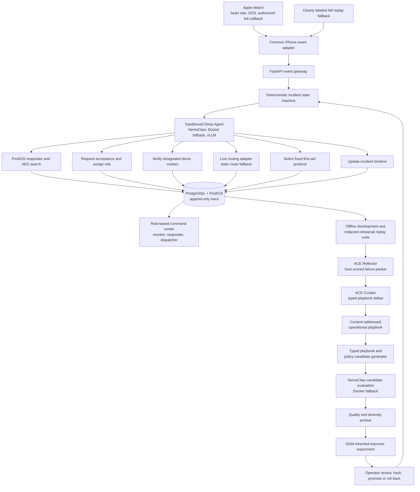

# Vital Relay

## Hackathon Proposal: A Wearable-Triggered Emergency Coordination Agent That Improves Its Operational Context Offline

**One-line pitch:** Vital Relay turns a wearable safety event into a coordinated, auditable response among trusted nearby helpers, then improves its operational playbook and coordination policy offline against protected replay scenarios—without diagnosing the wearer or contacting real emergency services.

**Working name:** Vital Relay  
**Primary platform:** Apple Watch + iPhone + local AI workstation  
**Safety boundary:** The prototype uses live wearable context, a manual or replayed emergency trigger, real notifications only to consenting demo participants, and a simulated dispatcher. It never contacts 911 or another real emergency service.

---

## 1. The problem

When someone falls or becomes unable to ask for help, the first few minutes are a coordination problem:

- the person may not be able to call or explain what happened;
- a trusted contact may not know the person's location;
- a nearby trained volunteer may be available but unaware;
- a known AED may be close but no one is assigned to retrieve it;
- everyone involved may receive fragmented or duplicate information.

Wearables can provide a trigger and useful context, but an alert alone does not coordinate a response.

Vital Relay explores a narrower, defensible question:

> Once a wearer asks for help or fails a safety check, can a constrained local agent coordinate trusted helpers faster and improve that coordination policy after reviewing replayed incidents?

This is an emergency-coordination prototype, not a medical diagnostic system.

---

## 2. What the prototype does

1. Streams live Apple Watch heart rate or workout status to the iPhone and command center.
2. Receives a safe incident trigger through a common `FallEventSource` interface:
   - manual SOS;
   - a real `CMFallDetectionManager` event when Apple's entitlement and user authorization are available;
   - a clearly labeled replay of a fall followed by stillness when entitlement approval or a safe live event is unavailable.
3. Shows a safety check on the Watch or iPhone: `I'm okay`, `I need help`, or countdown timeout.
4. Opens an incident through a deterministic state machine.
5. Runs the local coordination agent inside a NemoClaw/OpenShell sandbox, with the same tool contract runnable in Docker if NemoClaw cannot be completed.
6. Uses PostgreSQL/PostGIS to find nearby registered responders and AEDs, then requests a live route through a routing adapter; static venue coordinates and route instructions remain the offline fallback.
7. Selects a versioned, source-reviewed first-aid protocol through deterministic incident and responder inputs. The agent can select a protocol ID but cannot author or alter its medical content.
8. Notifies a designated contact, coordinates responder acceptance and roles, and maintains a shared incident timeline.
9. After the incident, replays development and consented, redacted rehearsal scenarios in an offline laboratory.
10. Uses Agentic Context Engineering (ACE) to turn host-scored failures into typed, versioned operational-playbook deltas through bounded Generator, Reflector, and Curator roles.
11. Uses a local model to propose bounded playbook and policy candidates, keeps only candidates that pass protected tests, and lets an operator promote or roll back a version.
12. Runs a DGM-inspired lineage experiment in which a descendant inherits a changed, bounded improvement artifact and uses it to create the following generation.

### Explicit non-goals

The hackathon prototype does not:

- diagnose a heart attack, arrhythmia, breathing disorder, or any medical condition;
- claim that Apple Watch data is continuous medical-grade telemetry;
- contact real emergency services;
- let an LLM decide whether a medical emergency exists;
- generate new first-aid instructions;
- allow candidate agents to edit approved first-aid protocols or their source metadata;
- verify professional credentials against external registries;
- rewrite the active agent during an incident;
- learn from live incidents, protected-validation outcomes, or final-test outcomes;
- place medical guidance, participant identity, protected health information, exact locations, secrets, permissions, or hidden evaluator knowledge in an evolved playbook;
- claim recursive self-improvement unless an inherited improvement-operator change is actually demonstrated.

---

## 3. The product wedge

The complete demo uses one incident: **fall or SOS followed by no response in a bounded campus, office, or hackathon venue**. The team will implement Apple's real fall-event callback, but will not stage an actual fall to force it; the on-stage trigger uses the real callback only if a safe authorized event is available, otherwise it uses the visibly labeled replay adapter through the identical schema.

The participant pool is deliberately small and consented:

- one monitored user;
- one designated contact;
- two or three demo responders with self-declared skills;
- one simulated dispatcher view;
- one or two PostGIS-backed AED locations with a live route and static venue-route fallback.

The product does not need a city-scale network to prove the experience. It needs to show that a safety event becomes a structured incident, that the right registered person receives the right role, and that the response policy improves on a protected benchmark.

---

## 4. Architecture



### Core control rule

The deterministic state machine decides when an incident may escalate. The LLM never receives raw authority to open an emergency or contact arbitrary people.

```text
MONITORING
  -> VERIFYING
  -> ESCALATING
  -> RESPONSE_ACTIVE
  -> RESOLVED
```

Examples:

- `manual SOS` can move directly to `ESCALATING`;
- an authorized Apple fall event or its replay fallback moves to `VERIFYING`;
- `I'm okay` returns the incident to `RESOLVED` as a false alarm;
- `I need help` or timeout moves to `ESCALATING`;
- only `ESCALATING` exposes notification and responder tools;
- first-aid protocol selection is permitted only after escalation and requires a deterministic event mapping plus responder-supplied condition inputs;
- every transition includes a timestamp, reason, source, and `simulated` flag, so an Apple callback and a replay can never be confused.

### Advanced integration fallbacks

| Advanced goal | Preferred path | Guaranteed fallback or claim boundary |
|---|---|---|
| Apple fall ingestion | `CMFallDetectionManager` with entitlement, authorization, delegate callback, and idempotency by event date | `ReplayFallEventSource` emits the same schema; no staged physical fall |
| Agent isolation | NemoClaw/OpenShell filesystem, egress, credential, and process policy | Docker with read-only protected mounts and an allowlisted tool proxy |
| Geospatial response | PostGIS `geography` columns and spatial indexes plus Mapbox Directions `mapbox/walking` routes | Seeded venue coordinates and static route instructions |
| First-aid presentation | Versioned, source-reviewed protocol records selected by deterministic mapping | Show the authoritative source link; never generate missing content |
| ACE operational context | Structured Generator–Reflector–Curator roles, typed deltas, deterministic host merge, and a content-addressed playbook | Use the reviewed static baseline playbook; never learn from a live incident or feed protected/final outcomes back into context |
| DGM lineage | Inherited Reflector/Curator context, `mutation_prompt.md`, or bounded failure-analysis rules create the next generation | Show the inheritance mechanism but do not claim improved self-improvement if the equal-budget comparison is inconclusive |

---

## 5. The agent's role

The local agent receives a structured incident summary, not an unbounded physiological stream. It coordinates permitted actions through typed tools.

### Minimum tool catalog

| Tool | Purpose |
|---|---|
| `get_incident` | Read the current state and approved incident context |
| `find_registered_responders` | Use PostGIS to rank consented responders by skill, availability, location freshness, and distance |
| `notify_responders` | Send an invitation only to allowlisted demo accounts |
| `assign_responder_role` | Assign direct assistance or AED retrieval after acceptance |
| `find_nearest_aed` | Use PostGIS to return the nearest known venue AED |
| `get_live_route` | Request responder-to-wearer or responder-to-AED directions through the routing adapter, with a static route fallback |
| `select_first_aid_protocol` | Return an immutable protocol ID and version after deterministic event mapping and responder condition input |
| `notify_demo_contact` | Send a fixed message to the designated contact |
| `update_timeline` | Add an auditable action or result |
| `close_incident` | Resolve the incident when the state machine permits it |

Every tool has:

- typed input and output schemas;
- a state permission check;
- idempotency protection;
- timeout and failure behavior;
- an allowlist for recipients or resources;
- an append-only audit event.

### Fixed first-aid content contract

The first-aid library is a protected, versioned artifact rather than agent-generated text:

```yaml
protocol_id: adult_unresponsive_assessment
version: 2025-aha-1
audience: trained_or_untrained_lay_responder
source_title: 2025 AHA Adult Basic Life Support Guidelines
source_url: https://cpr.heart.org/en/resuscitation-science/cpr-and-ecc-guidelines/adult-basic-life-support
reviewed_at: 2026-07-17
steps_file: protocols/adult_unresponsive_assessment.json
```

The initial library contains only a few mappings, such as `fall_responsive`, `unresponsive_breathing`, and `unresponsive_not_breathing_or_gasping`. The responder—not the Watch or LLM—supplies observable condition inputs such as responsiveness and breathing status. The application then selects the mapped, immutable protocol. Every protocol displays its source and version, and the team must verify permission to reproduce or adapt any source material before shipping the content.

The model can explain its action in one short sentence, but the dashboard shows observable tool calls and results rather than hidden reasoning.

---

## 6. The self-improvement differentiator

Vital Relay improves **bounded operational context and coordination policy**, not medical judgment.

### 6.1 The bounded artifact

The required demo mutates only a typed `coordination_policy.yaml` bundle:

```yaml
responder_search:
  radius_meters: 1200
  exact_skill_bonus: 50
  distance_penalty_per_meter: 0.01
  stale_location_seconds: 120
  maximum_notifications: 3

workflow:
  responder_accept_timeout_seconds: 20
  retry_declined_responder: false
  contact_order:
    - nearby_responder
    - designated_contact
    - simulated_dispatcher
```

All fields have allowed types and safe ranges. Candidates cannot edit the state machine, recipient allowlists, audit log, test expectations, notification credentials, or promotion logic.

### 6.2 The ACE operational playbook

ACE is the primary bounded context-improvement layer. It adapts reusable operational context rather than model weights, medical content, tool authority, or the live state machine.

The roles are deliberately narrow:

- **Generator:** the existing coordination agent executes a replay using the frozen state machine, typed tools, active policy, and approved playbook items selected by incident state, incident kind, and tool tags.
- **Reflector:** an offline-only role receives a redacted development or consented-rehearsal trace plus a host-produced failure packet. It identifies reusable coordination lessons but never sees protected or final expected outcomes.
- **Curator:** emits typed `ADD`, `REFINE`, `TAG`, or `DEPRECATE` operations. A deterministic host process validates, deduplicates, detects contradictions, prunes to a fixed budget, and creates the next content-addressed playbook version.

Each playbook item has a stable ID, applicability tags, provenance, content hash, and host-owned helpful/harmful evidence counters. The model cannot grade its own lesson or directly edit the active playbook.

Allowed playbook content is limited to operational tactics such as state re-read discipline, safe retry/fallback behavior, idempotency awareness, tool sequencing, and concise handoff strategy. The validator rejects any item containing or attempting to alter:

- diagnosis, first-aid content, or other medical advice;
- protected health information, participant identity, exact coordinates, secrets, or credentials;
- recipient allowlists, tool schemas, permissions, state transitions, protocol records, or safety gates;
- protected/final expectations, evaluator internals, scores, or other hidden test knowledge.

Only synthetic development traces and explicitly consented, redacted rehearsal traces may produce playbook deltas. Live incidents are never learning inputs. Protected validation and final test can score a frozen candidate but cannot supply reflection feedback. The reviewed static baseline playbook remains the fail-safe fallback.

### 6.3 The AlphaEvolve-inspired loop

The prototype implements the transferable AlphaEvolve pattern rather than claiming to reproduce Google's full system:

```text
select a parent policy/playbook pair and diverse inspiration
  -> provide a bounded failure packet
  -> ACE proposes typed playbook deltas and the local model may propose one typed policy patch
  -> validate schema, paths, and ranges
  -> run the candidate in an isolated environment
  -> score observable actions on replay scenarios
  -> retain a better or behaviorally distinct candidate
  -> require operator approval before promotion
```

The archive keeps a small set of useful elites instead of one winner:

- fastest correct responder acceptance;
- fewest unnecessary notifications;
- best handling of stale or declined responders;
- best overall protected score.

### 6.4 Benchmark partitions

| Partition | Visibility | Purpose |
|---|---|---|
| Development | Scenarios, expected behavior, and failure packets visible | Guides mutations |
| Protected validation | Candidate can run but cannot read expected outcomes | Selects among candidates |
| Final test | Run only for the selected candidate at a declared limited cadence | Evidence of generalization |
| Demo replay | Fixed and rehearsed | Reliable stage narrative |

Initial target: 10-12 development scenarios, 6 protected validation scenarios, and 4-6 final test scenarios with fixed random seeds.

Scenario families include:

- responder accepts immediately;
- first responder declines, second accepts;
- stale responder location;
- no matching skill;
- duplicate notification webhook;
- delayed contact delivery;
- user cancels after responder acceptance;
- local model unavailable, requiring an explicit manual-control outcome.

### 6.5 Evaluation evidence

The dashboard reports a metric vector, not only a single flattering score:

- correct workflow completion rate;
- missed required actions;
- duplicate or unnecessary notifications;
- time to qualified responder acceptance;
- responder skill-match rate;
- protected validation and final-test pass rates;
- hard-safety gate results;
- exact policy diff, playbook delta log, selected playbook-item IDs, and artifact hashes;
- static-baseline versus ACE versus ACE-plus-DGM results under the same model, seeds, scenario set, and candidate budget;
- scenarios improved and regressed.

A candidate is rejected regardless of its score if it:

- targets a real emergency number or non-allowlisted recipient;
- shares exact location before responder acceptance;
- issues a duplicate irreversible action;
- invents a responder, AED, or tool result;
- edits protected evaluator files or expected outcomes;
- learns from protected/final results or includes protected health information, identity, coordinates, credentials, permissions, evaluator knowledge, or medical content in the playbook;
- uses model-reported helpful/harmful scores instead of host-observed evaluation evidence;
- disables audit logging or required tests;
- generates medical instructions.

### 6.6 Safe promotion

The active agent never rewrites itself during an incident.

```text
candidate
  -> typed validation
  -> isolated evaluation
  -> protected safety gates
  -> operator review
  -> policy, playbook, delta-log, role, and model hashes in a version manifest
  -> atomic active-version switch
  -> previous version retained for rollback
```

### 6.7 Committed DGM-inspired lineage experiment

After the ACE and policy loops work, the advanced build allows a candidate to edit one bounded self-improvement artifact. The preferred choices are the Reflector playbook, Curator rules, `mutation_prompt.md`, or typed failure categories. A deterministic host validator and merge algorithm remain immutable; source-code mutation of the executor or evaluator remains out of scope.

The experiment records both direct task performance and **improvement capability**:

```text
Agent N with improver I0
  -> creates Agent N+1 with changed improver I1
  -> Agent N+1 loads I1, not I0
  -> I1 creates Agent N+2
  -> protected evaluator scores N+2

Counterfactual:
  I0 receives the same Agent N+1 failures, seeds, and candidate budget
  -> compare its best descendant with I1's best descendant
```

Call the result recursively self-improving only if all of the following occur:

1. Agent N produces Agent N+1.
2. Agent N+1 contains a changed improvement-operator hash.
3. Agent N+1's changed operator is actually loaded and used to produce Agent N+2.
4. Under the same seeds and candidate budget, the inherited operator produces stronger descendants than the original operator across repeated trials.

The dashboard shows agent ID, parent ID, policy/playbook hashes, selected playbook-item IDs, improver hash, exact meta-diff, child budget, direct score, and best-descendant score. If the inheritance mechanism works but the equal-budget performance comparison is inconclusive, describe the result honestly as a **DGM-inspired inherited-improver experiment**, not demonstrated recursive improvement. ACE improvement of operational context alone is not evidence of recursive self-improvement.

---

## 7. Data honesty

The demonstration uses three clearly separated data categories:

1. **Live wearable context:** Apple Watch heart rate during an active workout session, Watch/iPhone availability, the user's check-in response, and an authorized `CMFallDetectionManager` callback if one occurs.
2. **Fallback incident input:** a deterministic fall/no-response event sequence, clearly marked `REPLAYED DATA` in the UI. It uses the same event adapter as the real callback but is never presented as a real fall. A public motion dataset may inform the shape of the replay, but the team does not claim equivalence to an Apple Watch clinical event.
3. **Operational benchmark data:** synthetic scenario fixtures describing responder availability, skill, distance, delay, acceptance, failure, and expected tool actions. Synthetic coordination scenarios are appropriate because the benchmark tests software behavior, not clinical physiology.

SpO2, respiratory-rate, ECG, and arrhythmia prediction are excluded from the core demo. If shown at all, they appear as stored wellness context with no role in escalation.

---

## 8. Privacy and safety

- All demo participants opt in and can revoke participation.
- The system stores only the minimum incident context required for the demonstration.
- Exact wearer location is disclosed to a responder only after acceptance.
- The designated contact receives a fixed template, not free-form medical advice.
- First-aid protocols are immutable to the agent and candidate optimizer, display their source/version, and branch only on responder-provided observations.
- Real notifications target only allowlisted team phones or demo devices.
- Every screen shows `DEMO SYSTEM — NO EMERGENCY SERVICE CONTACTED`; replayed incidents additionally show `REPLAYED INCIDENT`.
- The prototype never presents itself as a substitute for 911 or professional medical care.
- The operator has a kill switch and one-click reset.
- Candidate agents have no access to notification credentials.
- NemoClaw or the Docker fallback permits only the internal tool proxy, local inference endpoint, and approved routing host; all other egress is denied.
- The live incident state machine and protected evaluator are immutable to candidates.

---

## 9. Final technology choices

| Layer | Default | Fallback |
|---|---|---|
| Watch and phone | SwiftUI, HealthKit, Core Motion `CMFallDetectionManager`, WatchConnectivity | `ReplayFallEventSource` plus iPhone check-in |
| Backend | Python, FastAPI, Pydantic | None |
| State machine | Python enum and transition table | LangGraph only if already familiar |
| Local agent | LangChain Deep Agents | Minimal LangChain tool-calling agent |
| Local inference | vLLM OpenAI-compatible endpoint | Preconfigured remote development endpoint only for rehearsal |
| Storage and spatial search | PostgreSQL + PostGIS + spatial indexes + append-only JSONL trace | SQLite with Haversine distance and seeded coordinates |
| Maps and routing | MapLibre UI + Mapbox Directions `mapbox/walking` adapter | Static venue map, coordinates, and route instructions |
| First-aid content | Protected, versioned JSON sourced from current AHA/Red Cross guidance | Authoritative source link without locally reproduced steps |
| Web application | Next.js, React, TypeScript | Single FastAPI-rendered operator page |
| Real-time updates | WebSocket | Short polling |
| Notifications | APNs or Twilio to allowlisted demo recipients | In-app responder notification |
| Incident and candidate isolation | NemoClaw/OpenShell policies and routed inference | Docker with read-only mounts and a strict tool proxy |
| Evolution archive | PostgreSQL plus content-addressed bundle directory | SQLite plus Git commits/worktrees |
| Charts and lineage | Recharts and a simple parent-child graph | Static SVG or table |

PostGIS performs responder/AED radius and nearest-neighbor search; live directions come from a routing-provider adapter rather than PostGIS itself. NemoClaw is the preferred sandbox for both the incident agent and improvement candidates, but the tool interface remains container-neutral so the Docker fallback can be selected at a fixed checkpoint. Public AED feeds, multi-agent topology, and voice calling remain optional integrations.

---

## 10. Core and advanced build scope

### Core must build

1. Live Watch heart rate or workout status and a Watch/iPhone safety check.
2. Manual SOS plus one clearly labeled fall/no-response replay.
3. Deterministic state machine with state-authorized tools.
4. Local vLLM-backed coordination agent.
5. One role-based web app showing command center, responder acceptance, simulated dispatcher, AED, and timeline views.
6. One real notification path to an allowlisted demo participant.
7. Typed policy mutation, protected replay evaluation, visible diff, operator promotion, and rollback.
8. A typed, content-addressed ACE operational playbook built only from synthetic development and consented, redacted rehearsal traces.

### Committed advanced goals

1. Submit the Apple fall-detection entitlement request immediately and implement the real authorized callback behind `FallEventSource`; use the replay adapter when approval or a safe event is unavailable.
2. Run the agent and candidates under NemoClaw filesystem/network/credential policy; switch to the predefined Docker policy if the time-boxed integration checkpoint fails.
3. Store responders and AEDs in PostgreSQL/PostGIS, perform indexed proximity search, and display a live route; retain seeded static coordinates and route instructions for offline reliability.
4. Present fixed, versioned, source-reviewed first-aid protocols selected through deterministic event mapping and responder observations.
5. Build the `Agent N -> Agent N+1 -> Agent N+2` inherited-improver chain and an equal-budget counterfactual using the original bounded Reflector/Curator or mutation-prompt artifact.

### Remaining optional integrations

1. Twilio voice call to a designated demo contact.
2. Public AED ingestion beyond the seeded venue records.
3. Multiple specialist agents or topology evolution.
4. Source-code mutation of the failure analyzer; typed Reflector/Curator rules or the mutation prompt are sufficient for the DGM experiment.

---

## 11. Suggested 48-hour build plan

### Hours 0-4: Freeze the contracts

- Submit the Apple fall-detection entitlement request immediately; add the entitlement, usage description, availability check, authorization flow, and `FallEventSource` interface to the implementation checklist.
- Define `WearableEvent`, `Incident`, `StateTransition`, `ToolCall`, `Scenario`, `Playbook`, `PlaybookDelta`, `PolicyPatch`, `ProtocolRecord`, and `EvaluationResult` schemas.
- Start PostgreSQL with PostGIS and create spatially indexed responder and AED tables.
- Time-box a NemoClaw onboarding spike and confirm that the same agent can be launched through a Docker fallback profile.
- Create a baseline coordination policy and six incident scenarios.
- Make one scenario produce a reproducible observable trace and score.

**Exit condition:** one command evaluates the baseline and returns a reproducible report; fall-event, sandbox, spatial, and protocol interfaces are frozen even if external approval is pending.

### Hours 4-12: Build the vertical incident slice

- Implement manual SOS, `AppleFallEventSource`, and `ReplayFallEventSource` adapters with idempotent event handling.
- Implement `MONITORING -> VERIFYING -> ESCALATING -> RESPONSE_ACTIVE -> RESOLVED`.
- Implement PostGIS responder/AED radius and nearest queries, designated contact, and timeline.
- Load at least one protected, source-reviewed first-aid protocol record and its deterministic mapping.
- Build a basic command-center page.

**Exit condition:** a replayed fall/no-response reaches responder acceptance and simulated dispatch without an LLM.

### Hours 12-22: Add the wearable and agent

- Stream live heart rate from an active Watch workout session.
- Add Watch/iPhone safety check and the authorized Core Motion fall-detection delegate path.
- Connect Deep Agents to local vLLM.
- Run the agent inside NemoClaw with allowlisted egress and no raw credentials. At hour 18, switch to the prepared Docker profile if the end-to-end NemoClaw path is not stable.
- Expose only state-authorized typed tools and fail closed to manual control
  when the model cannot complete safely.
- Add the live routing adapter and static venue-route fallback.

**Exit condition:** the same incident works with agent coordination, spatial search, routing, and fixed protocol presentation, and still works when the model or routing provider is unavailable.

### Hours 22-34: Add offline improvement

- Expand to 10-12 development and 6 validation scenarios.
- Add the ACE Generator–Reflector–Curator pipeline, typed playbook deltas, deterministic merge, and static-playbook fallback.
- Run a paired static-baseline-versus-ACE comparison with the same model, seeds, scenarios, and candidate budget.
- Generate typed policy patches.
- Validate, evaluate, archive, and display candidate diffs.
- Add policy, playbook, delta-log, role/model hashes, operator promotion, and rollback.
- Seed Agent N and create Agent N+1 with a bounded Reflector/Curator, `mutation_prompt.md`, or `failure_categories.yaml` change.

**Exit condition:** the paired ACE comparison and policy-candidate round are reproducible; any claimed improvement exceeds its pre-registered threshold without violating a hard gate. If neither improves, retain the static playbook and safe baseline and report the result as inconclusive.

### Hours 34-42: Complete the demo experience

- Add responder accept/decline view and one real allowlisted notification.
- Polish the PostGIS responder/AED queries, live map route, static fallback, and simulated dispatcher acknowledgement.
- Present the fixed first-aid protocol one step at a time with its source and version visible.
- Add before/after metrics and a simple lineage view.
- Load Agent N+1's inherited improver to create Agent N+2, then run the equal-budget I0-versus-I1 counterfactual with fixed seeds.

### Hours 42-48: Rehearse and harden

- Precompute a reliable archive.
- Run the final test set at the declared cadence.
- Verify NemoClaw/Docker policy denial tests, routing failover, PostGIS fallback export, and protected protocol hashes.
- Freeze the exact DGM claim based on the evidence: recursive improvement, inherited-improver mechanism only, or no claim.
- Rehearse the five-minute demo repeatedly.
- Prepare a recorded fallback for the live mutation step.
- Freeze all displayed measured numbers.

### Three-person split

- **Person A — Apple client:** entitlement request, Core Motion fall callback, Watch heart rate, WatchConnectivity, safety check, and replay parity.
- **Person B — incident platform:** FastAPI, state machine, PostgreSQL/PostGIS, routing, fixed protocol library, notifications, and web views.
- **Person C — agent and evolution:** vLLM, Deep Agents, NemoClaw/Docker policies, ACE playbook adaptation, scenario evaluator, policy mutation, DGM lineage, archive, and metrics.

Define the shared event and tool schemas together before splitting.

---

## 12. Five-minute demo script

### Scene 1 — Live and honest (30 seconds)

Show a teammate's Apple Watch heart rate streaming to the command center. Point out:

- Apple fall entitlement and authorization status;
- the active event source: `APPLE_FALL_EVENT` or `REPLAYED_FALL_EVENT`;
- the NemoClaw sandbox policy badge, or the visibly declared Docker fallback;
- the active agent and improver hashes;
- two PostGIS-backed registered responders.

Say:

> The wearable context is live, and the production fall-event adapter and entitlement status are visible. We will not induce a physical fall on stage, so this event uses the same clearly labeled replay interface. No real emergency service can be contacted.

### Scene 2 — Coordinated response (110 seconds)

Start `Fall + no response — replay`.

- The Watch/iPhone asks whether the wearer is okay.
- The countdown expires.
- The deterministic state machine opens the incident.
- The sandboxed local agent uses PostGIS to find registered responders and the nearest seeded AED.
- Responder A declines or has stale location.
- Responder B accepts.
- The agent assigns direct assistance and shows a live route; disconnect the routing provider or use a toggle to demonstrate the static route fallback if time permits.
- The responder supplies observable condition inputs, and the application presents the mapped, immutable first-aid protocol with source and version visible.
- The designated contact receives a real allowlisted notification.
- The simulated dispatcher acknowledges.
- The shared timeline shows every state change and tool result.

### Scene 3 — Context, policy, and improver evolution (100 seconds)

Show that the baseline policy retries a declined responder too slowly or ranks a stale responder too highly.

First show a redacted development failure becoming an ACE update:

```text
Host-scored development trace
  -> Reflector proposes a reusable operational lesson
  -> Curator emits a typed playbook delta
  -> deterministic host merge creates a hashed candidate playbook
  -> protected scenarios compare static baseline and ACE under the same budget
```

Display the exact delta and selected playbook-item IDs. State that protected and final outcomes are evaluation-only and never become reflection input.

Run one pre-bounded policy mutation round:

```text
Parent loaded
  -> failure packet summarized
  -> typed policy patch proposed
  -> invalid patch rejected or valid patch evaluated
  -> protected scenarios run
  -> new elite archived
```

Show the exact diff and measured development/validation results. Make clear which number is a target and which is measured.

Then show the DGM-inspired inheritance chain:

```text
Agent N / improver I0
  -> Agent N+1 / changed improver I1
  -> Agent N+2 created by loading I1
```

Display the bounded Reflector/Curator, `mutation_prompt.md`, or failure-rule diff, both improver hashes, and the equal-budget I0-versus-I1 result. If I1 did not reproducibly outperform I0, state that the demo proves inheritance but not recursive performance improvement.

### Scene 4 — Promote, replay, prove (60 seconds)

Promote the hashed candidate after operator approval, replay the coordination failure, and show faster correct responder assignment. Then show the final-test aggregate and safety gates to demonstrate that the fix generalized beyond the one visible scenario.

Close with:

> Vital Relay does not replace medical judgment. It connects a real wearable event path to sandboxed coordination, geospatial response, fixed sourced guidance, and offline improvement—and promotes only changes that survive protected tests.

---

## 13. Success criteria

The prototype succeeds if it can reliably demonstrate all of the following:

1. A live Apple Watch signal appears in the command center.
2. The Apple fall entitlement request is submitted, the real `CMFallDetectionManager` adapter is implemented, and authorization/availability are visible. A replay is unmistakably labeled when the entitlement or a safe real event is unavailable.
3. The user can confirm safety, request help, or time out.
4. The deterministic state machine authorizes every transition and tool.
5. The local agent coordinates through typed tools without diagnosing the wearer and runs inside NemoClaw or the declared Docker policy fallback.
6. PostGIS performs an indexed responder/AED proximity query, and a registered responder can accept or decline and receive a role.
7. A designated contact receives one allowlisted notification.
8. The dispatcher remains visibly simulated and no real emergency number is reachable.
9. All actions appear in an auditable timeline.
10. A live route is displayed when the provider is available, and the static venue route works when it is not.
11. The responder receives a deterministic, fixed first-aid protocol whose source and version are visible; neither the operational agent nor candidates can edit it.
12. The offline ACE loop turns a host-scored, redacted development failure into a typed, content-addressed operational-playbook delta without changing authority or medical content.
13. A paired static-baseline-versus-ACE evaluation runs with the same model, seeds, scenarios, and candidate budget; exact deltas, selected item IDs, and hashes are reported whether the result improves or is inconclusive.
14. The offline loop proposes and evaluates a typed policy change.
15. A selected policy/playbook candidate improves a measured coordination outcome on protected validation without a hard-gate failure.
16. The chosen version has content hashes, operator approval, and a rollback target.
17. A final test result is reported separately from development and selection results and never feeds the Reflector or Curator.
18. Agent N creates Agent N+1 with a changed improver hash, and Agent N+1's inherited improver is loaded to create Agent N+2.
19. The original and inherited improvers are compared under equal seeds and candidate budgets, with the claim calibrated to the measured result.

ACE succeeds as a bounded context-improvement mechanism only when the paired evidence shows a safe, reproducible benefit over the static baseline. The inheritance mechanism succeeds when its chain is real and reproducible. The stronger “recursively self-improving” claim succeeds only if the inherited improver also meets all four performance-proof conditions in section 6.7.

---

## 14. Why this proposal is competitive

### Clear value

It solves the gap between a wearable alert and a coordinated response among people who are already nearby and willing to help.

### Real technical depth

The demo combines Apple Watch streaming and fall-event ingestion, NemoClaw sandbox policy, PostGIS geospatial queries, live routing, fixed source-reviewed protocols, local tool-calling inference, deterministic authorization, replay evaluation, ACE playbook adaptation, bounded policy evolution, inherited improver lineage, and safe version promotion.

### Memorable differentiation

Most wearable demos stop at an alert. Vital Relay shows an incident response, exposes a real coordination failure, evolves bounded operational context and policy offline, and replays the result with protected evidence.

### Responsible ambition

The project is ambitious about orchestration and self-improvement while being conservative about medical claims, emergency-service access, agent authority, and evaluation leakage.

---

## 15. Reference assumptions

- Apple supports live workout data through `HKWorkoutSession` and `HKLiveWorkoutBuilder`.
- Apple exposes real-time fall events through `CMFallDetectionManager`, but the capability requires user authorization and an Apple entitlement. The implementation begins immediately while the replay adapter guarantees a safe stage path.
- Apple describes Blood Oxygen measurements as fitness/wellness data rather than medical measurements, so SpO2 is excluded from core escalation.
- PostGIS `ST_DWithin` provides spatial-index-aware radius filtering for responder and AED search; live turn-by-turn directions still require a routing engine or provider.
- Mapbox Directions supplies the preferred walking route, while a static venue route prevents an external API outage from breaking the incident flow.
- The fixed first-aid library is based on current source material such as the 2025 AHA Adult Basic Life Support Guidelines and American Red Cross guidance. The application displays source/version metadata, and the team must verify content-reproduction rights.
- LangChain Deep Agents provides planning, file-backed context, subagents, and tool use; Vital Relay uses only the bounded tool-calling portion required for coordination.
- vLLM supplies an OpenAI-compatible local inference endpoint; the team must select and test the exact supported hardware and model before the demo.
- NemoClaw/OpenShell can provide sandboxing and network/filesystem policy, but Docker remains the fallback so sandbox integration cannot block the project.
- Agentic Context Engineering motivates a structured Generator–Reflector–Curator loop, incremental context deltas, and a growing operational playbook. Vital Relay applies the pattern only to bounded, redacted operational context and keeps merge, safety, and evaluation authority in deterministic host code.
- AlphaEvolve motivates LLM-generated executable changes selected by automated evaluators and an archive.
- The Darwin Gödel Machine motivates archived self-modifying agent lineages; Vital Relay uses that label only for a genuine inherited improver experiment.

Primary references:

- [Apple: Building a multidevice workout app](https://developer.apple.com/documentation/healthkit/building-a-multidevice-workout-app)
- [Apple: CMFallDetectionManager](https://developer.apple.com/documentation/coremotion/cmfalldetectionmanager)
- [Apple: Fall Detection Notifications entitlement](https://developer.apple.com/documentation/bundleresources/entitlements/com.apple.developer.health.fall-detection)
- [Apple: Blood Oxygen app limitations](https://support.apple.com/en-gb/120358)
- [PostGIS: Use ST_DWithin for radius queries](https://postgis.net/documentation/tips/st-dwithin/)
- [American Heart Association: 2025 Adult Basic Life Support Guidelines](https://cpr.heart.org/en/resuscitation-science/cpr-and-ecc-guidelines/adult-basic-life-support)
- [American Red Cross: Unresponsive and breathing person](https://www.redcross.org/take-a-class/resources/learn-first-aid/unresponsive-and-breathing-person)
- [LangChain: Deep Agents overview](https://docs.langchain.com/oss/python/deepagents/overview)
- [vLLM installation and supported platforms](https://docs.vllm.ai/en/stable/getting_started/installation/)
- [Mapbox: Directions API](https://docs.mapbox.com/api/navigation/directions/)
- [NVIDIA: NemoClaw Deep Agents overview](https://docs.nvidia.com/nemoclaw/user-guide/deepagents/about/overview)
- [NVIDIA: NemoClaw network policies](https://docs.nvidia.com/nemoclaw/user-guide/deepagents/reference/network-policies)
- [Agentic Context Engineering paper](https://arxiv.org/abs/2510.04618)
- [ACE reference implementation](https://github.com/ace-agent/ace)
- [Google DeepMind: AlphaEvolve](https://deepmind.google/blog/alphaevolve-a-gemini-powered-coding-agent-for-designing-advanced-algorithms/)
- [Darwin Gödel Machine paper](https://arxiv.org/abs/2505.22954)
- [Twilio: Programmable SMS should not be used to reach emergency services](https://help.twilio.com/articles/223134327-Can-I-use-Twilio-SMS-messaging-for-emergency-purposes-)
