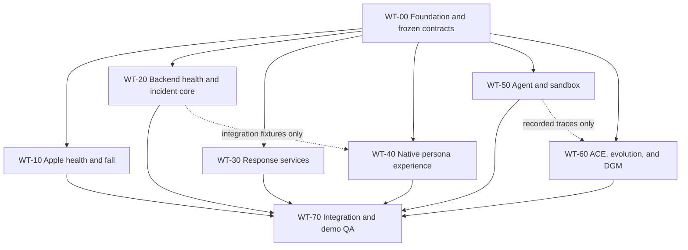

# Vital Relay Git Worktree Plan

**Source:** `proposal/implementation-plan.md`  
**Assumed team:** Three engineers  
**Integration branch:** `codex/integration`  
**Goal:** Let feature work proceed independently after one short contract-freeze gate, then merge in controlled waves into a continuously runnable demo.

---

## 1. Worktree rules

1. Complete and merge `WT-00` as a time-boxed shared gate, targeted for the first two hours, before creating the feature worktrees. Every later branch starts from the same frozen contract commit.
2. Feature branches target `codex/integration`, never another feature branch.
3. Each worktree edits only its owned paths. Shared wiring, root configuration, dependency locks, and contract changes belong to the integration lane.
4. Treat `contracts/json-schema/**`, `contracts/examples/**`, and protected safety content as frozen after Gate W0.
5. If a contract must change, add a short proposal under `contracts/change-requests/` and let the integration owner update the schema, examples, and compatibility tests in one commit.
6. Each worktree must run its local tests against frozen fixtures without requiring another feature branch.
7. External providers must sit behind interfaces and have deterministic fakes so Apple, Mapbox, Twilio/APNs, vLLM, NemoClaw, and PostGIS availability do not block local development.
8. Feature database migrations branch from the frozen base migration with unique revision IDs. The integration lane creates the Alembic merge revision after feature branches land.
9. Generated artifacts and local secrets are never committed. Candidate outputs remain under ignored `artifacts/` paths.
10. Keep `codex/integration` runnable after every merge. If a merge breaks the replay vertical slice, fix or revert it before merging another worktree.

---

## 2. Dependency map



The dotted dependencies are not development blockers. The native persona
worktree uses frozen JSON only for contract tests until the backend is merged;
the shipped feature path has no fixture fallback. The evolution worktree uses
recorded normalized traces until the real runner is merged.

---

## 3. Worktree summary

| ID | Branch | Primary scope | Plan items | Can start after |
|---|---|---|---|---|
| WT-00 | `codex/wt00-foundation-contracts` | Scaffold, schemas, fixtures, shared interfaces | P0-1, P0-2 | Immediately |
| WT-10 | `codex/wt10-apple-health-fall` | Watch/iPhone health, motion, fall, check-in | P0-3, P2-1, P2-2 | Gate W0 |
| WT-20 | `codex/wt20-backend-health-incidents` | Health ingestion, snapshots, state machine, timeline | P1-0, P1-1 | Gate W0 |
| WT-30 | `codex/wt30-response-services` | PostGIS, AED, routing, notification, protocols | P1-2, P1-3, P2-5 | Gate W0 |
| WT-40 | `codex/wt40-native-personas` | Native command, responder, dispatcher, evolution UI in the one Apple app | P1-5, P4-3 UI | Gate W0 |
| WT-50 | `codex/wt50-agent-sandbox` | Tool proxy, coordinator, NemoClaw/Docker | P0-4, P1-4, P2-3, P2-4 | Gate W0 |
| WT-60 | `codex/wt60-evolution-dgm` | Scenarios, evaluator, ACE playbook adaptation, mutation, promotion, DGM | P0-5, P3, P4-1, P4-2 | Gate W0 |
| WT-70 | `codex/integration` | Composition, E2E tests, readiness, reset, rehearsal | P5 | First feature merge |

---

## 4. Independent chunks

### WT-00 — Foundation and frozen contracts

**Owner:** Person B, reviewed by all  
**Worktree:** `../vital-relay-wt00-foundation`  
**Branch:** `codex/wt00-foundation-contracts`

**Owns**

- `contracts/**`
- initial repository/package skeletons under `apps/`, `backend/`, and `infrastructure/`
- root `pyproject.toml`, lock files, `.env.example`, `Makefile`, and base Compose configuration
- base Alembic revision and app/router registration stubs
- shared protocol/interface definitions and deterministic clock/provider fakes

**Deliverables**

- JSON Schemas and examples for `HealthMetric`, `HealthCapabilities`, `HealthSnapshot`, `WearableEvent`, incident updates, tools, protocols, scenarios, mutations, and evaluation results.
- Representative fixtures for live, stale, partial, unsupported, replayed, and duplicate data.
- Backend, Swift, and TypeScript contract-test entry points.
- All planned dependencies declared up front so feature branches rarely touch root package files.
- Empty but importable module/router stubs for every feature worktree.
- One base database migration. Reserve unique feature revision labels such as `health_core`, `response_geo`, and `evolution`.

**Done when**

- The repository starts through documented commands.
- Contract examples validate in Python and have test entry points for Swift and TypeScript.
- A deterministic fake event can pass through a stub API.
- All reviewers approve the contract commit SHA.

**Gate W0 (target: hour 2):** Merge into `codex/integration`, record the SHA as `WORKTREE_BASE_SHA`, and create every remaining worktree from that commit. If the full scaffold is not complete, freeze schemas/interfaces first and leave non-contract bootstrap work to WT-70; do not delay parallel feature work by continuing to polish foundation files.

### WT-10 — Apple health, motion, fall, and check-in

**Owner:** Person A  
**Worktree:** `../vital-relay-wt10-apple`  
**Branch:** `codex/wt10-apple-health-fall`

**Owns**

- `apps/apple/**`
- Apple-specific tests, entitlements, Info.plist descriptions, and fixture adapters

**Must not edit**

- backend schemas or APIs
- shared JSON fixtures after Gate W0
- web or backend implementation files

**Deliverables**

- Shared Swift Codable models matching the frozen contracts.
- Capability-aware `HealthMetricRegistry` and staged HealthKit authorization.
- Dynamic live-workout metric collection, recent HealthKit snapshots, derived Core Motion features, and pedometer context.
- WatchConnectivity transport with retry/idempotency behavior.
- Watch/iPhone safety check, manual SOS, source/freshness UI, fall entitlement status, Apple/replay fall adapters.
- A local mock transport that records the exact backend request bodies.

**Independent test boundary**

- Validate every outbound payload against frozen fixture expectations without a running backend.
- Use replayed HealthKit/motion fixtures in Simulator and require a separate physical-device checklist for supported live types.

**Done when**

- Apple and replay sources produce contract-equivalent events except for source/simulation metadata.
- Available health metrics carry source, observation time, acquisition class, availability, and freshness.
- Raw ECG waveforms and continuous raw motion streams are absent from transport payloads.
- Disconnect/reconnect and duplicate callbacks do not produce duplicate event IDs or batches.

### WT-20 — Backend health and incident core

**Owner:** Person B  
**Worktree:** `../vital-relay-wt20-backend-core`  
**Branch:** `codex/wt20-backend-health-incidents`

**Owns**

- `backend/src/vital_relay/api/health*`
- `backend/src/vital_relay/api/events*`
- `backend/src/vital_relay/api/incidents*`
- `backend/src/vital_relay/domain/**`
- `backend/src/vital_relay/health/**`
- `backend/src/vital_relay/application/incident_service.py`
- `backend/src/vital_relay/adapters/health_ingestion.py`
- health/incident/timeline persistence models and a uniquely labeled feature migration
- tests prefixed `test_health_`, `test_incident_`, or `test_timeline_`

**Deliverables**

- Idempotent metric-batch, snapshot, wearable-event, check-in, and incident APIs.
- Normalization, freshness, source tracking, context redaction, retention, and reset deletion.
- Transactional deterministic state machine and authoritative verification timeout.
- Append-only timeline plus WebSocket/polling read endpoints.
- Repository fakes for every response-service or coordinator dependency.

**Independent test boundary**

- Use frozen request fixtures, an in-memory/fake responder repository, fake coordinator, and fake clock.
- Do not require PostGIS, the native persona graph, Apple devices, or an LLM for local acceptance.

**Done when**

- All allowed/forbidden transitions and duplicate inputs are covered.
- Optional health values cannot create, suppress, or advance escalation.
- Mixed-source health batches and snapshots ingest idempotently and return correct freshness labels.
- A replay fall reaches the responder-search port using only fakes.

### WT-30 — Response services, routing, notifications, and protocols

**Owner:** Person B after WT-20 handoff, or another backend contributor  
**Worktree:** `../vital-relay-wt30-response`  
**Branch:** `codex/wt30-response-services`

**Owns**

- `backend/src/vital_relay/adapters/postgis.py`
- `backend/src/vital_relay/adapters/routing_*`
- `backend/src/vital_relay/adapters/notifications_*`
- `backend/src/vital_relay/protocols/**`
- top-level `protocols/**`
- responder/AED/route/notification persistence models and a uniquely labeled feature migration
- tests prefixed `test_geo_`, `test_route_`, `test_notification_`, or `test_protocol_`

**Deliverables**

- Indexed PostGIS responder and AED queries with pre-acceptance location redaction.
- Static venue data and routing fallback.
- Mapbox adapter with timeout/cache/validation.
- In-app notification adapter plus allowlisted Twilio/APNs adapter.
- Immutable, sourced fixed-protocol registry and deterministic selector.

**Independent test boundary**

- Expose the frozen repository/provider interfaces and test through direct contract calls.
- Use a local PostGIS container for spatial tests and provider fixtures for Mapbox/notifications.
- Do not require the state-machine implementation, native persona graph, or agent.

**Done when**

- Spatial ranking, stale-responder exclusion, AED selection, and location redaction pass.
- Forced routing/notification failures select deterministic fallbacks.
- Unknown or modified protocols are rejected and protocol hashes remain stable.

### WT-40 — Single-app native persona experience

**Owner:** Person B or a frontend contributor  
**Worktree:** `../vital-relay-wt40-native`
**Branch:** `codex/wt40-native-personas`

**Owns**

- `apps/apple/Sources/VitalRelayFeature/*Command*`
- `apps/apple/Sources/VitalRelayFeature/*Responder*`
- the persona composition files explicitly assigned by the integration owner
- focused native feature and transport tests

**Must not edit**

- backend routers or schemas
- contract examples; consume them as fixtures

**Deliverables**

- Credential-scoped Swift API clients and state models using frozen schemas.
- Community/wearer, responder, command, dispatcher, and evolution experiences
  inside one native app target.
- Multi-metric live cards/charts and categorized recent health-context drawer.
- Per-value source, timestamp, freshness, capability, replay, fallback, and simulation indicators.
- Responder acceptance/location reveal, fixed-protocol presentation, timeline, readiness, promotion, rollback, and demo-reset controls.
- Polling baseline, with streaming added later only behind the same state model.

**Independent test boundary**

- Decode frozen JSON examples and exercise intercepted native transports in
  tests; never substitute fixtures in a configured live feature graph.
- Keep persona credentials and exact accepted dispatch out of the wearer graph.

**Done when**

- All personas compose in one native target and the command/responder live
  modes compile against real API clients.
- Exact location is hidden before acceptance.
- Stale/historical health data cannot be mistaken for live data.
- Simulation, replay, sandbox, route, notification, and active-agent states are always visible.

### WT-50 — Agent coordinator and sandbox

**Owner:** Person C  
**Worktree:** `../vital-relay-wt50-agent`  
**Branch:** `codex/wt50-agent-sandbox`

**Owns**

- `backend/src/vital_relay/application/coordinator.py`
- `backend/src/vital_relay/application/tool_proxy.py`
- `backend/src/vital_relay/agent/**`
- `infrastructure/nemoclaw/**`
- `infrastructure/docker-agent/**`
- tests prefixed `test_agent_`, `test_tool_proxy_`, or `test_sandbox_`

**Deliverables**

- Typed tool proxy enforcing state, recipient allowlist, idempotency, timeouts, and audit logging.
- One normalized `AgentRunner` interface implemented by the Deep Agent runtime;
  model failure returns explicit manual control instead of another planner.
- Redacted health-summary input that cannot authorize escalation or diagnosis.
- NemoClaw runner plus Docker fallback with one request/result contract.
- Deny-by-default filesystem/egress policy and credential-isolation tests.

**Independent test boundary**

- Use a fake incident summary, frozen tool schemas, and an in-memory tool endpoint.
- Run runner parity and policy-denial tests without the real backend or native UI.

**Done when**

- The Deep Agent completes the canonical synthetic fall/no-response trace
  through registered typed tools.
- A forced model timeout returns `manual_required` without substituting tool
  calls or a deterministic coordinator.
- Protected writes, arbitrary network egress, and raw credential access are denied.
- NemoClaw and Docker produce the same normalized result envelope.

### WT-60 — ACE, evolution, promotion, and DGM experiment

**Owner:** Person C after the WT-50 normalized trace is stable
**Worktree:** `../vital-relay-wt60-evolution`  
**Branch:** `codex/wt60-evolution-dgm`

**Owns**

- `backend/src/vital_relay/evolution/**`
- `scenarios/**`
- `protected/**`
- `agents/**`
- evolution/scenario tests
- evolution persistence models and a uniquely labeled feature migration

**Deliverables**

- Development, protected-validation, and final-test partitions.
- Virtual clock and deterministic scenario runner consuming a recorded coordinator trace contract.
- Protected evaluator with direct metrics and hard gates.
- Content-addressed ACE operational playbook plus immutable item/delta contracts.
- Offline Generator–Reflector–Curator adapters consuming only synthetic development and explicitly consented, redacted rehearsal traces.
- Deterministic host validation, merge, deduplication, contradiction handling, pruning, and helpful/harmful evidence ownership.
- Paired static-baseline-versus-ACE evaluation under the same runner, model, seeds, partitions, and candidate budget.
- Typed bounded policy mutation, candidate archive, lineage, promotion, and rollback.
- N → N+1 → N+2 inherited-improver chain plus equal-budget I0/I1 comparison.

**Independent test boundary**

- Consume frozen state/tool schemas and recorded trace fixtures.
- Use a fake `AgentRunner`; integration later swaps in the WT-50 runner.
- Never require Apple, PostGIS, web, Mapbox, or notifications.
- Never use live-incident traces or protected/final outcomes as Reflector or Curator input; reject protected health information, identity, coordinates, secrets, authority changes, medical content, and evaluator knowledge from playbook candidates.

**Done when**

- Baseline results repeat identically three times.
- Invalid candidates fail protected-path, recipient, duplicate-action, and protocol-content gates.
- ACE produces a typed, fully hashed playbook delta and an honest paired report against the static baseline with zero new hard-gate failures; an inconclusive result remains a valid tracked outcome but not an improvement claim.
- One complete mutation round records hashes, diffs, scores, lineage, and invalid attempts.
- Promotion/rollback is atomic, and logs prove which improver hash generated each child.

### WT-70 — Integration, end-to-end testing, and demo QA

**Owner:** Rotating integration owner; only one person merges at a time  
**Working directory:** Main repository checkout  
**Branch:** `codex/integration`

**Owns**

- root application composition and router registration
- `backend/src/vital_relay/cli.py` and shared runtime configuration wiring
- root dependency/lock updates requested by worktrees
- Compose integration, Alembic merge revisions, Makefile targets, and scripts
- cross-feature integration/E2E tests, readiness endpoint, demo reset, and rehearsal documentation

**Responsibilities**

- Review ownership compliance before every merge.
- Merge feature migrations, then create one explicit Alembic merge head; never rewrite landed feature migrations.
- Replace fixture adapters one boundary at a time while retaining deterministic fallback flags.
- Run the replay vertical slice after every merge.
- Keep a short integration log containing merged SHA, migration head, tests run, known fallback, and rollback point.

**Done when**

- A clean clone can run database migration, backend, web, and deterministic replay from documented commands.
- The Apple client can send contract-valid metrics/events to the backend.
- The live/replay incident reaches responder acceptance, route, protocol, notification, dispatcher, and resolution.
- Agent and evolution flows use the production state machine/tool proxy and still pass safety gates.
- All deliberate failure drills recover safely or show a clear operator-visible error.
- Five consecutive clean-reset rehearsals complete within the demo window.

---

## 5. Recommended execution waves

With three engineers, keep at most three feature worktrees active at once.

| Wave | Time | Active worktrees | Outcome |
|---|---:|---|---|
| 0A | Hours 0-2 | WT-00; Apple entitlement and model availability checks may happen outside code | Frozen schemas/interfaces and importable scaffold |
| 0B | Hours 2-4 | WT-10 for P0-3; WT-50 and WT-60 sequentially for P0-4/P0-5 | Apple entitlement/skeleton, sandbox proof, normalized baseline trace, Gate G0 |
| 1 | Hours 4-12 | WT-10, WT-20, WT-50; WT-60 baseline remains available as a fixture | Apple skeleton, backend deterministic core, deterministic agent/tool boundary |
| 2 | Hours 12-22 | WT-10 and WT-50 continue; Person B moves between WT-30 and fixture-first WT-40 | Replay vertical slice plus Apple, response services, and minimum command/responder UI |
| 3 | Hours 22-34 | WT-60, WT-70, targeted fixes in the riskiest unfinished feature worktree | ACE/evolution loop, protected comparison, first full integration |
| 4 | Hours 34-42 | WT-60 DGM experiment, WT-40 presentation completion, WT-70 fallback checks | Frozen ACE and DGM claims, complete presentation surfaces |
| 5 | Hours 42-48 | WT-70 only except isolated critical fixes | Evidence, failure drill, reset, rehearsal, release candidate |

Do not merge large feature branches during the final six hours. Critical fixes should be small, reviewed commits cherry-picked into `codex/integration` and followed by the affected test plus the replay smoke test.

---

## 6. Merge order and gates

1. **WT-00:** scaffold and contracts. Tag the merge point or record `WORKTREE_BASE_SHA`.
2. **WT-20:** backend health/incident core. Prove event → verification → fake responder-search boundary.
3. **WT-50:** typed tool gateway and Deep Agent runner. Prove the synthetic
   vertical slice with fake response services and explicit manual failure.
4. **WT-30:** PostGIS, protocols, routing, and notification. Replace each fake independently.
5. **WT-40:** connect the native persona graphs to the real APIs; retain frozen
   examples only as test inputs, never as a live fallback.
6. **WT-10:** connect physical Apple clients; keep replay as the required stage fallback.
7. **WT-60:** connect ACE/scenario/evolution adapters to the production state machine and runner without admitting live or protected/final feedback into adaptation.
8. **WT-70 release candidate:** freeze dependencies, migrations, configuration, evidence, and demo script.

Each merge gate requires:

- owned unit/contract tests green;
- schema fixtures unchanged or an approved contract-change commit already merged;
- no secrets or generated artifacts in the diff;
- replay smoke test green on `codex/integration`;
- readiness output accurately reflecting unavailable preferred adapters;
- a known rollback commit recorded.

---

## 7. Worktree setup

Create the integration branch and foundation worktree first. Keep the main repository checkout on the integration branch.

```bash
git switch -c codex/integration main
git worktree add ../vital-relay-wt00-foundation -b codex/wt00-foundation-contracts codex/integration
```

After WT-00 is reviewed and merged into `codex/integration`, create the feature worktrees from that updated integration commit:

```bash
git switch codex/integration
git worktree add ../vital-relay-wt10-apple -b codex/wt10-apple-health-fall codex/integration
git worktree add ../vital-relay-wt20-backend-core -b codex/wt20-backend-health-incidents codex/integration
git worktree add ../vital-relay-wt30-response -b codex/wt30-response-services codex/integration
git worktree add ../vital-relay-wt40-native -b codex/wt40-native-personas codex/integration
git worktree add ../vital-relay-wt50-agent -b codex/wt50-agent-sandbox codex/integration
git worktree add ../vital-relay-wt60-evolution -b codex/wt60-evolution-dgm codex/integration
```

Because only three people are assumed, create only the worktrees needed for the current wave if six directories would add operational noise. Person C can keep WT-50 and WT-60 checked out simultaneously but should work on them sequentially during the first four hours.

---

## 8. Handoff template

Every feature worktree should hand off the same compact record:

```text
Worktree:
Branch and commit:
Frozen contract SHA used:
Owned paths changed:
Migrations/revision heads:
Commands/tests run:
Acceptance evidence:
External prerequisites still missing:
Fallback verified:
Integration wiring required:
Known risks:
Rollback commit:
```

This prevents the integration owner from rediscovering setup, assumptions, provider state, or required wiring during the final hours.
